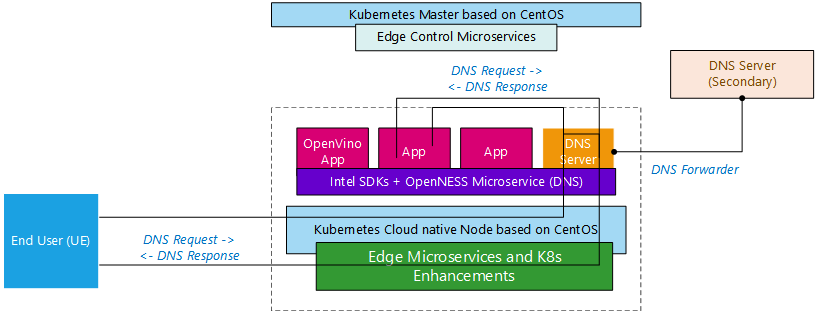

```text
SPDX-License-Identifier: Apache-2.0
Copyright (c) 2019 Intel Corporation
```
<!-- omit in toc -->
# Edge DNS
- [Overview](#overview)
- [Usage](#usage)
  - [Network edge usage](#network-edge-usage)

## Overview 
The edge platform must provide access to DNS. The edge platform receives the application DNS rules from the controller. This is specified in the ETSI Multi-access Edge Computing (MEC). From a 5G edge deployment perspective, the Primary DNS (priDns) and Secondary DNS (secDns) needs to be configured which is going to be consumed by the SMF. 
<!-- fix the last sentence above. Confusing. -->

OpenNESS supports DNS microservice to address these DNS requirements and also DNS service for edge applications and network functions. 



_Figure - DNS support on OpenNESS overview_

>**NOTE**: Secondary DNS service is out of the scope of OpenNESS and is only used for DNS forwarding.

EdgeDNS is a functionality to provide the Domain Name System (DNS) Server with a possibility to be controlled by its CLI. EdgeDNS Server listens for requests from a client's CLI. After receiving a CLI request, a function handling the request adds or removes the RULE inside of the EdgeDNS database. EdgeDNS supports only type A records for Set/Delete Fully Qualified Domain Names (FQDN) and the current forwarder is set to 8.8.8.8 (set in docker-compose.yml and openness.yaml). Network Edge mode provides EdgeDNS as a service, which is an application running in a K8s pod on each node of the OpenNESS K8s cluster. It allows users to add and remove DNS entries of the node host directly from K8s control plane using kubectl plugin.

## Usage

The EdgeDNS server can be controlled by its CLI. The CLI reads a json file containing HostRecordSet for set operation and RecordSet for del operation. The following is an example of JSON files that defines www.example.com to be 1.1.1.1;1.1.1.2;1.1.1.3;1.1.1.4 as `set.json` and `del.json` files:

set.json
```json  
  {
    "record_type":"A",
    "fqdn":"www.example.com",
    "addresses":["1.1.1.1", "1.1.1.2", "1.1.1.3", "1.1.1.4"]
  }
```

del.json
```json
  {
    "record_type":"A",
    "fqdn":"www.example.com"
  }
```

### Network edge usage

In Network Edge, the EdgeDNS CLI is used as a Kubernetes\* plugin. The following is an output of help of kubectl edgedns.

```
 `kubectl edgedns --help` to learn about usage
 `kubectl edgedns set <node_hostname> <JSON filename>` to set DNS entry of node
 `kubectl edgedns del <node_hostname> <JSON filename>` to delete DNS entry of node
```

>**NOTE**: `node_hostname` must be a valid node name; it can be found using `kubectl get nodes`

>**NOTE**: `JSON filename` is a path to the file containing record_type, fqdn, and addresses in case of setting operation. JSON file without record_type also is valid, and as default value "A" is set.

To set the DNS entry on the node1 host from the `set.json` file, users must provide the following command:

`kubectl edgedns set node1 set.json`

The following command removes this entry:

`kubectl edgedns del node1 del.json`

