```text
SPDX-License-Identifier: Apache-2.0
Copyright (c) 2019-2020 Intel Corporation
```

- [4G/LTE Core Configuration using CNCA](#4glte-core-configuration-using-cnca)
  - [Configuring in Network Edge mode](#configuring-in-network-edge-mode)
    - [Sample YAML LTE CUPS userplane configuration](#sample-yaml-lte-cups-userplane-configuration)
  - [Configuring in On-Premises mode](#configuring-in-on-premises-mode)
    - [CUPS UI Prerequisites](#cups-ui-prerequisites)
    - [First time access to CUPS UI](#first-time-access-to-cups-ui)
      - [Prerequisites](#prerequisites)
      - [Steps to access UI](#steps-to-access-ui)
    - [Get User Plane specific information and Update](#get-user-plane-specific-information-and-update)
    - [Add a new user plane information to Core](#add-a-new-user-plane-information-to-core)
    - [Delete a user plane information from Core](#delete-a-user-plane-information-from-core)
- [5G NGC components bringup and Configuration using CNCA](#5g-ngc-components-bringup-and-configuration-using-cnca)
  - [Network Edge mode](#network-edge-mode)
    - [Bring-up of NGC components in Network Edge mode](#bring-up-of-ngc-components-in-network-edge-mode)
    - [Configuring in Network Edge mode](#configuring-in-network-edge-mode-1)
      - [Edge Node services operations with 5G Core (through OAM interface)](#edge-node-services-operations-with-5g-core-through-oam-interface)
        - [Registration of UPF services associated with Edge-node with 5G Core](#registration-of-upf-services-associated-with-edge-node-with-5g-core)
      - [Traffic influence operations with 5G Core (through AF interface)](#traffic-influence-operations-with-5g-core-through-af-interface)
        - [Sample YAML NGC AF subscription configuration](#sample-yaml-ngc-af-subscription-configuration)
      - [Packet Flow Description operations with 5G Core (through AF interface)](#packet-flow-description-operations-with-5g-core-through-af-interface)
        - [Sample YAML NGC AF PFD transaction configuration](#sample-yaml-ngc-af-pfd-transaction-configuration)
      - [Policy Authorization operations with 5G Core (through AF interface)](#policy-authorization-operations-with-5g-core-through-af-interface)
        - [Sample YAML NGC AF Policy Authorization configuration](#sample-yaml-ngc-af-policy-authorization-configuration)
  - [On-Premises mode](#on-premises-mode)
    - [Bringing up NGC components in On-Premises mode](#bringing-up-ngc-components-in-on-premises-mode)
    - [Configuring in On-Premises mode](#configuring-in-on-premises-mode-1)
      - [Certificates Management for communicating with 5G core micro-services](#certificates-management-for-communicating-with-5g-core-micro-services)
      - [Edge Node services operations with 5G Core (through OAM interface)](#edge-node-services-operations-with-5g-core-through-oam-interface-1)
        - [Registration of UPF services associated with Edge-node with 5G Core](#registration-of-upf-services-associated-with-edge-node-with-5g-core-1)
      - [Traffic influence operations with 5G Core (through AF interface)](#traffic-influence-operations-with-5g-core-through-af-interface-1)
      - [Packet Flow Description operation with 5G Core (through AF interface)](#packet-flow-description-operation-with-5g-core-through-af-interface)
  - [Traffic Influence Subscription description](#traffic-influence-subscription-description)
    - [Identification (Mandatory)](#identification-mandatory)
    - [Traffic Description Group (Mandatory)](#traffic-description-group-mandatory)
    - [Target UE Identifier (Mandatory)](#target-ue-identifier-mandatory)
    - [Application Relocation (Optional)](#application-relocation-optional)
    - [Traffic Routing (Optional)](#traffic-routing-optional)
    - [Spatial Validity (Optional)](#spatial-validity-optional)
    - [Temporal Validity (Optional)](#temporal-validity-optional)
    - [UPF Event Notifications (Optional)](#upf-event-notifications-optional)
    - [AF to NEF specific (Optional)](#af-to-nef-specific-optional)
  - [Packet Flow Description transaction description](#packet-flow-description-transaction-description)
  - [Policy Authorization Application Session Context description](#policy-authorization-application-session-context-description)

# 4G/LTE Core Configuration using CNCA

## Configuring in Network Edge mode

In case of Network Edge mode, CNCA provides a kubectl plugin to configure the 4G/LTE Core network. Kubernetes adopts plugins concepts to extend its functionality. The `kube-cnca` plugin executes CNCA related functions within Kubernetes eco-system. The plugin performs remote callouts against LTE CUPS OAM agent.

Available management with `kube-cnca` against LTE CUPS OAM agent are:
1. Creation of LTE CUPS userplanes
2. Deletion of LTE CUPS userplanes
3. Updating (patching) LTE CUPS userplanes

The `kube-cnca` plugin is installed automatically on the master node during the installation phase of the [OpenNESS Experience Kit](https://github.com/open-ness/specs/blob/master/doc/getting-started/openness-experience-kits.md).
In the following sections, a detailed explanation with examples is provided about the CNCA management.


Creation the LTE CUPS userplane is performed based on the configuration provided by the given YAML file. The YAML configuration should follow the provided sample YAML in [Sample YAML LTE CUPS userplane configuration](#sample-yaml-lte-cups-userplane-configuration) section. Use the `apply` command as below to post a userplane creation request onto AF:
```shell
kubectl cnca apply -f <config.yml>
```

When the userplane is created successfully, the `apply` command will return the userplane identifier `<userplane-id>`, which should be used in further correspondence with LTE CUPS OAM agent concerning this particular userplane. It is the responsibility of the user to retain the `<userplane-id>` as `kube-cnca` is a stateless function.

> NOTE: All active userplanes can be retrieved from AF through command `kubectl cnca get userplanes`.

To retrieve an existing userplane with a known userplane ID, use the below command:
```shell
kubectl cnca get userplane <userplane-id>
```

To retrieve all active userplanes at LTE CUPS OAM agent, execute this command:
```shell
kubectl cnca get userplanes
```

To modify an active userplane, use the `patch` command providing a YAML file with the subset of the configuration to be modified:
```shell
kubectl cnca patch <userplane-id> -f <config.yml>
```

To delete an active userplane, use the `delete` command as below:
```shell
kubectl cnca delete userplane <userplane-id>
```

### Sample YAML LTE CUPS userplane configuration

Similarly, the `kube-cnca` expects the YAML configuration as in the format below for the LTE CUPS-specific information. The file must contain the topmost configurations; `apiVersion`, `kind` and `policy`.

```yaml
apiVersion: v1
kind: lte
policy:
  id: '5'
  uuid: beauty
  function: SAEGWU
  config:
    s5u_pgw:
      up_ip_address: 192.168.120.122
    s1u:
      up_ip_address: 192.190.120.122
    s5u_sgw:
      up_ip_address: 192.168.120.122
  selectors:
  - id: select001
    network:
      mcc: '466'
      mnc: '92'
    uli:
      tai:
        tac: 51
    pdn:
      apns:
      - APN001
```


## Configuring in On-Premises mode

In case of On-Premises deployment mode, Core network can be configured through the CNCA CUPS UI interface.

### CUPS UI Prerequisites

- Controller installation, configuration and run as root. Before building, setup the controller env file for CUPS as below:

```
  REACT_APP_CONTROLLER_API=http://<controller_ip_address>>:8080
  REACT_APP_CUPS_API=http://<<oamagent_ip_address>>:8080
```

- Build the full controller stack including CUPS:

    `make build`

  - Start the full controller stack and CUPS UI:

    `make all-up`

    > NOTE: To bring up just the CUPS UI run `make cups-ui-up`
  - Check whether controller CUPS UI already bring up by:

```
    Docker ps
    CONTAINER ID   IMAGE        COMMAND                  CREATED     STATUS      PORTS
    0eaaafc01013   cups:latest  "docker-entrypoint.s…"   8 days ago  Up 8 days   0.0.0.0:3010->80/tcp
    d732e5b93326   ui:latest    "docker-entrypoint.s…"   9 days ago  Up 9 days   0.0.0.0:3000->80/tcp
    8f055896c767   cce:latest   "/cce -adminPass cha…"   9 days ago  Up 9 days   0.0.0.0:6514->6514/tcp, 0.0.0.0:8080-8081->8080-8081/tcp, 0.0.0.0:8125->8125/tcp
    d02b5179990c   mysql:8.0    "docker-entrypoint.s…"   13 days ago Up 9 days   33060/tcp, 0.0.0.0:8083->3306/tcp
```

- OAMAgent(called EPC-OAM) and EPC Control plane installation, configuration and run as `root`.
  - OAMAgent acts as epc agent between the OpenNESS controller and EPC. It will process CUPS API messages (HTTP based) from the controller, parse JSON payload in the HTTP request, and then convert it to message format that can be used by EPC. And the same in reverse. Refer to the architecture specification and to README in epc-oam repo for further details.
  - For OAMAgent Installation and configuration details, refer to README in epc-oam repo.
  - EPC installation and configuration.

### First time access to CUPS UI

#### Prerequisites

- REACT_APP_CUPS_API=http://<<oamagent_ip_address>>:8080 added to Controller's "~/controller/.env" file.
- Controller full stack including CUPS UI are running.
- Oamagent and EPC are running.
- Confirm connection between controller and oamagent (EPC).

#### Steps to access UI

- Open any internet browser
- Type in "http://<Controller_ip_address>:3010/userplanes" in address bar.
- This will display all the existing EPC user planes list as shown below:
  &nbsp;
  

### Get User Plane specific information and Update

- Identify the specific userplane using the UUID to get additional information
- Click on **EDIT** as shown below
  &nbsp;
  
  &nbsp;

- User plane information is displayed as shown below
  &nbsp;
  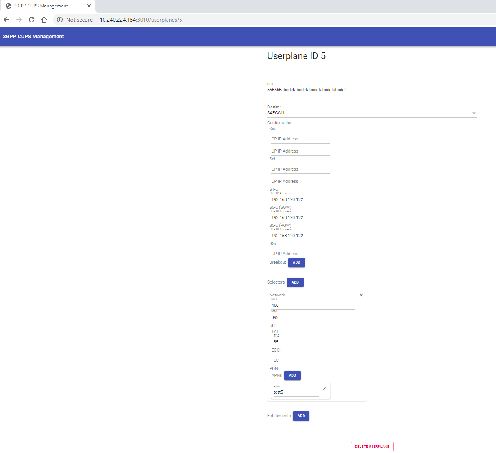
  &nbsp;

- Update parameters: any of the parameters _{S1-U , S5-U(SGW), S5-U(PGW), MNC,MCC, TAC, APN}_ as needed and then click on **Save**.
  **NOTE** A pop up window will appear with “successfully updated userplane”
  &nbsp;
  
  &nbsp;

- After that, web page will automatically return back to the updated user plane list as shown below
  &nbsp;
  
  &nbsp;

### Add a new user plane information to Core

- Click on **CREATE** button.

- Filling uuid with 36 char string, select Function as “SAEGWU” and set values for parameters: S1-U , S5-U(SGW), S5-U(PGW), MNC,MCC, TAC and APN. And click on “Save” and pop up with “successfully created userplane” as below:
  &nbsp;
  
  &nbsp;

- After that, web page will automatically return back to the updated user plane list as shown below
  &nbsp;
  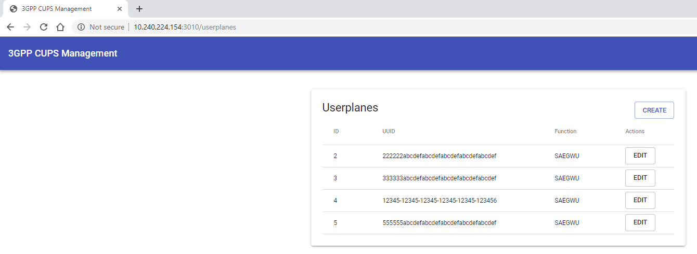
  &nbsp;

### Delete a user plane information from Core

- Find the user plane to delete using UUID and click **EDIT**

- Then web page will list the user plane information, and then click on **DELETE USERPLANE** with popup message with **successfully deleted userplane** as shown below
  &nbsp;
  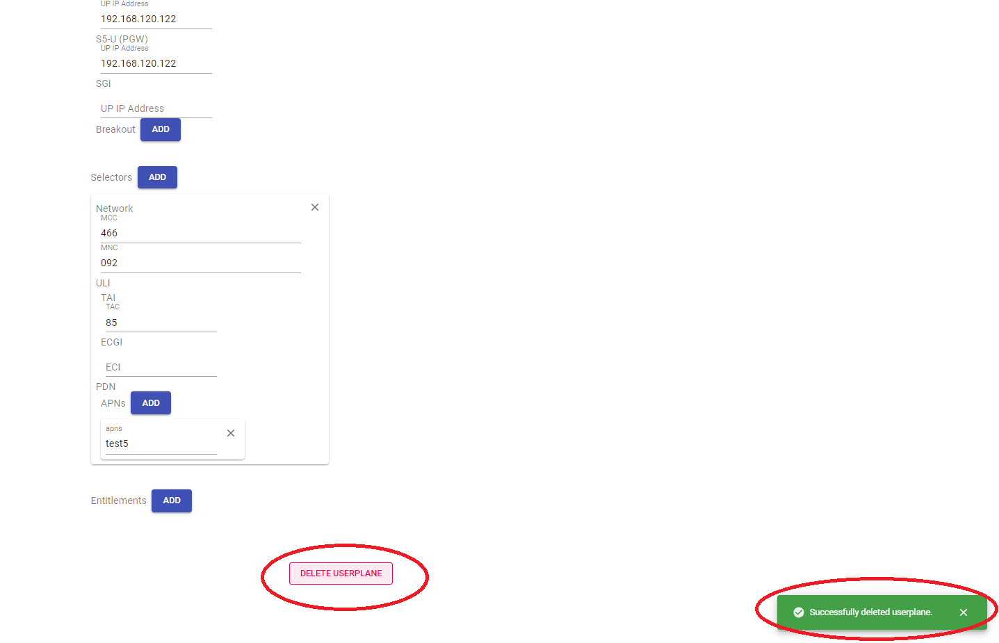
  &nbsp;

- After that, web page will automatically return back to the updated user plane list as shown below
  &nbsp;
  
  &nbsp;

# 5G NGC components bringup and Configuration using CNCA

OpenNESS provides ansible scripts for setting up NGC components for two scenarios. Each of the scenarios is supported by a separate role in the OpenNESS Experience Kit:

1. Role "ngc_test"
  This role brings up the 5g OpenNESS setup in the loopback mode for testing and demonstrating its usability. This scenario is currently the default 5G OpenNESS scenario. The ansible scripts that are part of "ngc_test" role build, configure and start AF(Application Function), NEF(Network Exposure Function), OAM(Operation Administration and Maintenance) and CNTF(Core Network Test Function) in the Network Edge or On-Premises mode. Within this role, AF, NEF, OAM and CNTF are set up on the controller node.  **Description of the configuration and setup of the NGC components provided in the next sections of this document refers to ngc_test role**. The NGC components set up within ngc_test role can be fully integrated and tested with provided kubectl plugin or CNCA UI.

2. Role "ngc"
  This role brings up 5g OpenNESS services - AF and NEF - to present the real deployment scenario, where these services can be further integrated with the real 5G core network. The ansible scripts that are part of this role build, configure and start AF and NEF micoservices on separate nodes either in Network Edge or On-Premises mode. The ansible scripts place AF again on the controller node, whereas NEF is placed on a worker node. Similar functionality will be added for OAM component in the future release. Currently, integration with CNCA UI and kubectl is not complete due to missing OAM component - the services can not be created and accessed. In CNCA UI the "services" web page does not show any content. The user should proceed to "subscriptions" web page to view and modify subscriptions.

## Network Edge mode

### Bring-up of NGC components in Network Edge mode

- If the Edge controller is not yet deployed through openness-experience-kit then:
   Enable the role for ngc by changing `ne_ngc_test_enable` variable to `true` in `group_vars/all/20-enhanced.yml` before running `deploy_ne.sh controller` or `deploy_ne.sh` as described in [OpenNESS Network Edge: Controller and Edge node setup](../getting-started/network-edge/controller-edge-node-setup.md) document,  **otherwise skip this step.**

- If Edge-controller is already deployed (but without enabling ngc role) and at a later stage you want to enable NGC components on edge-controller then,
  Enable the role for ngc by changing `ne_ngc_test_enable` variable to `true` in `group_vars/all/20-enhanced.yml` and then re-run `deploy_ne.sh controller` as described in [OpenNESS Network Edge: Controller and Edge node setup](../getting-started/network-edge/controller-edge-node-setup.md) document.

    **NOTE:**
    In addition to the OpenNESS controller bring-up, by enabling the ngc_test role the playbook scripts performs:
  - Clone of the x-epcforedge repo from github
  - Builds AF(Application Function), NEF(Network Exposure Function), OAM(Operation,Administration and Maintenance) and CNTF(Core Network Test Function) micro services
  - Generates certificate files at the location **/etc/openness/certs/ngc**
  - Updates the configuration files of AF and NEF with the service names of NEF and CNTF respectively.
  - Copies the OAM, NEF, CNTF and AF configuration to the location **/etc/openness/configs/ngc**
  - Creates docker images for AF, NEF, OAM and CNTF micro services and adds them into the docker registry at **\<controller ip:port\>**.
  - Installs the helm charts for AF, NEF, OAM and CNTF using the images from the docker registry
  - Copies the helm charts for AF, NEF, OAM and CNTF into the location **/opt/openness-helm-charts/**

- On successful start of AF, NEF, OAM and CNTF PODs. Status of PODs, Services, images and helm charts can verified using the below commands:

    ```shell
   - kubectl get po -n ngc
      NAME   READY   STATUS    RESTARTS   AGE
      af     1/1     Running   0          56m
      cntf   1/1     Running   0          6d5h
      nef    1/1     Running   0          6d5h
      oam    1/1     Running   0          6d5h

   - kubectl get services -n ngc
      NAME          TYPE       CLUSTER-IP      EXTERNAL-IP   PORT(S)                         AGE
      afservice     NodePort   10.96.241.176   <none>        8050:30050/TCP,8051:31357/TCP   57m
      cntfservice   NodePort   10.96.122.239   <none>        8095:30852/TCP                  6d5h
      nefservice    NodePort   10.96.124.222   <none>        8060:30685/TCP                  6d6h
      oamservice    NodePort   10.96.48.159    <none>        8070:30070/TCP                  6d6h

   - docker image ls
      REPOSITORY                                      TAG                 IMAGE ID            CREATED             SIZE
      10.190.212.195:5000/cntf-image                  1.0                 515ac537d5df        6 days ago          261MB
      10.190.212.195:5000/af-image                    1.0                 f3ee00000a29        6 days ago          264MB
      10.190.212.195:5000/nef-image                   1.0                 99e172731e56        6 days ago          263MB
      10.190.212.195:5000/oam-image                   1.0                 b5a771311ff8        6 days ago          261MB

    - helm list
      NAME            NAMESPACE       REVISION        UPDATED                                 STATUS          CHART                   APP VERSION
      af              default         1               2020-06-16 13:23:58.920063681 +0530 IST deployed        af-0.1.0                0.1.0
      cntf            default         1               2020-06-10 08:22:42.730030568 +0530 IST deployed        cntf-0.1.0              0.1.0
      nef             default         1               2020-06-10 08:21:25.081038001 +0530 IST deployed        nef-0.1.0               0.1.0
      oam             default         1               2020-06-10 08:20:45.755123843 +0530 IST deployed        oam-0.1.0               0.1.0
    ```

- After all the PODs are successfully up and running, if AF and OAM configuration parameters need to be updated (as per your deployment configuration) then follow the below steps.

  - Modify the AF configuration
    - Delete the AF pod using helm as below

      ```shell
      helm list | grep af
      af              default         1               2020-06-16 10:38:32.692955717 +0530 IST deployed        af-0.1.0                0.1.0

      helm uninstall af
      release "af" uninstalled

      ne-controller## kubectl get po -n ngc
      NAME   READY   STATUS    RESTARTS   AGE
      cntf   1/1     Running   0          6d4h
      nef    1/1     Running   0          6d5h
      oam    1/1     Running   0          6d5h
      ```

    - Open the file `/etc/openness/configs/ngc/af.json` and modify the parameters.
    - Save and exit.
    - Now restart AF POD using the below command:
  
      ```shell
      helm install af /opt/openness-helm-charts/af --set image.repository=10.190.212.195:5000/af-image
      NAME: af
      LAST DEPLOYED: Tue Jun 16 13:23:58 2020
      NAMESPACE: default
      STATUS: deployed
      REVISION: 1
      TEST SUITE: None
      NOTES:
      Chart af was successfully installed

      af image was saved in the docker registry
      Image name: 10.190.212.195:5000/af-image:1.0

      Your release is named af.

      To learn more about the release, try:

        $ helm status af
        $ helm get all af

      kubectl get po -n ngc
      NAME   READY   STATUS    RESTARTS   AGE
      af     1/1     Running   0          2m6s
      cntf   1/1     Running   0          6d5h
      nef    1/1     Running   0          6d5h
      oam    1/1     Running   0          6d5h
      ```

    - Successful restart of AF with the updated config can be observed through AF container logs. Run the below command to get AF container logs:
    `kubectl logs af --namespace=ngc af-container`
    Sample output of the AF container logs with updated config may appear as:
  

  - Modify the OAM configuration.  Follow the same steps as above(as done for AF) with the following differences
 
    - Delete the OAM pod using helm use **helm uninstall oam**
    - Open the file `/etc/openness/configs/ngc/oam.json` and modify the parameters.
    - Save and exit.
    - Now restart OAM POD using the command **helm install oam /opt/openness-helm-charts/oam --set image.repository=10.190.212.195:5000/oam-image**
    - Successful restart of OAM with the updated config can be observed through OAM container logs. Run the below command to get logs:

    NOTE: In case of ngc-test role/configuration, NEF, OAM and CNTF PODs will run in OpenNESS-Controller/Kubernetes-Master node for testing purpose. In a real implementation, if NEF and OAM are being used, these two services will run on the 5G Core network servers either in a POD or a standalone application on the host depending on 5G Core server environment

### Configuring in Network Edge mode

In case of Network Edge mode, CNCA provides kubectl plugin to configure 5G Core network. Kubernetes adopt plugins concepts to extend its functionality. The `kube-cnca` plugin executes CNCA related functions within the Kubernetes eco-system. The plugin performs remote callouts against NGC OAM and AF micro service on the controller itself.

The `kube-cnca` plugin is installed automatically on the master node during the installation phase of the [OpenNESS Experience Kit](https://github.com/otcshare/specs/blob/master/doc/getting-started/network-edge/controller-edge-node-setup.md)

#### Edge Node services operations with 5G Core (through OAM interface)

  ***NOTE:**
  Registration of OpenNESS Controller's AF instance with the 5G core need to be performed manually or through any other interface exposed by the 5G Core.  OAM capabilities will be enhanced in future releases to support this. Current version of OAM supports only one instance of OpenNESS Controller to communicate.*

##### Registration of UPF services associated with Edge-node with 5G Core

Supported operations through `kube-cnca` plugin:

  * Registration of edge service info for an UPF with 5G Core through OAM interface (co-located with Edge-Node)
  * Un-registration of edge service info

To register the AF service through the NGC OAM function, execute:
```shell
kubectl cnca register --dnai=<DNAI> --dnn=<DNN> --tac=<TAC> --priDns=<pri-DNS> --secDns=<sec-DNS> --upfIp=<UPF-IP> --snssai=<SNSSAI>
```

The following parameters MUST be provided to the command in order to succeed:
1. Data Network Access Identifier (DNAI)
2. Data Network Name (DNN)
3. Primary DNS (priDns)
4. Secondary DNS (secDns)
5. UPF IP Address (upfIp)
6. Network Slice Identifier (SNSSAI)

Upon successful registration, subscriptions can be instantiated over the NGC AF. The `af-service-id` is returned by the `register` command to be used in further correspondence with NGC OAM & AF functions.

Un-registration of the AF service can be performed as in the command below:
```shell
kubectl cnca unregister <af-service-id>
```

#### Traffic influence operations with 5G Core (through AF interface)

Supported operations through `kube-cnca` plugin:

  * Creation of traffic influence subscriptions through the AF micro service to steer application traffic towards edge-node
  * Deletion of subscriptions
  * Updating (patching) subscriptions
  * get or get-all subscriptions

Creation of the AF subscription is performed based on the configuration provided by the given YAML file. The YAML configuration should follow the provided sample YAML in the [Sample YAML NGC AF subscription configuration](#sample-yaml-ngc-af-subscription-configuration) section. Use the `apply` command as below to post a subscription creation request onto AF:
```shell
kubectl cnca apply -f <config.yml>
```

When the subscription is successfully created, the `apply` command will return the subscription URL that includes subscription identifier at the end of the string. Only this subscription identifier `<subscription-id>` should be used in further correspondence with AF concerning this particular subscription. For example, https://localhost:8060/3gpp-traffic-influence/v1/1/subscriptions/11111  and subscription-id is 11111. **It is the responsibility of the user to retain the `<subscription-id>` as `kube-cnca` is a stateless function.**

To retrieve an existing subscription with a known subscription ID, use the below command:
```shell
kubectl cnca get subscription <subscription-id>
```

To retrieve all active subscriptions at AF, execute this command:
```shell
kubectl cnca get subscriptions
```

To modify an active subscription, use the `patch` command providing a YAML file with the subset of the configuration to be modified:
```shell
kubectl cnca patch <subscription-id> -f <config.yml>
```

To delete an active subscription, use the `delete` command as below:
```shell
kubectl cnca delete subscription <subscription-id>
```

##### Sample YAML NGC AF subscription configuration

The `kube-cnca` expects the YAML configuration as in the format below. The file must contain the topmost configurations; `apiVersion`, `kind` and `policy`. The configuration `policy` retains the NGC AF-specific subscription information.

```yaml
apiVersion: v1
kind: ngc
policy:
  afServiceId: 'afService001'
  afAppId: app001
  afTransId: ''
  appReloInd: false
  dnn: edgeLocation001
  snssai:
    sst: 0
    sd: default
  anyUeInd: false
  gpsi: ''
  ipv4Addr: 127.0.0.1
  ipv6Addr: ''
  macAddr: ''
  requestTestNotification: true
  websockNotifConfig:
    websocketUri: ''
    requestWebsocketUri: true
  trafficRoutes:
  - dnai: edgeLocation001
    routeInfo:
      ipv4Addr: ''
      ipv6Addr: ''
    routeProfId: default
```

#### Packet Flow Description operations with 5G Core (through AF interface)

Supported operations through `kube-cnca` plugin:

  * Creation of packet flow description (PFD) transactions through the AF micro service to perform accurate detection of application traffic for UPF in 5G Core
  * Deletion of transactions and applications within a transaction
  * Updating (patching) transactions and applications within a transaction
  * get or get-all transactions.
  * get a specific application within a transaction

Creation of the AF PFD transaction is performed based on the configuration provided by the given YAML file. The YAML configuration should follow the provided sample YAML in the [Sample YAML NGC AF transaction configuration](#sample-yaml-ngc-af-transaction-configuration) section. Use the `apply` command as below to post a PFD transaction creation request onto AF:
```shell
kubectl cnca pfd apply -f <config.yml>
```

When the PFD transaction is successfully created, the `apply` command will return the transaction URL, that includes transaction identifier at the end of the string. Only this transaction identifier `<transaction-id>` should be used in further correspondence with AF concerning this particular transaction. For example, https://localhost:8050/af/v1/pfd/transactions/10000  and transaction-id is 10000. **It is the responsibility of the user to retain the `<transaction-id>` as `kube-cnca` is a stateless function.**

To retrieve an existing PFD transaction with a known transaction ID, use the below command:
```shell
kubectl cnca pfd get transaction <transaction-id>
```

To retrieve all active PFD transactions at AF, execute this command:
```shell
kubectl cnca pfd get transactions
```

To modify an active PFD transaction, use the `patch` command providing a YAML file with the subset of the configuration to be modified:
```shell
kubectl cnca pfd patch transaction <transaction-id> -f <config.yml>
```

To delete an active PFD transaction, use the `delete` command as below:
```shell
kubectl cnca pfd delete transaction <transaction-id>
```

To retrieve an existing application within a PFD  transaction with a known application ID and transaction ID, use the below command:
```shell
kubectl cnca pfd get transaction <transaction-id> application <application-id>
```

To modify an application within an active PFD transaction, use the `patch` command providing a YAML file with the subset of the configuration to be modified:
```shell
kubectl cnca pfd patch transaction <transaction-id> application <application-id> -f <config.yml>
```

To delete an application within an active PFD transaction, use the `delete` command as below:
```shell
kubectl cnca pfd delete transaction <transaction-id> application <application-id>
```


##### Sample YAML NGC AF PFD transaction configuration

The `kube-cnca pfd apply` expects the YAML configuration as in the format below. The file must contain the topmost configurations; `apiVersion`, `kind` and `policy`. The configuration `policy` retains the NGC AF-specific transaction information.

```yaml
apiVersion: v1
kind: ngc_pfd
policy:
  pfdDatas:
    - externalAppID: afApp01
      allowedDelay: 1000
      cachingTime: 1000
      pfds:
        - pfdID: pfdId01
          flowDescriptions:
            - "permit in ip from 10.11.12.123 80 to any"
          domainNames:
            - "www.google.com"
        - pfdID: pfdId02
          urls:
            - "^http://test.example2.net(/\\S*)?$"
        - pfdID: pfdId03
          domainNames:
            - "www.example.com"
    - externalAppID: afApp02
      allowedDelay: 1000
      cachingTime: 1000
      pfds:
        - pfdID: pfdId03
          flowDescriptions:
            - "permit in ip from 10.68.28.39 80 to any"
        - pfdID: pfdId04
          urls:
            - "^http://test.example1.net(/\\S*)?$"
        - pfdID: pfdId05
          domainNames:
            - "www.example.com"
```

Sample yaml file for updating a single application

```yaml
apiVersion: v1
kind: ngc_pfd
policy:
  externalAppID: afApp01
  allowedDelay: 1000
  cachingTime: 1000
  pfds:
    - pfdID: pfdId01
      flowDescriptions:
        - "permit in ip from 10.11.12.123 80 to any"
    - pfdID: pfdId02
      urls:
        - "^http://test.example2.net(/\\S*)?$"
    - pfdID: pfdId03
      domainNames:
        - "www.latest_example.com"
```

#### Policy Authorization operations with 5G Core (through AF interface)

Supported operations through `kube-cnca` plugin:

  * Creation of Policy Authorization - Application session context through the AF micro service.
  * Deletion of application session context
  * Updating (patching) application session context.
  * Get application session context.
  * Update or delete Event Notification within a application session context.

Creation of the Policy Authorization Application session context is performed based on the configuration provided by the given YAML file. The YAML configuration should follow the provided sample YAML in the [Sample YAML NGC AF transaction configuration](#sample-yaml-ngc-af-policy-authorization-configuration) section. Use the `apply` command as below to post a application session context creation request onto AF:
```shell
kubectl cnca policy-authorization apply -f <config.yml>
```

When the application session context is successfully created, the `apply` command will return the application session context ID (appSessionId). Only this `<appSessionId>` should be used in further correspondence with AF concerning this particular application session context. **It is the responsibility of the user to retain the `<appSessionId>` as `kube-cnca` is a stateless function.**

To retrieve an existing AppSession Session Context with a known appSessionId, use the below command:
```shell
kubectl cnca policy-authorization get <appSessionId>
```

To modify an active Application Session Context, use the `patch` command providing a YAML file with the subset of the configuration to be modified:
```shell
kubectl cnca policy-authorization patch <appSessionId> -f <config.yml>
```

To delete an active Application Session Context, use the `delete` command as below:
```shell
kubectl cnca policy-authorization delete <appSessionId>
```

To add/modify Event Notification of active Application Session Context, use the `subscribe` command providing a YAML file with the subset of the configuration to be modified:
```shell
kubectl cnca policy-authorization subscribe <appSessionId> -f <config.yml>
```

To unsubscribe from Event Notification of active Application Session Context, use the `unsubscribe` command as below:
```shell
kubectl cnca policy-authorization unsubscribe <appSessionId>
```

##### Sample YAML NGC AF Policy Authorization configuration

The `kube-cnca policy-authorixation apply` expects the YAML configuration as in the format below. The file must contain the topmost configurations; `apiVersion`, `kind` and `policy`. The configuration `policy` retains the NGC AF-specific transaction information.

```yaml
apiVersion: v1
kind: ngc_policy_authorization
policy:
  afAppId: PolicyAuthAppId01
  afRoutReq:
    appReloc: true
    routeToLocs:
    - dnai: DNAI_RTL1
      routeProfId: RouteInfo_ProfId01
      routeInfo:
        ipv4Addr: 196.168.0.1
        ipv6Addr: 2001:db8:a0b:12f0::1
        portNumber: 12345
    spVal:
      presenceInfoList:
      - praId: PraId_01
        presenceState: PRESENT
        trackingAreaList:
        - plmnId:
            mcc: '010'
            mnc: '101'
          tac: tac02
        ecgiList:
        - plmnId:
            mcc: '010'
            mnc: '101'
          eutraCellId: EutraCellId01
        ncgiList:
        - plmnId:
            mcc: '010'
            mnc: '101'
          nrCellId: NrCellId01
        globalRanNodeIdList:
        - plmnId:
            mcc: '010'
            mnc: '101'
          n3IwfId: N3IwfId01
          gNbId:
            bitLength: 32
            gNBValue: GNB01
          ngeNbId: NgeNbId
    tempVals:
    - startTime: '10:30'
      stopTime: '11:30'
    - startTime: '12:30'
      stopTime: '13:30'
    upPathChgSub:
      notificationUri: http://example.com/notif
      notifCorreId: '1234'
      dnaiChgType: EARLY
  evSubsc:
    events:
    - event: PLMN_CHG
      notifMethod: EVENT_DETECTION
    notifUri: www.example.com
    usgThres:
      duration: 100
      totalVolume: 1000
      downlinkVolume: 500
      uplinkVolume: 200
  medComponents:
    - afAppId: MC_AppId01
      afRoutReq:
        appReloc: true
        routeToLocs:
        - dnai: EARLY
          routeProfId: RouteInfo_ProfId02
          routeInfo:
            ipv4Addr: 196.168.0.1
            ipv6Addr: 2001:db8:a0b:12f0::1
            portNumber: 12345
        spVal:
         presenceInfoList:
         - praId: PraId_01
           presenceState: PRESENT
           trackingAreaList:
           - plmnId:
               mcc: '010'
               mnc: '101'
             tac: tac01
           ecgiList:
           - plmnId:
               mcc: '010'
               mnc: '101'
             eutraCellId: EutraCellId01
           ncgiList:
           - plmnId:
               mcc: '010'
               mnc: '101'
             nrCellId: NrCellId02
           globalRanNodeIdList:
           - plmnId:
               mcc: '010'
               mnc: '101'
             n3IwfId: N3IwfId01
             gNbId:
               bitLength: 32
               gNBValue: GNB01
             ngeNbId: NgeNbId
        tempVals:
        - startTime: '13:30'
          stopTime: '14:30'
        - startTime: '15:30'
          stopTime: '16:30'
        upPathChgSub:
         notificationUri: http://example.com/notif_mc
         notifCorreId: '4321'
         dnaiChgType: EARLY
      contVer: 123
      medCompN: 1
  dnn: PolicyAuthDnn01
  ipDomain: PolicyAuthIPDomain
  notifUri: http://afservice:9050/policyAuthorizationNotif
  sliceInfo:
    sst: 100
    sd: PolicyAuthSd_01
  suppFeat: 1
  ueIpv4: 127.0.0.1
  ```

## On-Premises mode


### Bringing up NGC components in On-Premises mode

  To bring-up the NGC components in on-premises mode, enable the rule `ngc_test/onprem/master` in the file: `openness-experience-kits/on_premises.yml`. and then run the script `deploy_onprem.sh controller`  as described in [OpenNESS On-Premise: Controller and Edge node setup document](../getting-started/on-premises/controller-edge-node-setup.md).

### Configuring in On-Premises mode

  OpenNESS On-Premises management homepage:
      sample url: http://<LANDING_UI_URL>/landing
      
  **NOTE**: `LANDING_UI_URL` can be retrieved from `.env` file.

#### Certificates Management for communicating with 5G core micro-services
  5G Core micro-services uses HTTPS protocol over HTTP2 for communication. To communicate with 5G micro-services, the certificates used by 5G core micro-services (AF/NEF/OAM) should be imported into web browser. The root certificate `root-ca-cert.pem` which need to be imported is available at location `/etc/openness/certs/ngc/` where OpenNess Experience Kit is installed.

  **NOTE:** The certificates generated as part of OpenNess Experience Kit are self signed certificates are for testing purpose only.

  The certificate can be imported in the different browsers as:

   * Google Chrome (ver 80.0.3987): Go to settings --> Under "Privacy and security" Section Click on "More" --> Select "Manage Certificates" --> in the pop up window select "Intermediate Certification Authorities" --> Select "Import" and provide the downloaded certificate file (root-ca-cert.pem).
   * Mozilla Firefox (ver 72.0.2): Go to options --> Under "Privacy and security" Section Click on "View Certificates..." --> Under "Authorities" section click on "import" --> Provide the certificate (root-ca-cert.pem) and import it for accessing websites.

  **NOTE:** If a user don't want to import certificate in the browser or failed to import the certificates, other steps can be followed to trust the certificates:
   * User needs to access these specific 5G core components URL to trust the certificates used by the 5G core components.
   * First access the urls `https://controller_ip:8070/ngcoam/v1/af/services, https://controller_ip:8050/af/v1/pfd/transactions`.
   * On accessing these url, browser will show the warning for trusting the self-signed certificate. Proceed by trusting the certificates.

#### Edge Node services operations with 5G Core (through OAM interface)

  ***NOTE:**
  Registration of the OpenNESS Controller's AF instance with the 5G core needs to be performed manually or through any other interface exposed by the 5G Core.  OAM capabilities will be enhanced in future releases to support this. The current version of OAM supports only one instance of OpenNESS Controller to communicate.*

##### Registration of UPF services associated with Edge-node with 5G Core

   * Edge services registration home page:
      sample url: http://<cnca_ui_ip>:3020/services
      

   * Registration of a new edge service offered by UPF (associated with edge-node)
      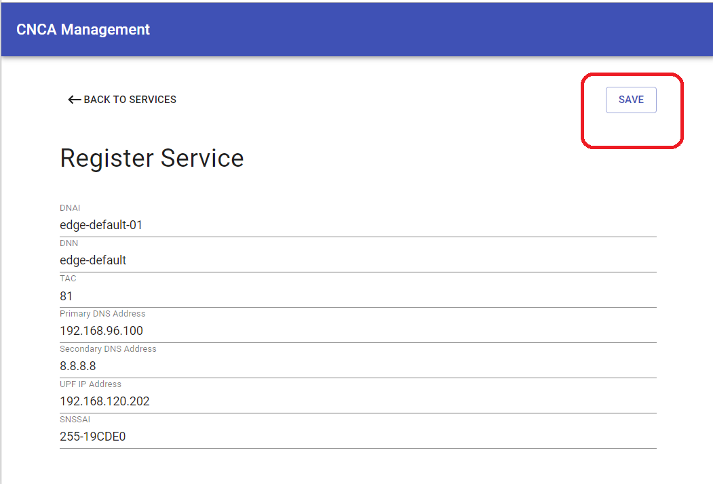

   * Display of registered edge servers with 5G Core
      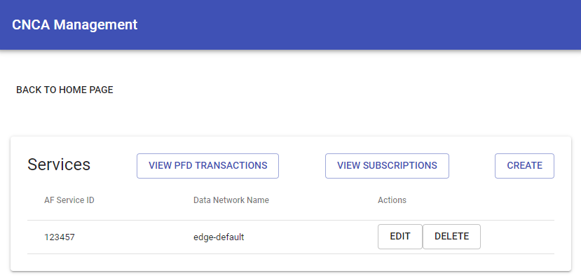

   * To edit a registered services
      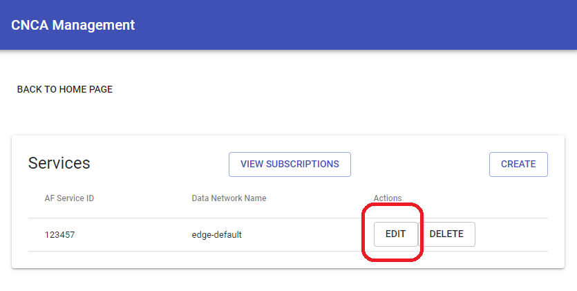

   * To delete a registered service
      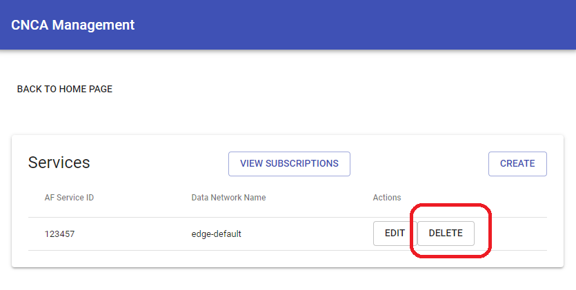

#### Traffic influence operations with 5G Core (through AF interface)

   * Edge traffic subscription submission homepage
      sample url: http://<cnca_ui_ip>:3020/subscriptions
      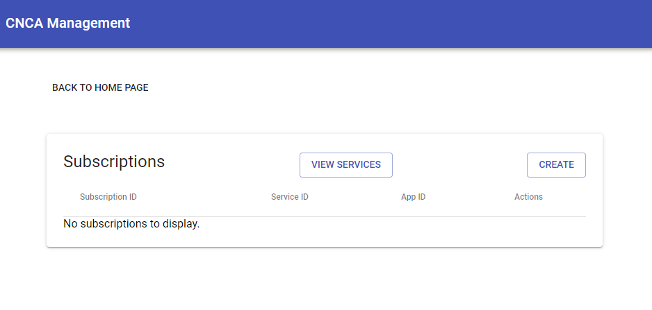

   * Edge traffic subscription submissions with 5G-Core (NEF)
      click on the "Create" button on the above homepage
      NOTE: "AF Service Id" field should be the same as the value returned through the AF services create request. In the below sample screen capture shows a different value.
      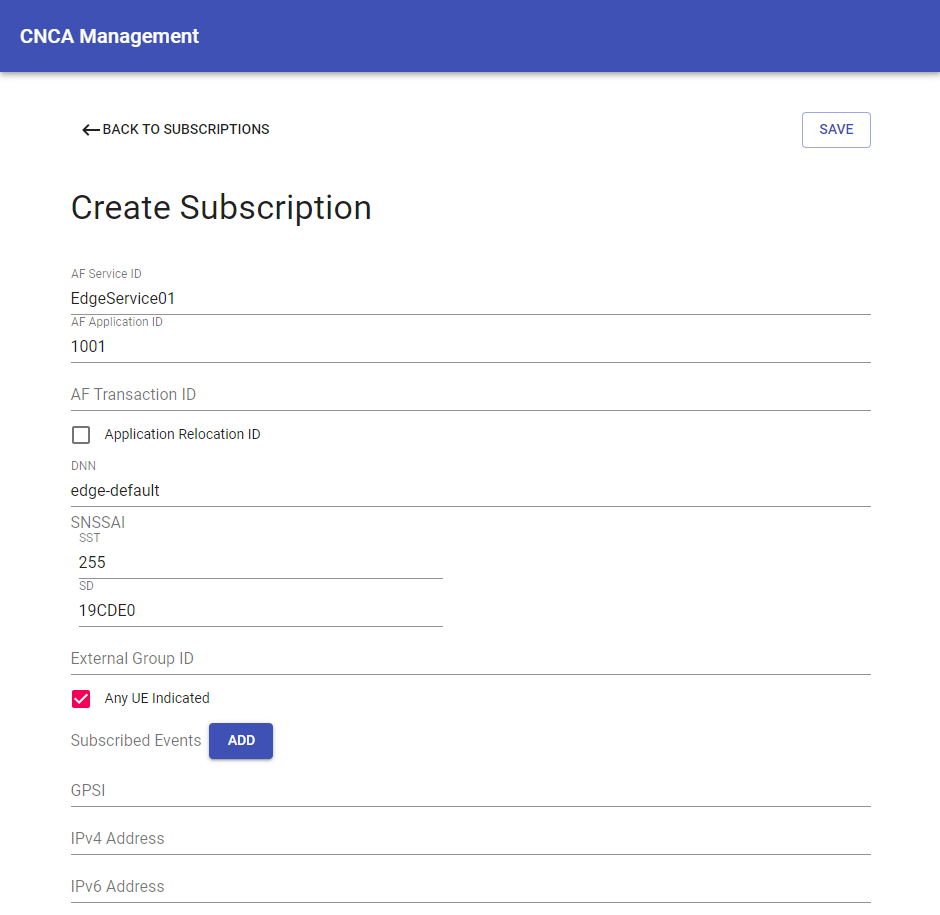
      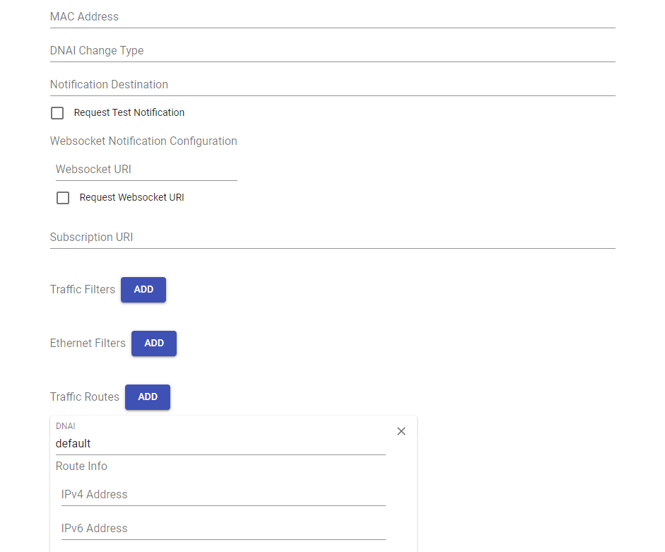
      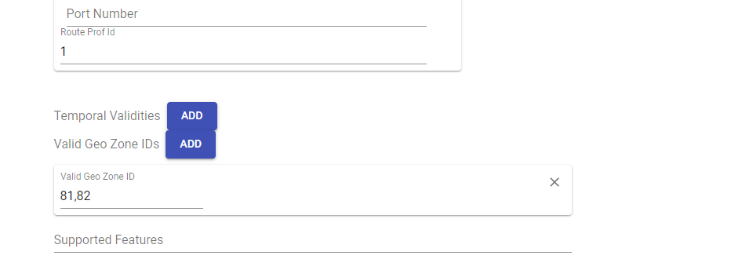

   * Display of submitted Edge traffic subscriptions
      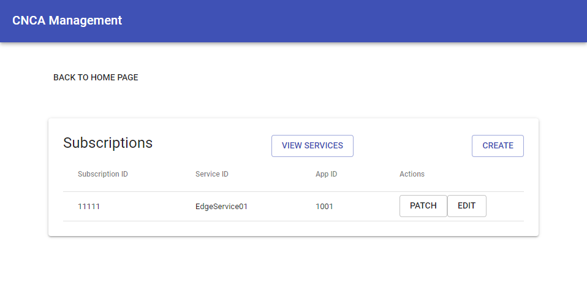

   * To edit a submitted edge traffic subscription
      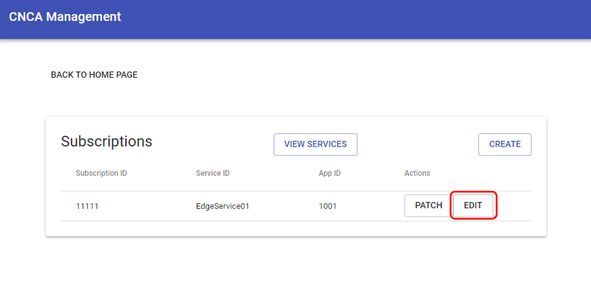

   * To patch a submitted edge traffic subscription
      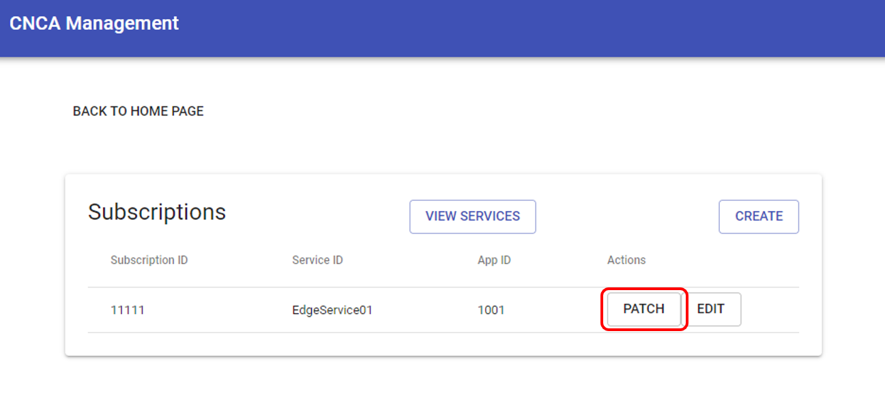

   * To delete a submitted edge traffic subscription
      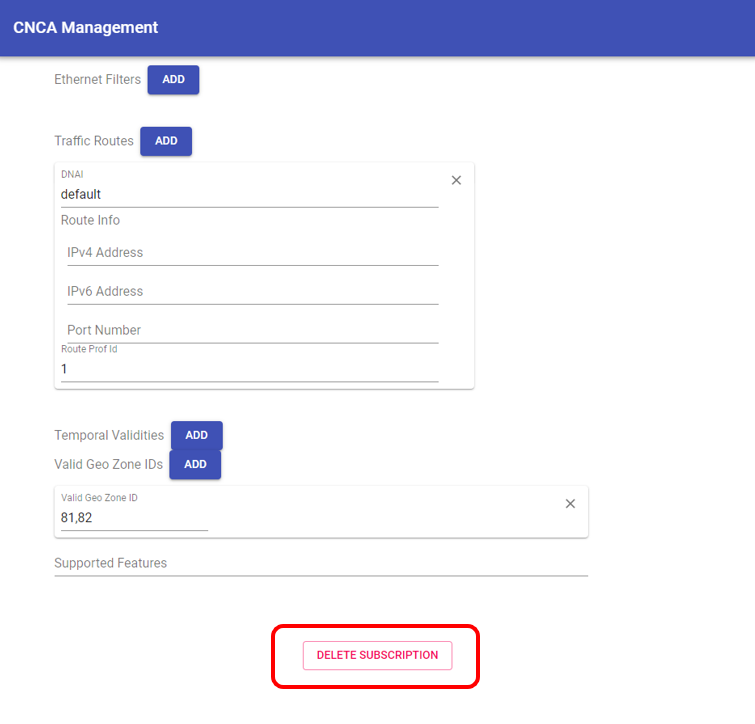

#### Packet Flow Description operation with 5G Core (through AF interface)

   * Edge traffic PFD transaction submission homepage
      sample url: http://<cnca_ui_ip>:3020/pfds
      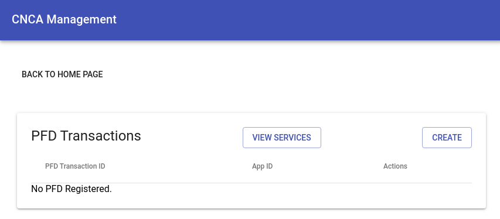

   * Edge PFD transaction submissions with 5G-Core (NEF)
      click on the "Create" button on the above homepage
      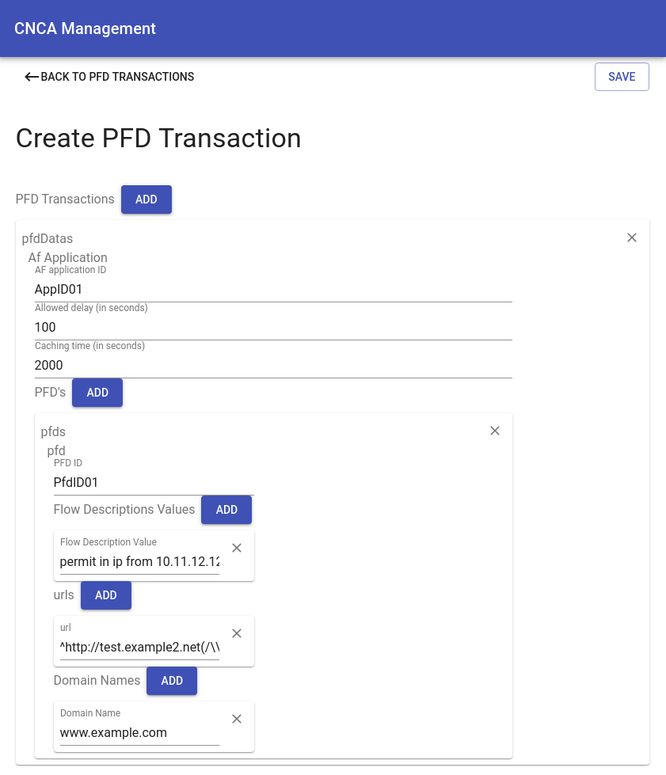

   * Display of submitted Edge PFD transaction
      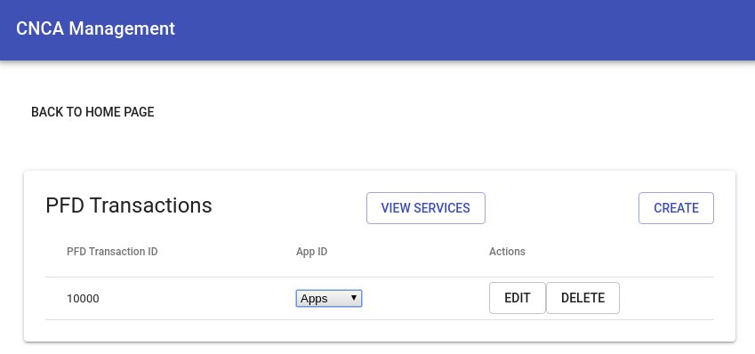

   * To edit a submitted edge PFD transaction
      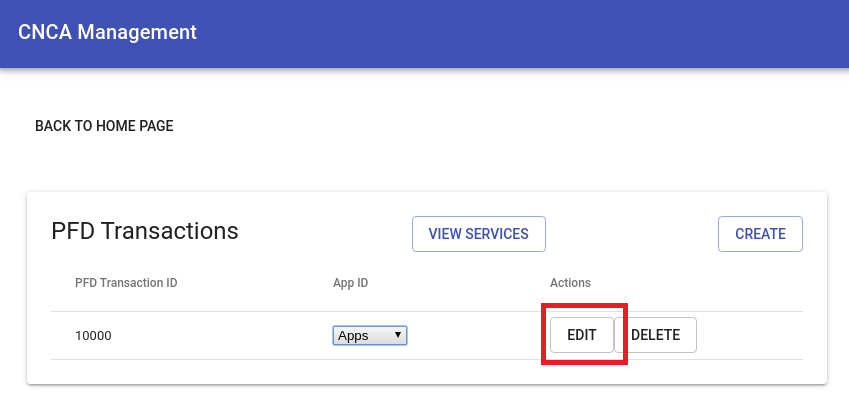

   * To edit a submitted edge PFD transaction application
      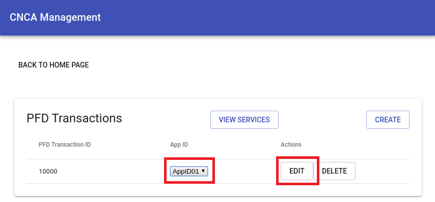

   * To delete a submitted edge PFD transaction
      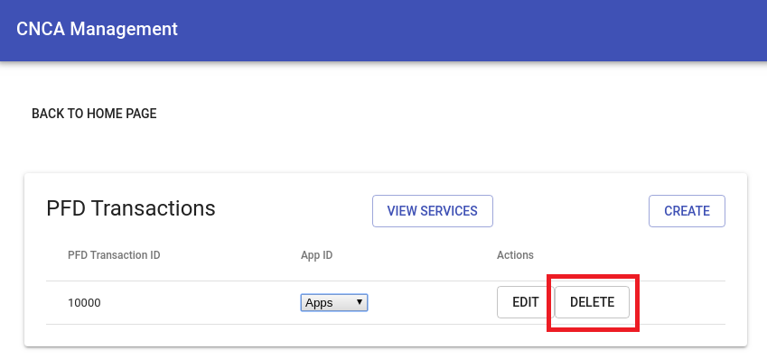

   * To delete a submitted edge PFD transaction application
      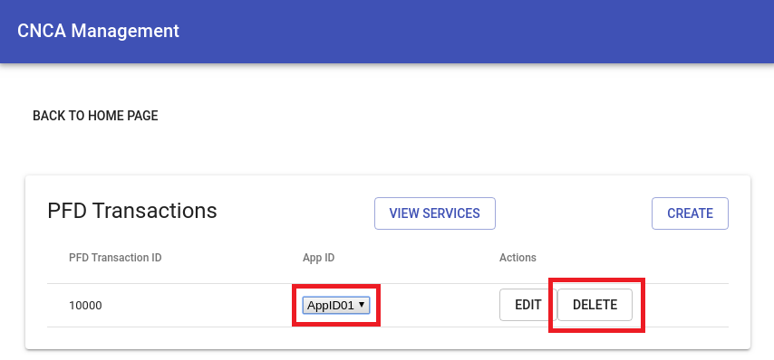

## Traffic Influence Subscription description

This sections describes the paramters that are used in the Traffic Influce subscription POST request. Groups mentioned as Mandatory needs te provided, in the absence of the Mandatory parameters a 400 response would be returned.

### Identification (Mandatory)
| Attribute name | Description                                                                                                                           |
| -------------- | ------------------------------------------------------------------------------------------------------------------------------------- |
| afTransId      | Identifies an NEF Northbound interface transaction, generated by the AF                                                               |
| self           | Link to this resource. This parameter shall be supplied by the NEF in HTTP POST responses, which is used by AF for further operations |

### Traffic Description Group (Mandatory)

| Attribute name | Description                                                           |
| -------------- | --------------------------------------------------------------------- |
| afServiceId    | Identifies a service on behalf of which the AF is issuing the request |
| dnn            | Identifies a DNN                                                      |
| snssai         | Identifies an S-NSSAI                                                 |

Note: One of afServiceId or dnn shall be included

| Attribute name    | Description                        |
| ----------------- | ---------------------------------- |
| afAppId           | Identifies an application          |
| trafficFilters    | Identifies IP packet filters       |
| ethTrafficFilters | Identifies Ethernet packet filters |

Note: One of "afAppId", "trafficFilters" or "ethTrafficFilters" shall be included

### Target UE Identifier (Mandatory)
| Attribute name  | Description                                                                                                                                 |
| --------------- | ------------------------------------------------------------------------------------------------------------------------------------------- |
| externalGroupId | Identifies a group of users                                                                                                                 |
| anyUeInd        | Identifies whether the AF request applies to any UE. This attribute shall set to "true" if applicable for any UE, otherwise, set to "false" |
| gpsi            | Identifies a user                                                                                                                           |
| ipv4Addr        | Identifies the IPv4 address                                                                                                                 |
| ipv6Addr        | Identifies the IPv6 address                                                                                                                 |
| macAddr         | Identifies the MAC address                                                                                                                  |

Note: One of individual UE identifier (i.e. "gpsi", "ipv4Addr", "ipv6Addr" or macAddr), External Group Identifier (i.e. "externalGroupId") or any UE indication "anyUeInd" shall be included

### Application Relocation (Optional)
| Attribute name | Description                                                                                                                                                                                                  |
| -------------- | ------------------------------------------------------------------------------------------------------------------------------------------------------------------------------------------------------------ |
| appReloInd     | Identifies whether an application can be relocated once a location of the application has been selected. Set to "true" if it can be relocated; otherwise set to "false". Default value is "false" if omitted |

### Traffic Routing (Optional)
| Attribute name | Description                                   |
| -------------- | --------------------------------------------- |
| trafficRoutes  | Identifies the N6 traffic routing requirement |

### Spatial Validity (Optional)
| Attribute name  | Description                                                                                                         |
| --------------- | ------------------------------------------------------------------------------------------------------------------- |
| validGeoZoneIds | Identifies a geographic zone that the AF request applies only to the traffic of UE(s) located in this specific zone |

### Temporal Validity (Optional)
| Attribute name | Description                                                                 |
| -------------- | --------------------------------------------------------------------------- |
| tempValidities | Indicates the time interval(s) during which the AF request is to be applied |

### UPF Event Notifications (Optional)
| Attribute name          | Description                                                                                                                  |
| ----------------------- | ---------------------------------------------------------------------------------------------------------------------------- |
| subscribedEvents        | Identifies the requirement to be notified of the event(s)                                                                    |
| dnaiChgType             | Identifies a type of notification regarding UP path management event                                                         |
| notificationDestination | Contains the Callback URL to receive the notification from the NEF. It shall be present if the "subscribedEvents" is present |

### AF to NEF specific (Optional)
| Attribute name          | Description                                                                                                                                                                                                                                             |
| ----------------------- | ------------------------------------------------------------------------------------------------------------------------------------------------------------------------------------------------------------------------------------------------------- |
| suppFeat                | Indicates the list of Supported features used as described in subclause 5.4.4. This attribute shall be provided in the POST request and in the response of successful resource creation. Values 1 - Notification_websocket 2 -  Notification_test_event |
| requestTestNotification | Set to true by the AF to request the NEF to send a test notification as defined in subclause 5.2.5.3 of 3GPP TS 29.122 [4]. Set to false or omitted otherwise                                                                                           |
| websockNotifConfig      | Configuration parameters to set up notification delivery over Websocket protocol                                                                                                                                                                        |

## Packet Flow Description transaction description

This sections describes the parameters that are used in the Packet flow description POST request. Groups mentioned as Mandatory needs to be provided, in the absence of the Mandatory parameters a 400 response would be returned.

| Attribute name   | Mandatory | Description                                                                                                                            |
| ---------------- | --------- | -------------------------------------------------------------------------------------------------------------------------------------- |
| externalAppID    | Yes       | Unique Application identifier of a PFD                                                                                                 |
| Allowed Delay    | No        | Indicates that the list of PFDs in this request should be deployed within the time interval indicated by the Allowed Delay             |
| Caching Time     | No        | It shall be included when the allowed delayed cannot be satisfied, i.e. it is smaller than the caching time configured in fetching PFD |
| pfdId            | Yes       | Identifies a PFD of an application identifier.                                                                                         |
| flowDescriptions | NOTE      | Represents a 3-tuple with protocol, server ip and server port for UL/DL application traffic.                                           |
| Urls             | NOTE      | Indicates a URL or a regular expression which is used to match the significant parts of the URL.                                       |
| domainName       | NOTE      | Indicates an FQDN or a regular expression as a domain name matching criteria.                                                          |

  **NOTE:**
  One of the attribute of flowDescriptions, URls and domainName is mandatory.

## Policy Authorization Application Session Context description
This sections describes the parameters that are used in the AppSessionContextReqData part of Policy Authorization POST request. Groups mentioned as Mandatory needs to be provided, in the absence of the Mandatory parameters a 400 response would be returned.
| Attribute name | Mandatory   | Description                                                                                                                                                                                                                |
| -------------- | ----------- | -------------------------------------------------------------------------------------------------------------------------------------------------------------------------------------------------------------------------- |
| suppFeat       | Yes         | This provides a list of Supported features used as described Individual Application Session Context resource. Supported features are: (a)InfluenceOnTrafficRouting (b) SponsoredConnectivity (c) MediaComponentVersioning. |
| notifUri       | Yes         | Notification URI for Application Session Context termination requests.                                                                                                                                                     |
| afRoutReq      | Conditional | Indicates the AF traffic routing requirements. It shall be included if Influence on Traffic Routing feature is supported. Applicable when `suppFeat` indicates InfluenceOnTrafficRouting                                   |
| dnn            | Conditional | Data Network Name. Applicable when `suppFeat` indicates InfluenceOnTrafficRouting and `afRoutReq` is present                                                                                                               |
| aspId          | Conditional | Application service provider identity. It shall be included if "SponsoredConnectivity" feature is supported                                                                                                                |
| sponId         | Conditional | Sponsor identity. It shall be included if "SponsoredConnectivity" feature is supported.                                                                                                                                    |
| sponStatus     | Optional    | Indication of whether sponsored connectivity is enabled or disabled/not enabled                                                                                                                                            |
| contVer        | Conditional | Represents the content version of a media component.                                                                                                                                                                       |
| ueIpv4         | Optional    | The IPv4 address of the served UE.                                                                                                                                                                                         |
| ueIpv6         | Optional    | The IPv6 address of the served UE.                                                                                                                                                                                         |
| ueMac          | Optional    | The MAC address of the served UE.                                                                                                                                                                                          |
**NOTE:**
  Only one of the attribute of ueIpv4, ueIpv6 and ueMAC is mandatory.