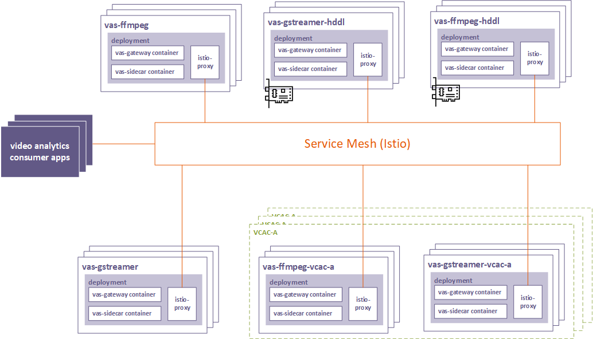
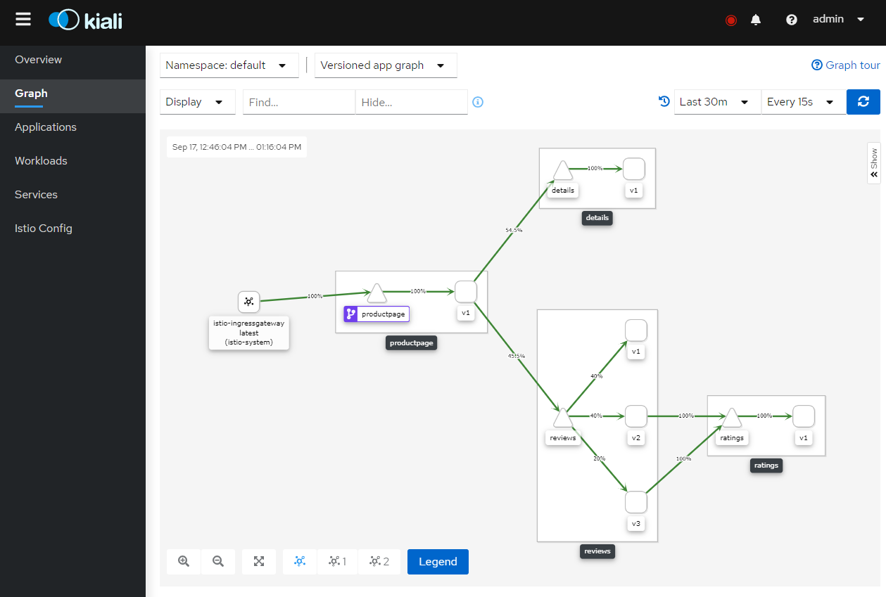
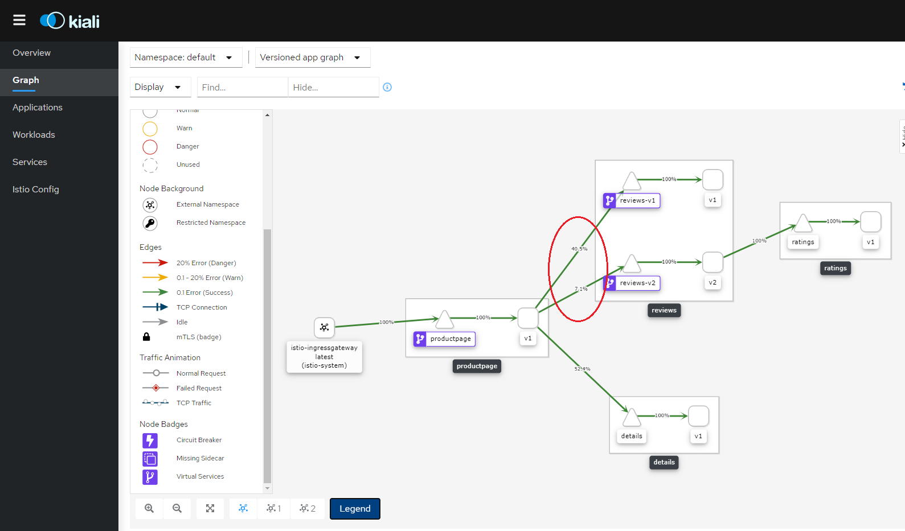
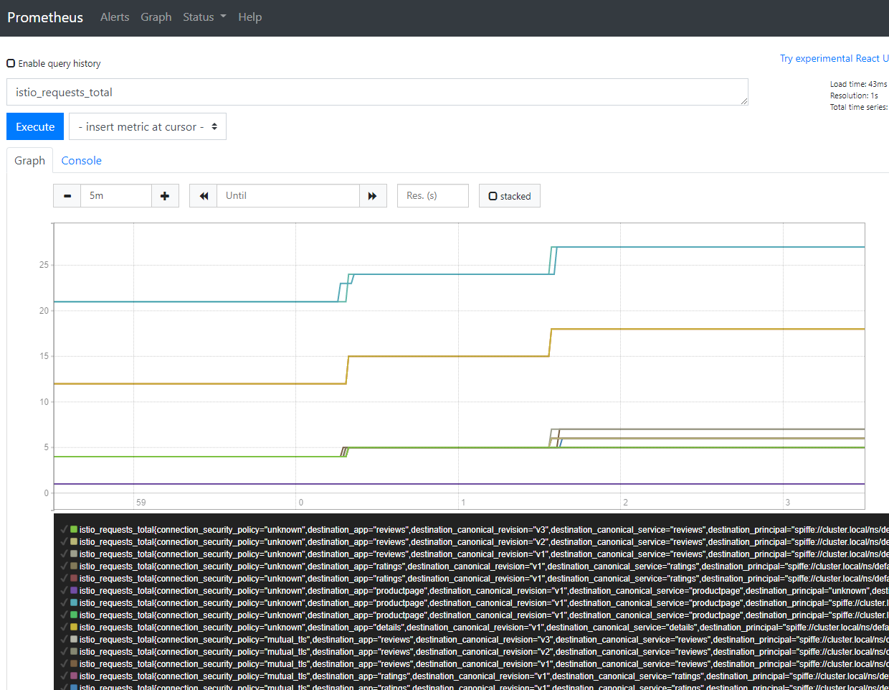
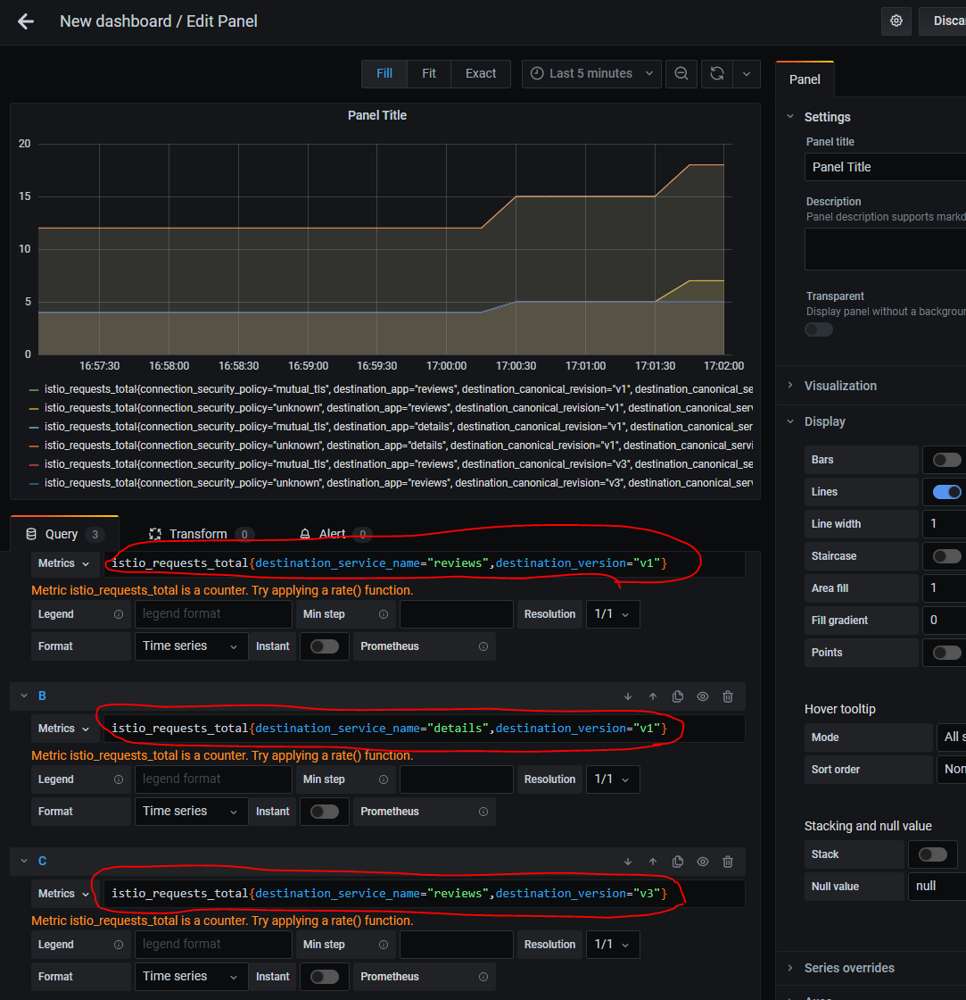
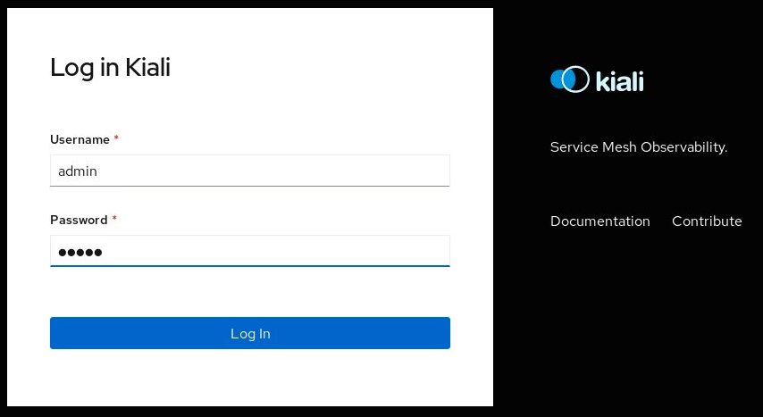

```text
SPDX-License-Identifier: Apache-2.0
Copyright (c) 2020 Intel Corporation
```
<!-- omit in toc -->
# Utilizing a Service Mesh for Edge Services in OpenNESS
- [Overview](#overview)
- [OpenNESS Service Mesh Enablement through Istio](#openness-service-mesh-enablement-through-istio)
- [Video Analytics Service Mesh](#video-analytics-service-mesh)
- [Video Analytics Service Mesh Deployment](#video-analytics-service-mesh-deployment)
- [Authentication, Authorization & Mutual TLS enforcement](#authentication-authorization--mutual-tls-enforcement)
- [Traffic Management](#traffic-management)
  - [External Access](#external-access)
  - [Load Balancing](#load-balancing)
  - [Canary Deployment](#canary-deployment)
- [Fault Injection](#fault-injection)
  - [Delays](#delays)
  - [Aborts](#aborts)
  - [Circuit Breaker](#circuit-breaker)
- [NGC Edge Control Plane Functions Enablement via OpenNESS Service Mesh](#ngc-edge-control-plane-functions-enablement-via-openness-service-mesh)
- [Prometheus, Grafana & Kiali integration](#prometheus-grafana--kiali-integration)
- [Getting Started](#getting-started)
  - [Enabling Service Mesh through the Service Mesh Flavor](#enabling-service-mesh-through-the-service-mesh-flavor)
  - [Enabling Service Mesh with the Media Analytics Flavor](#enabling-service-mesh-with-the-media-analytics-flavor)
  - [Enabling 5GC Service Mesh with the Core Control Plane Flavor](#enabling-5gc-service-mesh-with-the-core-control-plane-flavor)
- [References](#references)

## Overview

Service mesh acts as a middleware between the edge applications/services and the OpenNESS platform that provides abstractions for traffic management, observability, and security of the edge micro-services in the mesh.

In the native Kubernetes deployment, the services are orchestrated by the Kubernetes controller and the consumer applications must decide which service endpoint they need to reach out according to the services information broadcasted on the Edge Application Agent (EAA) bus.

With the Service Mesh approach, the applications do not decide which service endpoint it should reach. Instead, it requests a service name that is translated and load-balanced by the service mesh. The service mesh manages the traffic routing and the service scale-up and down behind the scenes, and it adds more capabilities to the mix such as tracing, monitoring, and logging.


## OpenNESS Service Mesh Enablement through Istio

[Istio](https://istio.io/) is a feature-rich, cloud-native service mesh platform that provides a collection of key capabilities such as: [Traffic Management](https://istio.io/latest/docs/concepts/traffic-management/), [Security](https://istio.io/latest/docs/concepts/security/) and [Observability](https://istio.io/latest/docs/concepts/observability/) uniformly across a network of services. OpenNESS integrates natively with the Istio service mesh to help reduce the complexity of large scale edge applications, services, and network functions. The Istio service mesh is deployed automatically through OpenNESS Experience Kits (OEK) with an option to onboard the media analytics services on the service mesh.

Istio mandates injecting [Envoy sidecars](https://istio.io/latest/docs/ops/deployment/architecture/#envoy) into the applications and services pods to become part of the service mesh. The Envoy sidecars intercept all inter-pod traffic, making it easy to manage, secure, and observe. Sidecar injection is automatically enabled to the `default` namespace in the OpenNESS cluster. This is done by applying the label `istio-injection=enabled` to the `default` namespace.


## Video Analytics Service Mesh

OpenNESS Video Analytics services enable third-party consumer applications running on OpenNESS to perform video analytics and inferencing workloads by consuming the Video Analytics Serving APIs as described in the [OpenNESS Video Analytics Services](./openness_va_services.md).

The proposed architecture with the video analytics use case is depicted in the graphic below:



_Figure - Video Analytics Service Mesh Architecture_

Multiple instances of video analytics services can be provisioned in the cluster. These services are deployed in multiple flavors based on the supported multimedia frameworks (FFmpeg\* and GStreamer\*) and the available acceleration (CPU, HDDL, and VCAC-A).

In each deployment, three containers are created:

- Video analytics serving gateway (VAS gateway): This is the actual video analytics serving container that exposes the consumable APIs for video analytics and inference.
- Video analytics serving sidecar (VAS sidecar): This is the sidecar that creates and registers the service with the EAA internal service registry.
- Envoy sidecar (istio-proxy): This is the sidecar proxy that is used for the service mesh plumbing. See [Envoy Sidecars](https://istio.io/latest/docs/ops/deployment/architecture/#envoy).

The service mesh framework takes care of provisioning, monitoring, and routing the traffic to various services endpoints.


## Video Analytics Service Mesh Deployment

The media analytics services can be automatically deployed on the Istio service mesh using the OEK. To do so, the entry `ne_istio_enable` in the file `flavors/media-analytics/all.yml` needs to be set to `true`. After running the `deploy.sh` script, the output should include the following pods in the `default` and `istio-system` namespaces on the cluster:

```shell
$ kubectl get pods -A
NAMESPACE      NAME                                                         READY   STATUS      RESTARTS   AGE
default        analytics-ffmpeg-684588bb9f-4c9n4                            3/3     Running     1          5m44s
default        analytics-gstreamer-5789c96cbd-qwksw                         3/3     Running     1          5m44s
...
istio-system   istio-ingressgateway-5bfc5c665-hshbn                         1/1     Running     0          17m
istio-system   istiod-8656df74b4-kp584                                      1/1     Running     0          18m
istio-system   kiali-d45468dc4-65btj                                        1/1     Running     0          17m
istio-system   smi-adapter-istio-54b7c99755-sxfgd                           1/1     Running     0          15m
...
```

With Istio enabled in the media analytics services flavor, Istio creates two new [Destination Rules](https://istio.io/latest/docs/concepts/traffic-management/#destination-rules) in the service mesh. These Destination Rules enable Mutual TLS for each service, which enforces the need for any client attempting to connect to the services via the service mesh to also use the Mutual TLS mode. This prevents any client not using Mutual TLS from connecting with any of the media analytics services pods on the service mesh.

```yaml
apiVersion: networking.istio.io/v1beta1
kind: DestinationRule
metadata:
  name: destination-rule-analytics-ffmpeg
  namespace: default
spec:
  host: analytics-ffmpeg
  trafficPolicy:
    tls:
      mode: ISTIO_MUTUAL
---
apiVersion: networking.istio.io/v1beta1
kind: DestinationRule
metadata:
  name: destination-rule-analytics-gstreamer
  namespace: default
spec:
  host: analytics-gstreamer
  trafficPolicy:
    tls:
      mode: ISTIO_MUTUAL
```


## Authentication, Authorization & Mutual TLS enforcement

Mutual TLS is enforced by default in OpenNESS to enable authentication of all applications and services onboarded on the mesh.

To prevent non-mutual TLS for the whole mesh, the following `PeerAuthentication` policy is automatically applied to the `default` namespace in the OpenNESS cluster. This policy instructs Istio to *strictly* set the mutual TLS between all mesh applications and services running in the `default` namespace.

```yaml
apiVersion: security.istio.io/v1beta1
kind: PeerAuthentication
metadata:
  name: default
  namespace: default
spec:
  mtls:
    mode: STRICT
```

With mutual TLS enabled, Istio is capable of applying authorization policies as designed by the cluster administrator. The below authentication policy is applied automatically by the video analytics service mesh. This policy instructs Istio to authorize *all the authenticated* applications to consume the `analytics-ffmpeg` service and to use its "GET", "POST", and "DELETE" methods.

```yaml
apiVersion: security.istio.io/v1beta1
kind: AuthorizationPolicy
metadata:
  name: allow-analytics-ffmpeg
  namespace: default
spec:
  selector:
    matchLabels:
      app: analytics-ffmpeg
  action: ALLOW
  rules:
  - from:
    - source:
        principals: ["*"]
        namespaces: ["default"]
    to:
    - operation:
        methods: ["GET", "POST", "DELETE"]
```

In this `AuthorizationPolicy`, the Istio service mesh will allow "GET", "POST", and "DELETE" requests from any authenticated applications from the `default` namespace only to be passed to the service. For example, if using the [Video Analytics sample application](https://github.com/otcshare/edgeapps/tree/master/applications/vas-sample-app), the policy will allow requests from the sample application to be received by the service as it is deployed in the `default` namespace. However, if the application is deployed in a different namespace (for example, the `openness` namespace mentioned above in the output from the Kubernetes cluster), then the policy will deny access to the service as the request is coming from an application on a different namespace.

> **NOTE**: The above `AuthorizationPolicy` can be tailored so that the OpenNESS service mesh *selectively* authorizes particular applications to consume premium video analytics services such as those accelerated using HDDL or VCAC-A cards.

## Traffic Management

Istio facilitates the traffic management between the services running in the mesh, which can be done either directly over Istio's API or through the [Service Mesh Interface (SMI)](https://smi-spec.io/) that is standardized across various service mesh implementations. The SMI adapter must be compatible with the service mesh implementation to work properly.

The following examples are based on the [BookInfo sample application](https://istio.io/latest/docs/examples/bookinfo/) that is shipped by default with the Istio software package. Deploying the BookInfo sample application turns up a couple of interconnected services as shown in this figure:



_Figure - Book Info Sample Application_

> **NOTE**: By default, the Istio deployment namespace in OpenNESS is set to the `default` Kubernetes namespace where all the ingress traffic to the cluster is blocked by the default network policy `block-all-ingress`. At the time of writing this document, the Kubernetes NetworkPolicy does not support specifying port ranges that are needed by the BookInfo sample application. Therefore, as a workaround, the user should remove the network policy of the `default` namespace.
> ```shell
> kubectl delete netpol block-all-ingress
> ```

### External Access

Accessing a service endpoint in the mesh from outside the cluster is achieved by deploying the [Ingress Gateway](https://istio.io/latest/docs/tasks/traffic-management/ingress/ingress-control/). The following `Gateway` specs are extracted from the sample [BookInfo Gateway](https://github.com/istio/istio/blob/master/samples/bookinfo/networking/bookinfo-gateway.yaml) to demonstrate the concept of Ingress Gateway:

```yaml
apiVersion: networking.istio.io/v1alpha3
kind: Gateway
metadata:
  name: bookinfo-gateway
spec:
  selector:
    istio: ingressgateway
  servers:
  - port:
      number: 80
      name: http
      protocol: HTTP
    hosts:
    - "*"
---
apiVersion: networking.istio.io/v1alpha3
kind: VirtualService
metadata:
  name: bookinfo
spec:
  hosts:
  - "*"
  gateways:
  - bookinfo-gateway
  http:
  - match:
    - uri:
        exact: /productpage
    - uri:
        prefix: /static
    - uri:
        exact: /login
    - uri:
        exact: /logout
    - uri:
        prefix: /api/v1/products
    route:
    - destination:
        host: productpage
        port:
          number: 9080
```

Now, the `BookInfo` web dashboard is accessible by any web browser at the address `http://<CONTROLLER_IP>:<GATEWAY_PORT>/productpage`. The `<GATEWAY_PORT>` is assigned dynamically and can be retrieved using the following command:

```shell
$ kubectl -n istio-system get service istio-ingressgateway -o jsonpath='{.spec.ports[?(@.name=="http2")].nodePort}'
```


_Figure - BookInfo Application Main Page_

### Load Balancing

Istio provides load balancing functionality to spread access to multiple service instances (different versions or replicas of the same version). There are two types of load balancers:
* `simple`, which consists of the following variants: `RANDOM`, `ROUND_ROBIN`, and `LEAST_CONN`, or
* `consistentHash`, while the `simple` constantly changes the reachable service instance according to a chosen algorithm, the `consistentHash` allows users to keep accessing the same service based on the consumer IP address or a magic keyword in the request header.

Round-robin load-balancer:

```yaml
apiVersion: networking.istio.io/v1alpha3
kind: DestinationRule
metadata:
  name: bookinfo-load-balancer
spec:
  host: reviews
  trafficPolicy:
    loadBalancer:
      simple: ROUND_ROBIN
```

Random load-balancer:

```yaml
apiVersion: networking.istio.io/v1alpha3
kind: DestinationRule
metadata:
  name: bookinfo-load-balancer
spec:
  host: reviews
  trafficPolicy:
    loadBalancer:
      simple: RANDOM
```

Load-balancer based on service consumer IP address:

```yaml
apiVersion: networking.istio.io/v1alpha3
kind: DestinationRule
metadata:
  name: bookinfo-load-balancer
spec:
  host: reviews
  trafficPolicy:
    loadBalancer:
      consistentHash:
        useSourceIp: true
```

### Canary Deployment

Canary deployment is a technique to reduce the risk of introducing a new service version in production by gradually routing a percentage of the traffic to the new service instance before rolling it out to the entire service mesh and making it available to full consumption.
This can be done with `TrafficSplit` structure according to the following example. The traffic is routed with a ratio of 5:1 between `reviews-v1` and `reviews-v2` back-end services:

```yaml
apiVersion: split.smi-spec.io/v1alpha2
kind: TrafficSplit
metadata:
  name: reviews-rollout
spec:
  service: reviews
  backends:
  - service: reviews-v1
    weight: 5
  - service: reviews-v2
    weight: 1
```



_Figure - Canary Deployment with TrafficSplit_


## Fault Injection

Fault injection, in the context of Istio, is a mechanism by which failures can be purposefully injected into the service mesh to mimic how an application would behave in case failures or degradations are encountered. Application developers and cluster administrators can programmatically inject faults at the application layer instead of killing pods, delaying packets, or corrupting packets at the TCP layer. Istio provisions various APIs to perform fault injections such as delays, aborts, and circuit breakers to the application micro-services deployed in the OpenNESS cluster and to verify their resiliency.

### Delays

Delays are timing failures such as network latency or overloaded upstreams. A sample rule for traffic delaying coming from the test user `<username>` can be injected by applying the following specification:

```yaml
apiVersion: networking.istio.io/v1beta1
kind: <service-name>
...
spec:
  hosts:
  - ratings
  http:
  - fault:
      delay:
        fixedDelay: 7s
        percentage:
          value: 100
    match:
    - headers:
        end-user:
          exact: jason
    route:
    - destination:
        host: ratings
        subset: v1
```

### Aborts

Aborts are crash failures such as HTTP error codes or TCP connection failures. Creating a fault injection rule for an HTTP abort is done by applying the following specification:

```yaml
apiVersion: networking.istio.io/v1beta1
kind: <service-name>
...
spec:
  hosts:
  - ratings
  http:
  - fault:
      abort:
        httpStatus: 500
        percentage:
          value: 100
    match:
    - headers:
        end-user:
          exact: jason
    route:
    - destination:
        host: ratings
        subset: v1
  - route:
    - destination:
        host: ratings
        subset: v1
```

### Circuit Breaker

A simple circuit breaker can be set based on criteria for several failed connections or request limits. Creating a circuit breaker rule to limit the number of connections to a service is done by applying the following specification:

```yaml
destination: reviews.default.svc.cluster.local
tags:
  version: v1
circuitBreaker:
  simpleCb:
    maxConnections: 100
```

## NGC Edge Control Plane Functions Enablement via OpenNESS Service Mesh

The Next-Gen Core (NGC) edge control plane functions are enabled via the OpenNESS service mesh as depicted in the graphic below. 

The NGC functions—Application Function (AF), Network Exposure Function (NEF) and Operations, Administration and Maintenance (OAM)—are hosted on the service mesh where the externally exposed APIs of AF and OAM are accessible through the Ingress Gateway. All inter-function communications are secured with mutual TLS enabled. The rest of the NGC Network Functions externally reachable outside the OpenNESS cluster. More details on the NGC architecture can be found in the [Edge Cloud Deployment with 3GPP 5G](../core-network/openness_ngc.md) document.


_Figure - Service Mesh for NGC_

When the Istio service mesh is enabled for the `ngc` namespace, the NGC functions (AF, NEF, and OAM) are deployed with the `istio-proxy` sidecar injected into their pods. Accordingly, all the traffic routed towards the NGC function pods is intercepted by the sidecar proxy as described in the following sections.

**Traffic flow: Client → Istio Gateway**

To access NGC function API’s (AF and OAM), the client request to the server using the hostname (`afservice`, `oamservice`) along with the port number exposed by the ingress gateway. Based on the Host header, traffic is forwarded to either AF or OAM container. Mutual TLS between gateway and client is enabled by default. The certificates for enabling mutual TLS is managed using `kubectl secret`. The following command adds the `server-cert.pem`, `server-key.pem`, and `root-ca-cert.pem` to the kubectl secret, which is used while creating istio ingress gateway.

```shell
$ kubectl create secret generic ngc-credential -n istio-system \
      --from-file=tls.key=/etc/openness/certs/ngc/server-key.pem \
      --from-file=tls.crt=/etc/openness/certs/ngc/server-cert.pem \
      --from-file=ca.crt=/etc/openness/certs/ngc/root-ca-cert.pem
```

The `root-ca-cert.pem` is used to validate client certificates while the `server-cert.pem` and `server-key.pem` are used for providing server authentication and encryption. This below policy creates istio gateway with mutual TLS while using the `ngc-credential` secret created above.

```yaml
apiVersion: networking.istio.io/v1alpha3
kind: Gateway
metadata:
  name: ngc-ingress-gateway
spec:
  selector:
    istio: ingressgateway
  servers:
  - port:
      number: 443
      name: https
      protocol: HTTPS
    tls:
      mode: MUTUAL
      credentialName: ngc-credential
    hosts:
    - afservice
  - port:
      number: 443
      name: https
      protocol: HTTPS
    tls:
      mode: MUTUAL
      credentialName: ngc-credential
    hosts:
    - oamservice
```

The above gateway can be configured to either use HTTP2 without TLS, HTTP2 with simple TLS, or HTTP2 with mutual TLS by changing value of `port.protocol` (HTTPS/HTTP/HTTP2) and `tls.mode` (SIMPLE, MUTUAL). Istio upgrades the traffic to HTTP2 by default if supported by the client. An istio virtual service `ngc-vs` is also created, which defines the routes from istio-ingress-gateway.

**Traffic flow: Istio Ingress gateway → Istio-proxy (AF/OAM pods)**

Istio ingress gateway after performing TLS handshake forwards the client request to `afservice/oamservice`, which is intercepted by the istio-proxy attached to the corresponding service.

**Traffic flow: Between Istio-proxy and Microservices (AF/OAM/NEF/CNTF)**

Microservice handles the incoming and outgoing requests. A request made by the service is intercepted by the istio-proxy, which performs encryption (mutual TLS) and forwards the request to the server. An incoming request to the microservice is intercepted by the istio-proxy, which decrypts the traffic and forwards it to the actual service container. Any decryption/encryption and client/server validation is performed by the istio-proxy only.

**Traffic Flow: Between different istio-proxy containers**

The traffic between the istio-proxy containers is fully encrypted by using mutual TLS. The below policy enforces mutual TLS for the traffic between different istio-proxy.

```yaml
apiVersion: security.istio.io/v1beta1
kind: PeerAuthentication
metadata:
  name: ngc-mtls
  namespace: ngc
spec:
  mtls:
    mode: STRICT
```

Every workload in `ngc` namespace that has the `istio-proxy` sidecar attached is enforced to use mutual TLS. Any entity cannot access 5G APIs without authenticating via istio-proxy.


## Prometheus, Grafana & Kiali integration

Prometheus\* and Grafana\* are deployed in OpenNESS platform as part of the [Telemetry support in OpenNESS](../enhanced-platform-awareness/openness-telemetry.md) and are integrated with the Istio service mesh. When enabled in OpenNESS, Istio's scraping endpoints are added to the Prometheus configuration file according to the [Prometheus configuration guide](https://istio.io/latest/docs/ops/integrations/prometheus/).

Istio related metrics can be viewed on Grafana\* dashboard by defining a filtration criteria such as `istio_requests_total` that displays all requests made through the service mesh. It can be narrowed down to a specific service version e.g: `istio_requests_total{destination_service_name="reviews",destination_version="v1"}` as shown in the following figure. The same approach can be done on Prometheus\* dashboard. More details can be found in the [Grafana](../enhanced-platform-awareness/openness-telemetry.md#grafana) section.


_Figure - Grafana example metric rule for Istio_

Kiali is deployed alongside Istio. More details on accessing the Kiali dashboard are covered in the [Getting Started](#getting-started) section.

When a properly configured Istio can provide Prometheus and Grafana with telemetry data. Examples showing how many times `BookInfo` micro-services were accessed.

Prometheus - all elements:



_Figure - Istio Telemetry with Prometheus_

Grafana - only stats only for specific services: `details`, `reviews-v1`, and `reviews-v3`



_Figure - Istio Telemetry with Grafana_

## Getting Started

### Enabling Service Mesh through the Service Mesh Flavor

Istio service mesh can be deployed with OpenNESS using the OEK through the pre-defined *service-mesh* flavor as described in [Service Mesh Flavor](../flavors.md#service-mesh-flavor) section. Istio is installed with `default` profile by default (for Istio installation profiles refer to: https://istio.io/latest/docs/setup/additional-setup/config-profiles/). 
The Istio management console, [Kiali](https://kiali.io/), is deployed alongside Istio with the default credentials: 

* Username: `admin`
* Password: `admin`
* Nodeport set to `30001`

Prometheus and Grafana are deployed in the OpenNESS platform as part of the telemetry role and are integrated with the Istio service mesh.

To verify if Istio resources are deployed and running, use the following command:

```shell
$kubectl get deployments,pods,serviceaccounts -n istio-system
NAME                                   READY   UP-TO-DATE   AVAILABLE   AGE
deployment.apps/istio-ingressgateway   1/1     1            1           2d21h
deployment.apps/istiod                 1/1     1            1           2d21h
deployment.apps/kiali                  1/1     1            1           2d21h
deployment.apps/smi-adapter-istio      1/1     1            1           2d21h
NAME                                       READY   STATUS    RESTARTS   AGE
pod/istio-ingressgateway-5bfc5c665-xl6tb   1/1     Running   0          2d21h
pod/istiod-8656df74b4-lfngv                1/1     Running   0          2d21h
pod/kiali-d45468dc4-448cg                  1/1     Running   0          2d21h
pod/smi-adapter-istio-54b7c99755-mllvx     1/1     Running   0          2d21h
NAME                                                  SECRETS   AGE
serviceaccount/default                                1         2d21h
serviceaccount/istio-ingressgateway-service-account   1         2d21h
serviceaccount/istio-reader-service-account           1         2d21h
serviceaccount/istiod-service-account                 1         2d21h
serviceaccount/kiali-service-account                  1         2d21h
serviceaccount/smi-adapter-istio                      1         2d21h
```

During Istio deployment, the `default` namespace is labeled with `istio-injection=enabled`

```shell
$kubectl describe ns default
Name:         default
Labels:       istio-injection=enabled
Annotations:  ovn.kubernetes.io/cidr: 10.16.0.0/16
              ovn.kubernetes.io/exclude_ips: 10.16.0.1
              ovn.kubernetes.io/logical_switch: ovn-default
Status:       Active
```

Users can change the namespace labeled with istio label using the parameter `istio_deployment_namespace`
* in `flavors/service-mesh/all.yml` for deployment with service-mesh flavor
* in `flavors/media-analytics/all.yml` for deployment with media-analytics flavor

> **NOTE**: The default OpenNESS network policy applies to pods in the `default` namespace and blocks all ingress traffic. Users must remove the default policy and apply custom network policy when deploying applications in the `default` namespace. Refer to the [Kubernetes NetworkPolicies](https://github.com/otcshare/specs/blob/master/doc/applications-onboard/network-edge-applications-onboarding.md#applying-kubernetes-network-policies) for an example policy allowing ingress traffic from `192.168.1.0/24` subnet on a specific port.

Kiali console is accessible from a browser using `http://<CONTROLLER_IP>:30001` and credentials defined in OpenNESS Experience Kits:



_Figure - Kiali Dashboard Login_

### Enabling Service Mesh with the Media Analytics Flavor

The Istio service mesh is not enabled by default in OpenNESS. It can be installed alongside the video analytics services by setting the flag `ne_istio_enable` to `true` in the *media-analytics* flavor. The media analytics services are installed with the OpenNESS service mesh through the OEK playbook as described in the [Media Analytics](../flavors.md#media-analytics-flavor) section.

### Enabling 5GC Service Mesh with the Core Control Plane Flavor

The Istio service mesh is integrated with the NGC core control plane and can be deployed through the pre-defined *core-cplane* deployment flavor in OEK playbook as described in the [Core Control Plane Flavor](../flavors.md#core-control-plane-flavor) section. The Istio service mesh flag `ne_istio_enable` is enabled by default.

## References

- [Istio Service Mesh](https://istio.io/)
- [Service Mesh Interface](https://smi-spec.io/)
- [OpenNESS Video Analytics Services](./openness_va_services.md)
- [Edge Cloud Deployment with 3GPP 5G](../core-network/openness_ngc.md)
