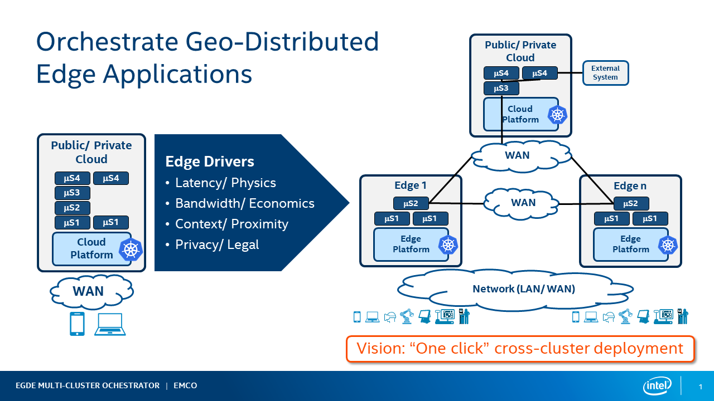
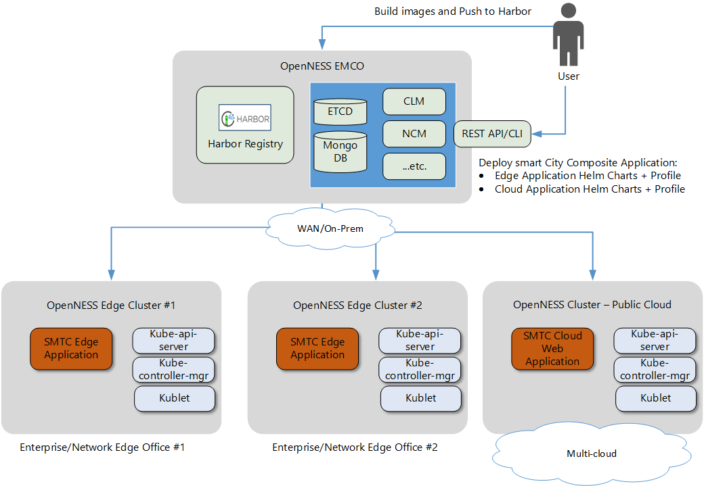
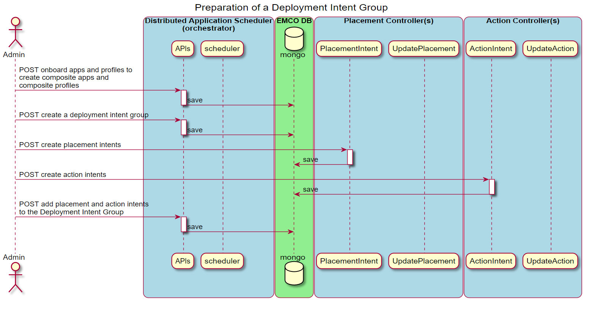
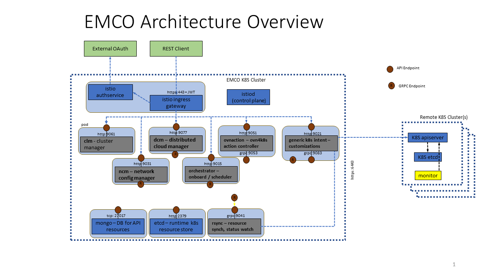
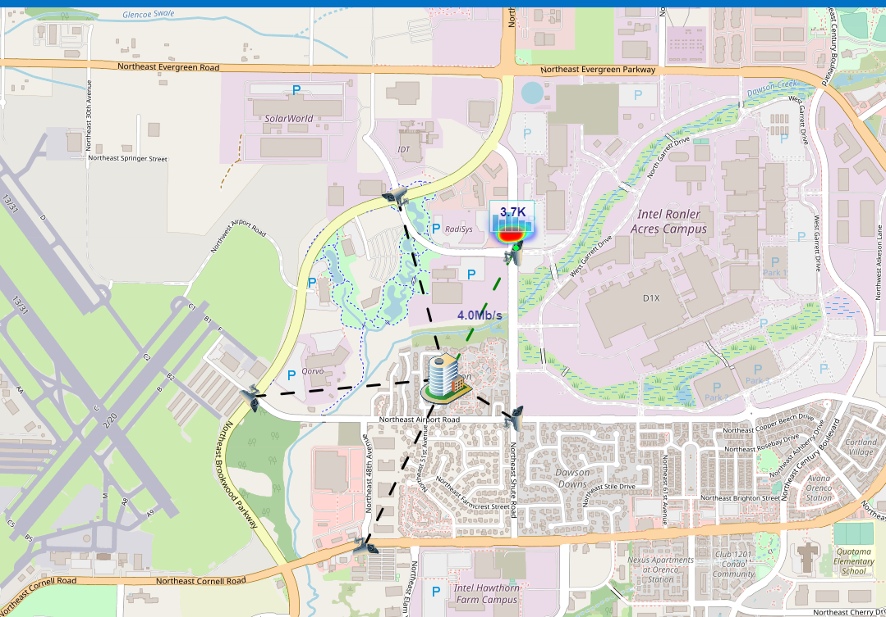
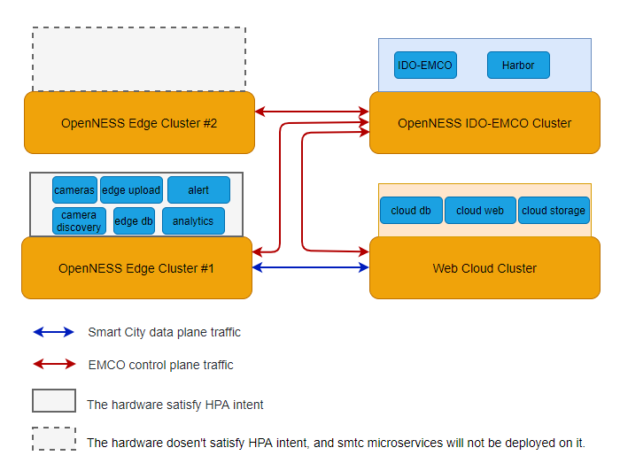

```text
SPDX-License-Identifier: Apache-2.0       
Copyright (c) 2020-2021 Intel Corporation
```
<!-- omit in toc -->
# Edge Multi-Cluster Orchestrator (EMCO)

- [Background](#background)
- [EMCO Introduction](#emco-introduction)
  - [EMCO Terminology](#emco-terminology)
  - [EMCO Architecture](#emco-architecture)
    - [Cluster Registration](#cluster-registration)
    - [Distributed Application Scheduler](#distributed-application-scheduler)
      - [Lifecycle Operations](#lifecycle-operations)
    - [Network Configuration Management](#network-configuration-management)
      - [Lifecycle Operations](#lifecycle-operations-1)
    - [Distributed Cloud Manager](#distributed-cloud-manager)
      - [Lifecycle Operations](#lifecycle-operations-2)
      - [Level-1 Logical Clouds](#level-1-logical-clouds)
      - [Level-0 Logical Clouds](#level-0-logical-clouds)
    - [OVN Action Controller](#ovn-action-controller)
    - [Traffic Controller](#traffic-controller)
    - [Generic Action Controller](#generic-action-controller)
    - [Resource Synchronizer](#resource-synchronizer)
    - [Placment and Action Controllers in EMCO](#placment-and-action-controllers-in-emco)
    - [Status Monitoring and Queries in EMCO](#status-monitoring-and-queries-in-emco)
  - [EMCO Terminology](#emco-terminology-1)
  - [EMCO API](#emco-api)
  - [EMCO Authentication and Authorization](#emco-authentication-and-authorization)
  - [EMCO Installation With OpenNESS Flavor](#emco-installation-with-openness-flavor)
- [EMCO Example: SmartCity Deployment](#emco-example-smartcity-deployment)
  - [Cluster Setup](#cluster-setup)
  - [Project Setup](#project-setup)
  - [Logical Cloud Setup](#logical-cloud-setup)
  - [Deploy SmartCity Application](#deploy-smartcity-application)
  - [SmartCity Termination](#smartcity-termination)
  - [Deploy SmartCity Application With HPA Intent](#smartcity-deploy-hpa-intent)

## Background
Edge Multi-Cluster Orchestration(EMCO), an OpenNESS Building Block, is a Geo-distributed application orchestrator for Kubernetes\*. EMCO operates at a higher level than Kubernetes\* and interacts with multiple of edges and clouds running Kubernetes. The main objective of EMCO is automation of the deployment of applications and services across multiple clusters. It acts as a central orchestrator that can manage edge services and network functions across geographically distributed edge clusters from different third parties. 

Increasingly we see a requirement of deploying 'composite applications' in multiple geographical locations. Some of the catalysts for this change are:

-  Latency - requirements for new low latency application use cases such as AR/VR. Need for ultra low latency response needed in IIOT and other cases. This requires running some parts of the applications on edges close to the user 
-  Bandwidth - processing data on edges to avoid costs associated with transporting the data to clouds for processing, 
-  Context/Promixity - running some part of the applications on edges near the user that require local context 
-  Privacy/Legal - some data can have legal requirements to not leave a geographic location


_Figure 1 - Orchestrate GeoDitributed Edge Applications_

> **NOTE**: A 'composite application' is a combination of multiple applications with each application packaged as a Helm chart. Based on the deployment intent, various applications of the composite application get deployed at various locations, and get replicated in multiple locations.

Life cycle management of composite applications is complex. Instantiation and terminations of the complex application across multiple K8s clusters (Edges and Clouds), monitoring the status of the complex application deployment, Day 2 operations (Modification of the deployment intent, upgrades etc..) are few complex operations. 

Number of K8s clusters (Edges or clouds) could be in tens of thousands, number of complex applications that need to be managed could be in hundreds, number of applications in a complex application could be in tens and number of micro-services in each application of the complex application can be in tens. Moreover, there can be multiple deployments of the same complex applications for different purposes. To reduce the complexity, all these operations are to be automated. There shall be one-click deployment of the complex applications and one simple dashboard to know the status of the complex application deployment at any time. Hence, there is a need for Multi-Edge and Multi-Cloud distributed application orchestrator.
 
Compared with other multiple-clusters orchestration, EMCO focuses on the following functionalities:
- Enrolling multiple geographically distributed OpenNESS clusters and third party cloud clusters.
- Orchestrating composite applications (composed of multiple individual applications) across different clusters.
- Deploying edge services and network functions on to different nodes spread across different clusters.
- Monitoring the health of the deployed edge services/network functions across different clusters.
- Orchestrating edge services and network functions with deployment intents based on compute, acceleration, and storage requirements.
- Supporting multiple tenants from different enterprises while ensuring confidentiality and full isolation between the tenants.


The following figure shows the topology overview for the OpenNESS EMCO orchestration with edge and multiple clusters. It also shows an example of deploying SmartCity with EMCO. 


_Figure 2 - Topology Overview with OpenNESS EMCO_

All the managed edge clusters and cloud clusters are connected with the EMCO cluster through the WAN network. 
- The central orchestration (EMCO) cluster can be installed and provisioned by using the [OpenNESS Central Orchestrator Flavor](../../flavors.md). 
- The edge clusters and the cloud cluster can be installed and provisioned by using the [OpenNESS Flavor](../../flavors.md). 
- The composite application - [SmartCity](https://github.com/OpenVisualCloud/Smart-City-Sample) is composed of two parts: edge application and cloud (web) application. 
  - The edge application executes media processing and analytics on multiple edge clusters to reduce latency.
  - The cloud application is like a web application for additional post-processing, such as calculating statistics and display/visualization on the cloud cluster side.
  - The EMCO user can deploy the SmartCity applications across the clusters. Besides that, EMCO allows the operator to override configurations and profiles to satisfy deployment needs.

This document aims to familiarize the user with EMCO and [OpenNESS deployment flavor](../../flavors.md) for EMCO installation and provision, and provide instructions accordingly.

## EMCO Introduction

### EMCO Terminology

| Term | Description |
|:-----: | ----- | 
| AppContext | <p>The AppContext is a set of records maintained in the EMCO etcd data store which maintains the collection of resources and clusters associated with a deployable EMCO resource (e.g. Deployment Intent Group)..</p>|
| Cluster Provider | <p>The provider is someone who owns clusters and registers them.</p>|
| Projects | <p>The project resource provides means for a collection of applications to be grouped. Several applications can exist under a specific project. Projects allows for grouping of applications under a common tenant to be defined.</p>|
| Composite application | <p>The composite application is combination of multiple applications. Based on the deployment intent, various applications of the composite application get deployed at various locations. Also, some applications of the composite application get replicated in multiple locations. </p>|
| Deployment Intent | <p>EMCO does not expect the editing of Helm charts provided by application/Network-function vendors by DevOps admins. Any customization and additional K8s resources that need to be present with the application are specified as deployment intents. </p>|
| Deployment Intent Group | <p>The Deployment Intent Group represents an instance of a composite application that can be deployed with a specified composite profile and a specified set of deployment intents which will control the placement and other configuration of the application resources. </p>|
| Placement | <p>EMCO supports to create generic placement intents for a given composite application. Normally, EMCO scheduler calls placement controllers first to figure out the edge/cloud locations for a given application. Finally, it works with 'resource synchronizer & status collector' to deploy K8s resources on various Edge/Cloud clusters. </p>|

### EMCO Architecture
The following diagram depicts a high level overview of the EMCO architecture.


_Figure 3 - EMCO Architecture_

- Cluster Registration Controller registers clusters by cluster owners.
- Distributed Application Scheduler provides a simplified and extensible placement.
- Network Configuration Management handles creation/management of virtual and provider networks.
- Hardware Platform Aware Controller enables scheduling with auto-discovery of platform features/ capabilities.
- Distributed Cloud Manager presents a single logical cloud from multiple edges.
- Secure Mesh Controller auto-configures both service mesh (ISTIO) and security policy (NAT, firewall).
- Secure WAN Controller automates secure overlays across edge groups.
- Resource Syncronizer manages instantiation of resources to clusters.
- Monitoring covers distributed application.

#### Cluster Registration
A microservice exposes RESTful API. User can register cluster providers and clusters of those providers via these APIs. After preparing edge clusters and cloud clusters, which can be any Kubernetes\* cluster, user can onboard those clusters to EMCO by creating a cluster provider and then adding clusters to the cluster provider. After cluster providers are created, the KubeConfig files of edge and cloud clusters should be provided to EMCO as part of the multi-part POST call to the Cluster API. 

Additionally, after a cluster is created, labels and key value pairs can be added to the cluster via the EMCO API. Clusters can be specified by label when preparing placement intents.
> **NOTE**: The cluster provider is someone who owns clusters and registers them to EMCO. If an Enterprise has clusters, for example from AWS, then the cluster provider for those clusters from AWS is still considered as from that Enterprise. AWS is not the provider. Here, the provider is someone who owns clusters and registers them here. Since AWS does not register their clusters here, AWS is not considered cluster provider in this context.

#### Distributed Application Scheduler
The distributed application scheduler microservice:
- Project Management provides multi-tenancy in the application from a user perspective.
- Composite App Management manages composite apps that are collections of Helm Charts, one per application.
- Composite Profile Management manages composite profiles that are collections of profile, one per application.
- Deployment Intent Group Management manages Intents for composite applications.
- Controller Registration manages placement and action controller registration, priorities etc.
- Status Notifier framework allows user to get on-demand status updates or notifications on status updates.
- Scheduler: 
  - Placement Controllers: Generic Placement Controller. 
  - Action Controllers.

##### Lifecycle Operations
The Distributed Application Scheduler supports operations on a deployment intent group resource to instantiate the associated composite application with any placement, and action intents performed by the registered placement and action controllers. The basic flow of lifecycle operations on a deployment intent group after all the supporting resources have been created via the APIs are:
- approve: marks that the deployment intent group has been approved and is ready for instantiation.
- instantiate: the Distributed Application Scheduler prepares the application resourcs for deployment, and applies placement and action intents before invoking the Resource Synchronizer to deploy them to the intended remote clusters.
- status: (may be invoked at any step) provides information on the status of the deployment intent group.
- terminate: terminates the application resources of an instantiated application from all of the clusters to which it was deployed. In some cases, if a remote cluster is intermittently unreachable, the instantiate operation may still retry the instantiate operation for that cluster. The terminate operation will cause the instantiate operation to complete (i.e. fail), before the termination operation is performed.
- stop: In some cases, if the remote cluster is intermittently unreachable, the Resource Synchronizer will continue retrying an instantiate or terminate operation. The stop operation can be used to force the retry operation to stop, and the instantiate or terminate  operation will complete (with a failed status). In the case of terminate, this allows the deployment intent group resource to be deleted via the API, since deletion is prevented until a deployment intent group resource has reached a completed terminate operation status.
Refer to [EMCO Resource Lifecycle Operations](https://github.com/otcshare/EMCO/tree/main/docs/user/Resource_Lifecycle.md) for more details.

#### Network Configuration Management
The network configuration management (NCM) microservice:
- Provider Network Management to create provider networks. 
- Virtual Network Management to create dynamic virtual networks. 
- Controller Registration manages network plugin controllers, priorities etc.
- Status Notifier framework allows user to get on-demand status updates or notifications on status updates.
- Scheduler with Built in Controller - OVN-for-K8s-NFV Plugin Controller.

##### Lifecycle Operations
The Network Configuration Management microservice supports operations on the network intents of a cluster resource to instantiate the associated provider and virtual networks that have been defined via the API for the cluster. The basic flow of lifecycle operations on a cluster, after all the supporting network resources have been created via the APIs are:
- apply: the Network Configuration Management microservice prepares the network resources and invokes the Resource Synchronizer to deploy them to the designated cluster.
- status: (may be invoked at any step) provides information on the status of the cluster networks.
- terminate: terminates the network resources from the cluster to which they were deployed. In some cases, if a remote cluster is intermittently unreachable, the Resource Synchronizer may still retry the instantiate operation for that cluster. The terminate operation will cause the instantiate operation to complete (i.e. fail), before the termination operation is performed.
- stop: In some cases, if the remote cluster is intermittently unreachable, the Resource Synchronizer will continue retrying an instantiate or terminate operation. The stop operation can be used to force the retry operation to stop, and the instantate or terminate  operation will be completed (with a failed status). In the case of terminate, this allows the deployment intent group resource to be deleted via the API, since deletion is prevented until a deployment intent group resource has reached a completed terminate operation status.

#### Distributed Cloud Manager
The Distributed Cloud Manager (DCM) provides the Logical Cloud abstraction and effectively completes the concept of "multi-cloud". One Logical Cloud is a grouping of one or many clusters, each with their own control plane, specific configurations and geo-location, which get partitioned for a particular EMCO project. This partitioning is made via the creation of distinct, isolated namespaces in each of the Kubernetes\* clusters that thus make up the Logical Cloud.

A Logical Cloud is the overall target of a Deployment Intent Group and is a mandatory parameter (the specific applications under it further refine what gets run and in which location). A Logical Cloud must be explicitly created and instantiated before a Deployment Intent Group can be instantiated.

Due to the close relationship with Clusters, which are provided by Cluster Registration (clm) above, it is important to understand the mapping between the two. A Logical Cloud groups many Clusters together but a Cluster may also be grouped by multiple Logical Clouds, effectively turning the cluster multi-tenant. The partitioning/multi-tenancy of a particular Cluster, via the different Logical Clouds, is done today at the namespace level (different Logical Clouds access different namespace names, and the name is consistent across the multiple clusters of the Logical Cloud).


_Figure 4 - Mapping between Logical Clouds and Clusters_

##### Lifecycle Operations
Prerequisites to using Logical Clouds:
* with the project-less Cluster Registration API, create the cluster providers, clusters and optionally cluster labels.
* with the Distributed Application Scheduler API, create a project which acts as a tenant in EMCO.

The basic flow of lifecycle operations to get a Logical Cloud up and running via the Distributed Cloud Manager API is:
* Create a Logical Cloud specifying the following attributes:
  - Level: either 1 or 0, depending on whether an admin or a custom/user cloud is sought - more on the differences below.
  - (*for Level-1 only*) Namespace name - the namespace to use in all of the Clusters of the Logical Cloud.
  - (*for Level-1 only*) User name - the name of the user that will be authenticating to the Kubernetes\* APIs to access the namespaces created.
  - (*for Level-1 only*) User permissions - permissions that the user specified will have in the namespace specified, in all of the clusters.
* (*for Level-1 only*) Create resource quotas and assign them to the Logical Cloud created: this specifies what quotas/limits the user will face in the Logical Cloud, for each of the Clusters.
* Assign the Clusters previously created with the project-less Cluster Registration API to the newly-created Logical Cloud.
* Instantiate the Logical Cloud. All of the clusters assigned to the Logical Cloud are automatically set up to join the Logical Cloud. Once this operation is complete, the Distributed Application Scheduler's lifecycle operations can be followed to deploy applications on top of the Logical Cloud.

Apart from the creation/instantiation of Logical Clouds, the following operations are also available:
* Terminate a Logical Cloud - this removes all of the Logical Cloud -related resources from all of the respective Clusters.
* Delete a Logical Cloud - this eliminates all traces of the Logical Cloud in EMCO.

##### Level-1 Logical Clouds
Logical Clouds were introduced to group and partition clusters in a multi-tenant way and across boundaries, improving flexibility and scalability. A Level-1 Logical Cloud is the default type of Logical Cloud providing just that much. When projects request a Logical Cloud to be created, they provide what permissions are available, resource quotas and clusters that compose it. The Distributed Cloud Manager, alongside the Resource Synchronizer, sets up all the clusters accordingly, with the necessary credentials, namespace/resources, and finally generating the kubeconfig files used to authenticate/reach each of those clusters in the context of the Logical Cloud.

##### Level-0 Logical Clouds
In some use cases, and in the administrative domains where it makes sense, a project may want to access raw, unmodified, administrator-level clusters. For such cases, no namespaces need to be created and no new users need to be created or authenticated in the API. To solve this, the Distributed Cloud Manager introduces Level-0 Logical Clouds, which offer the same consistent interface as Level-1 Logical Clouds to the Distributed Application Scheduler. Being of type Level-0 means "the lowest-level", or the administrator level. As such, no changes will be made to the clusters themselves. Instead, the only operation that takes place is the reuse of credentials already provided via the Cluster Registration API for the clusters assigned to the Logical Cloud (instead of generating new credentials, namespace/resources and kubeconfig files).

#### OVN Action Controller
The OVN Action Controller (ovnaction) microservice is an action controller which may be registered and added to a deployment intent group to apply specific network intents to resources in the composite application. It provides the following functionalities:
- Network intent APIs which allow specification of network connection intents for resources within applications.
- On instantiation of a deployment intent group configured to utilize the ovnaction controller, network interface annotations will be added to the pod template of the identified application resources.
- ovnaction supports specifying interfaces which attach to networks created by the Network Configuration Management microservice.

#### Traffic Controller
The traffic controller microservice provides a way to create network policy resources across edge clusters. It provides inbound RESTful APIs to create intents to open the traffic from clients, and provides change and delete APIs for update and deletion of traffic intents. Using the information provided through intents, it also creates a network policy resource for each of the application servers on the corresponding edge cluster.
> **NOTE**:For network policy to work, edge cluster must have network policy support using CNI such as calico.

#### Generic Action Controller
The generic action controller microservice is an action controller which may be registered with the central orchestrator. It can achieve the following usecases:

- <b>Create a new Kubernetes* object</b> and deploy that along with a specific application which is part of the composite Application. There are two variations here: 
  
  - Default : Apply the new object to every instance of the app in every cluster where the app is deployed.
  - Cluster-Specific : Apply the new object only where the app is deployed to a specific cluster, denoted by a cluster-name or a list of clusters denoted by a cluster-label.

- <b>Modify an existing Kubernetes* object</b> which may have been deployed using the Helm chart for an app, or may have been newly created by the above mentioned usecase. Modification may correspond to specific fields in the YAML definition of the object.

To achieve both the usecases, the controller exposes RESTful APIs to create, update and delete the following:

- Resource - Specifies the newly defined object or an existing object.
- Customization - Specifies the modifications (using JSON Patching) to be applied on the objects.


#### Resource Synchronizer
This microservice is the one which deploys the resources in edge/cloud clusters. 'Resource contexts' created by various microservices are used by this microservice. It takes care of retrying, in case the remote clusters are not reachable temporarily. 

#### Placment and Action Controllers in EMCO
This section illustrates some key aspects of the EMCO controller architecture.  Depending on the needs of a composite application, intents that handle specific operations for application resources (e.g. addition, modification, etc.) can be created via the APIs provided by the corresponding controller API.  The following diagram shows the sequence of interactions to register controllers with EMCO.


_Figure 5 - Register placement and action controllers with EMCO_

This diagram illustrates the sequence of operations taken to prepare a Deployment Intent Group that utilizes some intents supported by controllers.  The desired set of controllers and associated intents are included in the definition of a Deployment Intent Group to satisfy the requirements of a specific deployed instance of a composite application.



_Figure 6 - Create a Deployment Intent Group_

When the Deployment Intent Group is instantiated, the identified set of controllers are invoked in order to perform their specific operations.


_Figure 7 - Instantiate a Deployment Intent Group_

In this initial release of EMCO, a built-in generic placement controller is provided in the `orchestrator`.  As described above, the three provided action controllers are the OVN Action, Traffic and Generic Action controllers.

#### Status Monitoring and Queries in EMCO
When a resource like a Deployment Intent Group is instantiated, status information about both the deployment and the deployed resources in the cluster are collected and made available for query by the API. The following diagram illustrates the key components involved.  For more information about status queries see [EMCO Resource Lifecycle Operations](https://github.com/otcshare/EMCO/tree/main/docs/user/Resource_Lifecycle.md).


_Figure 8 - Status Monitoring and Query Sequence_

### EMCO Terminology

|                        |                                                                                                                                  |
|------------------------|----------------------------------------------------------------------------------------------------------------------------------|
| Cluster Provider       | The provider is someone who owns clusters and registers them.                                                                    |
| Projects               | The project resource provides means for a collection of applications to be grouped.                                              |
|                        | Several applications can exist under a specific project.                                                                         |
|                        | Projects allows for grouping of applications under a common tenant to be defined.                                                |
| Composite application  | Composite application is combination of multiple applications.                                                                   |
|                        | Based on the deployment intent, various applications of the composite application get deployed at various locations.             |
|                        | Also, some applications of the composite application get replicated in multiple locations.                                       |
| Deployment Intent      | EMCO does not expect the editing of helm charts provided by application/Network-function vendors by DevOps admins.               |
|                        | Any customization and additional K8s resources that need to be present with the application are specified as deployment intents. |
| Placement Intent       | EMCO supports to create generic placement intents for a given composite application.                                             |
|                        | Normally, EMCO scheduler calls placement controllers first to figure out the edge/cloud locations for a given application.       |
|                        | Finally works with 'resource synchronizer & status collector' to deploy K8s resources on various Edge/Cloud clusters.            |


### EMCO API
For user interaction, EMCO provides [RESTful API](https://github.com/otcshare/EMCO/blob/main/docs/emco_apis.yaml). Apart from that, EMCO also provides CLI. For the detailed usage, refer to [EMCO CLI](https://github.com/otcshare/EMCO/tree/main/src/tools/emcoctl)
> **NOTE**: The EMCO RESTful API is the foundation for the other interaction facilities like the EMCO CLI, EMCO GUI (available in the future) and other orchestrators.

### EMCO Authentication and Authorization
EMCO uses Istio and other open source solutions to provide Multi-tenancy solution leveraging Istio Authorization and Authentication frameworks. This is achieved without adding any logic to EMCO microservices.
- Authentication and Authorization for EMCO users is done at the Istio Ingress Gateway, where all the traffic enters the cluster.

- Istio along with autherservice (Istio ecosystem project) enables request-level authentication with JSON Web Token (JWT) validation. Authservice is an entity that works along side with Envoy proxy. It is used to work with external IAM systems (OAUTH2). Many Enterprises have their own OAUTH2 server for authenticating users and provide roles.

- Authservice and ISTIO can be configured to talk to multiple OAUTH2 servers. Using this capability EMCO can support multiple tenants, for example one tenant belonging to one project.

- Using Istio AuthorizationPolicy access to different EMCO resources can be controlled based on roles defined for the users.

The following figure shows various EMCO services running in a cluster with Istio.



_Figure 9 - EMCO setup with Istio and Authservice_

The following figure shows the authentication flow with EMCO, Istio and Authservice


_Figure 10 - EMCO Authenication with external OATH2 Server_

Detailed steps for configuring EMCO with Istio can be found in [EMCO Integrity and Access Management](https://github.com/otcshare/EMCO/tree/main/docs/user/Emco_Integrity_Access_Management.md) document.

Steps for EMCO Authentication and Authorization Setup:
- Install and Configure Keycloak Server to be used in the setup. This server runs outside the EMCO cluster
  - Create a new realm, add users and roles to Keycloak
- Install Istio in the Kubernetes* cluster where EMCO is running
- Enable Sidecar Injection in EMCO namesapce
- Install EMCO in EMCO namespace (with Istio sidecars)
- Configure Istio Ingress gateway resources for EMCO Services
- Configure Istio Ingress gateway to enable running along with Authservice
- Apply EnvoyFilter for Authservice
- Apply Authentication and Authorization Policies

### EMCO Installation With OpenNESS Flavor
EMCO supports [multiple deployment options](https://github.com/otcshare/EMCO/tree/main/deployments). [Converged Edge Experience Kits](../../getting-started/converged-edge-experience-kits.md) offers the `central_orchestrator` flavor to automate EMCO build and deployment as mentioned below.
- The first step is to prepare one server environment which needs to fulfill the [preconditions](../../getting-started/network-edge/controller-edge-node-setup.md#preconditions).
- Place the EMCO server hostname in `controller_group/hosts/ctrl.openness.org:` dictionary in `inventory.yml` file of converged-edge-experience-kit.
- Update the `inventory.yaml` file by setting the deployment flavor as `central_orchestrator`
    ```yaml
    ---
    all:
      vars:
        cluster_name: central_orchestrator_cluster
        flavor: central_orchestrator
    ... 
    ```
> **NOTE**: `edgenode_group:` and `edgenode_vca_group:` are not required for configuration, since EMCO micro services just need to be deployed on the Kubernetes* control plane node.

> **NOTE**: for more details about deployment and defining inventory please refer to [CEEK](../../getting-started/converged-edge-experience-kits.md#converged-edge-experience-kit-explained) getting started page.
- Run script `python3 deploy.py`. Deployment should complete successfully. In the flavor, harbor registry is deployed to provide images services as well.

```shell
# kubectl get pods -n emco
NAMESPACE NAME                           READY   STATUS   RESTARTS AGE
emco      clm-6979f6c886-tjfrv           1/1     Running  0        14m
emco      dcm-549974b6fc-42fbm           1/1     Running  0        14m
emco      dtc-948874b6fc-p2fbx           1/1     Running  0        14m
emco      etcd-5f646586cb-p7ctj          1/1     Running  0        14m
emco      gac-788874b6fc-p1kjx           1/1     Running  0        14m
emco      mongo-5f7d44fbc5-n74lm         1/1     Running  0        14m
emco      ncm-58b85b4688-tshmc           1/1     Running  0        14m
emco      orchestrator-78b76cb547-xrvz5  1/1     Running  0        14m
emco      ovnaction-5d8d4447f9-nn7l6     1/1     Running  0        14m
emco      rsync-99b85b4x88-ashmc         1/1     Running  0        14m
```

Besides that, OpenNESS EMCO also provides Azure templates and supports deployment automation for EMCO cluster installation on Azure public cloud. More details refer to [OpenNESS Development Kit for Microsoft Azure](https://github.com/otcshare/ido-specs/blob/master/doc/devkits/openness-azure-devkit.md).

## EMCO Example: SmartCity Deployment
- The [SmartCity application](https://github.com/OpenVisualCloud/Smart-City-Sample) is a sample application that is built on top of the OpenVINO™ and Open Visual Cloud software stacks for media processing and analytics. The composite application is composed of two parts: EdgeApp + WebApp (cloud application for additional post-processing such as calculating statistics and display/visualization) 
- The edge cluster (representing regional office), the cloud cluster and the EMCO are connected with each other.
- The whole deployment architecture diagram is shown as below:


_Figure 11 - SmartCity Deployment Architecture Overview_

The example steps are shown as follows:
- Prerequisites
  - Make one edge cluster and one cloud cluster ready by using OpenNESS Flavor.
  - Prepare one server with a vanilla CentOS\* 7.9.2009 for EMCO installation.
- EMCO installation
- Cluster setup
- Project setup
- Logical cloud Setup
- Deploy SmartCity application

### Cluster Setup
In the step, cluster provider will be created. And both the edge cluster and the cloud cluster will be registered in the EMCO.

1. After [EMCO Installation With OpenNESS Flavor](#emco-installation-with-openness-flavor), logon to the EMCO host server and maker sure that Harbor and EMCO microservices are in running status.

2. On the edge and cloud cluster, run the following command to make Docker logon to the Harbor deployed on the EMCO server, thus the clusters can pull SmartCity images from the Harbor:
    ```shell
    HARBORRHOST=<harbor_registry_host>

    cd /etc/docker/certs.d/
    mkdir ${HARBORRHOST}
    cd ${HARBORRHOST}
    curl -sk -X GET https://${HARBORRHOST}/api/v2.0/systeminfo/getcert -H "accept: application/json" -o harbor.crt 
    HARBORRPW=Harbor12345
    docker login ${HARBORRHOST} -u admin -p ${HARBORRPW}
    ```

    > **NOTE**: <harbor_registry_host> should be `<EMCO Server IP Address>:30003`.

3. On the EMCO server, download the [scripts,profiles and configmap JSON files](https://github.com/otcshare/edgeapps/tree/master/applications/smart-city-app/emco).

4. Run the command for the environment setup with success return as below:
    ```shell
    # cd cli-scripts/
    # ./setup_env.sh -e <EMCO_IP> -d <EDGE_HOST_IP> -c <CLOUD_HOST_IP> -r
    ```

    > **NOTE**: [SmartCity application](https://github.com/OpenVisualCloud/Smart-City-Sample) secrets need the specific information only accessiable by the edge cluster and the cloud cluster.  `setup_env.sh` will automate it.
    > **NOTE**: The enviroment setup steps include SmartCity github repo clone, docker images building, helm charts prepration and clusters configuration information preparation.  


5. Run the command for the clusters setup with expected result as below:
    ```shell
    # cd cli-scripts/
    # ./01_apply.sh
    ....
    URL: cluster-providers/smartcity-cluster-provider/clusters/edge01/labels Response Code: 201 Response: {"label-name":"LabelSmartCityEdge"}
    URL: cluster-providers/smartcity-cluster-provider/clusters/cloud01/labels Response Code: 201 Response: {"label-name":"LabelSmartCityCloud"}
    ```

    > **NOTE**: The cluster setup steps include clusters providers registration, clusters registration, adding labels for the clusters, EMCO controller creation and registration. 
    > **NOTE**: The `01_apply.sh` script invokes EMCO CLI tool - `emcoctl` and applies resource template file - `01_clusters_template.yaml` which contains the clusters related resources to create in EMCO. For example: Cluster Providers, Labels...etc.

### Project Setup

Run the command for the project setup with expected result as below:

    ```shell
    # cd cli-scripts/
    # ./02_apply.sh

    Using config file: emco_cfg.yaml
    http://localhost:31298/v2
    URL: projects Response Code: 201 Response: {"metadata":{"name":"project_smtc","description":"","UserData1":"","UserData2":""}}
    ```

    > **NOTE**: The `02_apply.sh` script invokes EMCO CLI tool - `emcoctl` and applies resource template file - `02_project_template.yaml` which contains the projects related resources to create in EMCO.

### Logical Cloud Setup

Run the command for the logical cloud setup with expected result as below:

    ```shell
    # cd cli-scripts/
    # ./03_apply.sh

    Using config file: emco_cfg.yaml
    http://localhost:31877/v2
    URL: projects/project_smtc/logical-clouds Response Code: 201 Response: {"metadata":{"name":"default","description":"","userData1":"","userData2":""},"spec":{"namespace":"","level":"0","user":{"user-name":"","type":"","user-permissions":null}}}
    http://localhost:31877/v2
    URL: projects/project_smtc/logical-clouds/default/cluster-references Response Code: 201 Response: {"metadata":{"name":"lc-edge01","description":"","userData1":"","userData2":""},"spec":{"cluster-provider":"smartcity-cluster-provider","cluster-name":"edge01","loadbalancer-ip":"0.0.0.0","certificate":""}}
    http://localhost:31877/v2
    URL: projects/project_smtc/logical-clouds/default/instantiate Response Code: 200 Response:
    ```

    > **NOTE**: The `03_apply.sh` script invokes EMCO CLI tool - `emcoctl` and applies resource template file - `03_logical_cloud_template.yaml` which contains the logical cloud related resources to create in EMCO.
    
### Deploy SmartCity Application

1. Run the command for the SmartCity application deployment with expected result as below:
    ```shell
    # cd cli-scripts/
    # ./04_apply.sh

    http://localhost:31298/v2
    URL: projects/project_smtc/composite-apps/composite_smtc/v1/deployment-intent-groups/smtc-deployment-intent-group/approve Response Code: 202 Response:
    http://localhost:31298/v2
    URL: projects/project_smtc/composite-apps/composite_smtc/v1/deployment-intent-groups/smtc-deployment-intent-group/instantiate Response Code: 202 Response:
    ```

    > **NOTE**: EMCO supports generic K8S resource configuration including configmap, secret,etc. The example offers the usage about [configmap configuration](https://github.com/otcshare/edgeapps/blob/master/applications/smart-city-app/emco/cli-scripts/04_apps_template.yaml) to the clusters. 
    > **NOTE**: The `04_apply.sh` script invokes EMCO CLI tool - `emcoctl` and applies resource template file - `04_apps_template.yaml` which contains the application related resources to create in EMCO, for example deployment-intent, application helm chart entries, override profiles, configmap...etc. The placement intent for the use case is cluster label name and provider name.
    
2. Verify SmartCity Application Deployment Information.
The pods on the edge cluster are in the running status as shown as below:

    ```shell
    # kubectl get pods
    NAME                                              READY STATUS  RESTARTS AGE
    traffic-office1-alert-5b56f5464c-ldwrf            1/1   Running 0        20h
    traffic-office1-analytics-traffic-6b995d4d6-nhf2p 1/1   Running 0        20h
    traffic-office1-camera-discovery-78bccbdb44-k2ffx 1/1   Running 0        20h
    traffic-office1-cameras-6cb67ccc84-8zkjg          1/1   Running 0        20h
    traffic-office1-db-84bcfd54cd-ht52s               1/1   Running 1        20h
    traffic-office1-db-init-64fb9db988-jwjv9          1/1   Running 0        20h
    traffic-office1-mqtt-f9449d49c-dwv6l              1/1   Running 0        20h
    traffic-office1-mqtt2db-5649c4778f-vpxhq          1/1   Running 0        20h
    traffic-office1-smart-upload-588d95f78d-8x6dt     1/1   Running 1        19h
    traffic-office1-storage-7889c67c57-kbkjd          1/1   Running 1        19h
    ```
    The pods on the cloud cluster are in the running status as shown as below:
    ```shell
    # kubectl get pods
    NAME                             READY   STATUS    RESTARTS   AGE
    cloud-db-5d6b57f947-qhjz6        1/1     Running   0          20h
    cloud-storage-5658847d79-66bxz   1/1     Running   0          96m
    cloud-web-64fb95884f-m9fns       1/1     Running   0          20h
    ```

3. Verify Smart City GUI 
From a web browser, launch the Smart City web UI at URL `https://<cloudcluster-controller-node-ip>`. The GUI shows like:      


_Figure 12 - SmartCity UI_


### SmartCity Termination

Run the command for the SmartCity termination with expected result as below:
    ```shell
    # cd cli-scripts/
    # ./88_terminate.sh

    Using config file: emco_cfg.yaml
    http://localhost:31298/v2
    URL: projects/project_smtc/composite-apps/composite_smtc/v1/deployment-intent-groups/smtc-deployment-intent-group/terminate Response Code: 202 Response:
    ```

After termination, the SmartCity application will be deleted from the clusters.


### Deploy SmartCity Application With HPA intent
OpenNESS EMCO supports Hardware Platform Awareness (HPA) based Placement Intent.
- Application developer such as SmartCity can state that a certain microservice needs a specific list of resources.
- EMCO can pass that requirement to each appropriate K8s cluster so that the K8s scheduler can place the microservice on a node that has that specific list of resources.
  - There are two kinds of resources:
    - Allocatable resources which can be quantified and allocated to containers in specific quantities, such as cpu and memory. 
    - Non-allocatable resources which are properties of CPUs, hosts, etc. such as the availablity of a specifc instruction set like AVX512.
  - Each resource requirement in the intent shall be stated using the same name as in Kubernetes, such as cpu, memory, and intel.com/gpu, for both allocatable and non-allocatable resources.
- More details about EMCO HPA can refer to [EMCO HPA Design](https://github.com/otcshare/IDO-EMCO/blob/main/docs/developer/hpa-design.md).


OpenNESS EMCO offers an example for HPA based SmartCity application deployment. To obtain all the deployment related scripts, contact your Intel representative. Below will give overview about how to enable HPA intent based on the scripts used in the previous sections.

The overall setup topology looks like:



_Figure 12 - SmartCity HPA Setup_


Step1: Add HPA related controller creation section in `01_clusters_template.yaml` as below:
```yaml
---
#creating placement controller entries for determining a suitable cluster based on the hardware requirements for each microservice
version: emco/v2
resourceContext:
  anchor: controllers
metadata :
  name: hpa-placement-controller-1
  description: test
  userData1: test1
  userData2: test2
spec:
  host: {{ .HpaPlacementIP }}
  port: {{ .HpaPlacementPort }}
  type: placement
  priority: 1

---
#creating action controller entries for modifying the Kubernetes objects corresponding to the app or microservice, so that the Kubernetes controller in the target cluster can satisfy those requirements.
version: emco/v2
resourceContext:
  anchor: controllers
metadata :
  name: hpa-action-controller-1
spec:
  host: {{ .HpaActionIP }}
  port: {{ .HpaActionPort }}
  type: action
  priority: 1

---
#creating clm controller entries
version: emco/v2
resourceContext:
  anchor: clm-controllers
metadata :
  name: hpa-placement-controller-1
  description: test
  userData1: test1
  userData2: test2
spec:
  host: {{ .HpaPlacementIP }}
  port: {{ .HpaPlacementPort }}
  priority: 1
```  
  
> **NOTE**: To test with multiple edge clusters, can add more edge clusters registration in `01_clusters_template.yaml` and add the new reference edge cluster to logical cloud in `03_logical_cloud_template.yaml`.
 

Step2: Add HPA related intent creation and consumer application context section in `04_apps_template.yaml.yaml` as below:    
    
```yaml
---
#create app hpa placement intent
version: emco/v2
resourceContext:
  anchor: projects/{{ .ProjectName }}/composite-apps/{{ .CompositeApp }}/v1/deployment-intent-groups/{{ .DeploymentIntent }}/hpa-intents
metadata:
  name: hpa-placement-intent-1
  description: "smtc app hpa placement intent"
  userData1: test1
  userData2: test2
spec:
  app-name: {{ .AppEdge }}

---
#add consumer 1 to app hpa placement intent. A resource consumer for an allocatable resource is a container within a pod and resource consumer is expressed in terms of any of these Kubernetes objects.
version: emco/v2
resourceContext:
  anchor: projects/{{ .ProjectName }}/composite-apps/{{ .CompositeApp }}/v1/deployment-intent-groups/{{ .DeploymentIntent }}/hpa-intents/hpa-placement-intent-1/hpa-resource-consumers
metadata:
  name: hpa-placement-consumer-1
spec:
  api-version: apps/v1
  kind: Deployment
  name: traffic-office1-analytics-traffic
  container-name:  traffic-office1-analytics-traffic

---
#add allocatable-resource to app hpa placement consumer
version: emco/v2
resourceContext:
  anchor: projects/{{ .ProjectName }}/composite-apps/{{ .CompositeApp }}/v1/deployment-intent-groups/{{ .DeploymentIntent }}/hpa-intents/hpa-placement-intent-1/hpa-resource-consumers/hpa-placement-consumer-1/resource-requirements
metadata:
  name: hpa-placement-allocatable-resource-1
  description: "resource requirements"
spec:
    allocatable : true
    mandatory : true
    weight : 1
    resource : {"name":"cpu", "requests":8, "limits":9}
```

After deployment with SmartCity application instantiation, the expected result is: edge application will be deployed on the edge cluster which satisfies the resource request according to HPA intent. 

