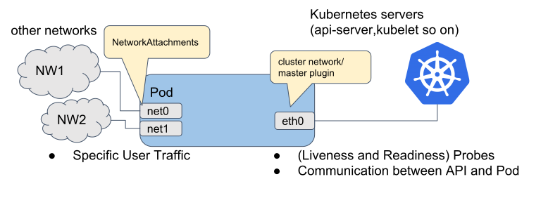
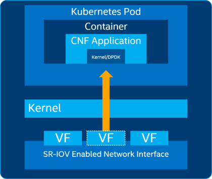
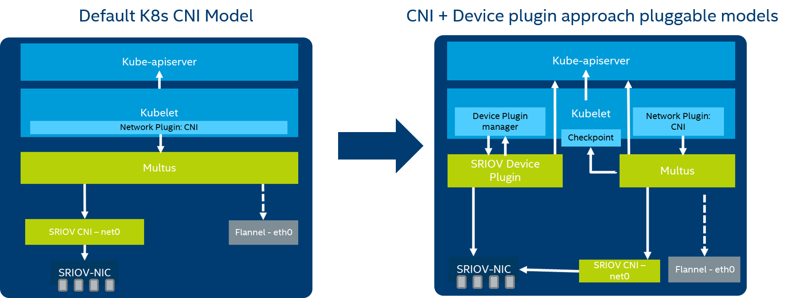

```text
SPDX-License-Identifier: Apache-2.0
Copyright (c) 2019-2020 Intel Corporation
```
<!-- omit in toc -->
# Multiple Interface and PCIe\* SR-IOV Support in OpenNESS
- [Overview](#overview)
  - [Overview of Multus](#overview-of-multus)
  - [Overview of SR-IOV CNI](#overview-of-sr-iov-cni)
  - [Overview of SR-IOV Device Plugin](#overview-of-sr-iov-device-plugin)
- [Details - Multiple Interface and PCIe SR-IOV support in OpenNESS](#details---multiple-interface-and-pcie-sr-iov-support-in-openness)
  - [Multus usage](#multus-usage)
  - [SRIOV configuration and usage](#sriov-configuration-and-usage)
    - [Edge Node SR-IOV interfaces configuration](#edge-node-sr-iov-interfaces-configuration)
    - [Usage](#usage)
    - [SR-IOV troubleshooting](#sr-iov-troubleshooting)
- [Reference](#reference)

## Overview

Edge deployments consist of both network functions and applications. Cloud-native solutions such as Kubernetes\* typically expose only one interface to the application or network function pods. These interfaces are typically bridged interfaces. This means that network functions like Base station or Core network User plane functions and applications such as CDN are limited by the default interface.
To address this, two key networking features must be enabled:
1) Enable a Kubernetes like orchestration environment to provision more than one interface to the application and network function pods.
2) Enable the allocation of dedicated hardware interfaces to application and network function pods.

### Overview of Multus

To enable multiple interface support in pods, OpenNESS Network Edge uses the Multus\* container network interface. Multus CNI is a container network interface (CNI) plugin for Kubernetes that enables the attachment of multiple network interfaces to pods. Typically, in Kubernetes, each pod only has one network interface (apart from a loopback). With Multus, you can create a multi-homed pod that has multiple interfaces. To accomplish this, Multus acts as a “meta-plugin”, a CNI plugin that can call multiple other CNI plugins. The Multus CNI follows the Kubernetes Network Custom Resource Definition De-facto Standard to provide a standardized method by which to specify the configurations for additional network interfaces. This standard is put forward by the Kubernetes Network Plumbing Working Group.

The figure below illustrates the network interfaces attached to a pod, as provisioned by the Multus CNI. The diagram shows the pod with three interfaces: eth0, net0, and net1. eth0 connects to the Kubernetes cluster network to connect with the Kubernetes server/services (kubernetes api-server, kubelet, etc.). net0 and net1 are additional network attachments and they connect to other networks by using other CNI plugins (e.g., vlan/vxlan/ptp).



_Figure - Multus Overview_

### Overview of SR-IOV CNI

The Single Root I/O Virtualization (SR-IOV) feature provides the ability to partition a single physical PCI resource into virtual PCI functions that can be allocated to application and network function pods. To enable SR-IOV device resource allocation and CNI, OpenNESS Network Edge uses the SR-IOV CNI and SR-IOV Device Plugin. The SR-IOV CNI plugin enables the Kubernetes pod to be attached directly to an SR-IOV virtual function (VF) using the standard SR-IOV VF driver in the container host’s kernel.



_Figure - SR-IOV CNI_

### Overview of SR-IOV Device Plugin

The Intel SR-IOV Network device plugin discovers and exposes SR-IOV network resources as consumable extended resources in Kubernetes. This works with SR-IOV VFs in both Kernel drivers and DPDK drivers. When a VF is attached with a kernel driver, the SR-IOV CNI plugin can be used to configure this VF in the pod. When using the DPDK driver, a VNF application configures this VF as required.




_Figure - SR-IOV Device plugin_

## Details - Multiple Interface and PCIe\* SRIOV support in OpenNESS

In Network Edge mode, the Multus CNI, which provides the possibility for attaching multiple interfaces to the pod, is deployed automatically when the `kubernetes_cnis` variable list (in the `inventory/default/group_vars/all/10-open.yml` file) contains at least two elements, e.g.,:
```yaml
kubernetes_cnis:
- calico
- sriov
```

### Multus usage

Multus CNI is deployed in OpenNESS using a Helm chart. The Helm chart is available in [openness-experience-kits](https://github.com/otcshare/openness-experience-kits/tree/master/roles/kubernetes/cni/multus/controlplane/files/multus-cni). The Multus image is pulled by Ansible\* Multus role and pushed to a local Docker\* registry on Edge Controller.

[Custom resource definition](https://kubernetes.io/docs/concepts/extend-kubernetes/api-extension/custom-resources/#custom-resources) (CRD) is used to define an additional network that can be used by Multus.

1. The following example creates a `NetworkAttachmentDefinition` that can be used to provide an additional macvlan interface to a pod:
```bash
cat <<EOF | kubectl create -f -
apiVersion: "k8s.cni.cncf.io/v1"
kind: NetworkAttachmentDefinition
metadata:
  name: macvlan
spec:
  config: '{
    "name": "mynet",
    "type": "macvlan",
    "master": "virbr0",
    "ipam": {
      "type": "host-local",
      "subnet": "192.168.1.0/24",
      "rangeStart": "192.168.1.200",
      "rangeEnd": "192.168.1.216"
    }
  }'
EOF
```
2. To list defined configurations, use:
```bash
  kubectl get network-attachment-definitions
```
3. To create a pod that uses the previously created interface, add an annotation to pod definition:
```yaml
  apiVersion: v1
  kind: Pod
  metadata:
    name: samplepod
    annotations:
      k8s.v1.cni.cncf.io/networks: macvlan
  spec:
    containers:
    - name: multitoolcont
      image: praqma/network-multitool
```

>**NOTE**: More networks can be added after a comma in the same annotation.
4. To verify that the additional interface is configured, run `ip a` in the deployed pod. The output should look similar to the following:
```bash
  1: lo: <LOOPBACK,UP,LOWER_UP> mtu 65536 qdisc noqueue state UNKNOWN qlen 1000
    link/loopback 00:00:00:00:00:00 brd 00:00:00:00:00:00
    inet 127.0.0.1/8 scope host lo
       valid_lft forever preferred_lft forever
  2: net1@if178: <NO-CARRIER,BROADCAST,MULTICAST,UP> mtu 1500 qdisc noqueue state LOWERLAYERDOWN
    link/ether 06:3d:10:e3:34:a4 brd ff:ff:ff:ff:ff:ff link-netnsid 0
    inet 192.168.1.200/24 scope global net1
       valid_lft forever preferred_lft forever
  308: eth0@if309: <BROADCAST,MULTICAST,UP,LOWER_UP> mtu 1400 qdisc noqueue state UP
    link/ether 0a:00:00:10:00:12 brd ff:ff:ff:ff:ff:ff link-netnsid 0
    inet 10.245.0.17/16 brd 10.245.255.255 scope global eth0
       valid_lft forever preferred_lft forever
```

### SR-IOV configuration and usage

To deploy the OpenNESS' Network Edge with SR-IOV, `sriov` must be added to the `kubernetes_cnis` list in `inventory/default/group_vars/all/10-open.yml`:
```yaml
kubernetes_cnis:
- calico
- sriov
```

SR-IOV CNI and device plugin are deployed in OpenNESS using Helm chart. The Helm chart is available in [openness-experience-kits](https://github.com/otcshare/openness-experience-kits/tree/master/roles/kubernetes/cni/sriov/controlplane/files/sriov). Additional chart templates for SR-IOV device plugin can be downloaded from [container-experience-kits repository](https://github.com/intel/container-experience-kits/tree/master/roles/sriov_dp_install/charts/sriov-net-dp/templates). SR-IOV images are built from source by the Ansible SR-IOV role and pushed to a local Docker registry on Edge Controller.

#### Edge Node SR-IOV interfaces configuration

For the installer to turn on the specified number of SR-IOV VFs for a selected network interface of node, provide that information in the format `{interface_name: VF_NUM, ...}` in the `sriov.network_interfaces` variable inside the config files in `inventory/default/host_vars` Ansible directory.
For technical reasons, each node must be configured separately. Copy the example file `inventory/default/host_vars/node01/10-open.yml` and then create a similar one for each node being deployed.

Also, each node must be added to the Ansible inventory file `inventory/default/inventory.ini`.

For example providing `inventory/default/host_vars/node01/10-open.yml` (for Single Node deployment create and edit `inventory/default/host_vars/<CONTROLLER_NAME>/20-enhanced.yml`) with:

```yaml
sriov:
  network_interfaces: {ens787f0: 4, ens787f1: 8}
```


#### Usage
SRIOV plugins use [Multus](#multus-plugin), and the usage is very similar to the one described above. By default, OpenNESS will create network `sriov-openness`, which can be used to attach VFs. Find the `sriov-openness` network's CRD below:

```yaml
apiVersion: "k8s.cni.cncf.io/v1"
kind: NetworkAttachmentDefinition
metadata:
  name: sriov-openness
  annotations:
    k8s.v1.cni.cncf.io/resourceName: intel.com/intel_sriov_netdevice
spec:
  config: '{
  "type": "sriov",
  "cniVersion": "0.3.1",
  "name": "sriov-openness-network",
  "ipam": {
    "type": "host-local",
    "subnet": "192.168.2.0/24",
    "routes": [{
      "dst": "0.0.0.0/0"
    }],
    "gateway": "192.168.2.1"
  }
}'
```

>**NOTE**: Users can create a network with a different CRD as needed.

1. To create a pod with an attached SR-IOV device, add the network annotation to the pod definition and `request` access to the SR-IOV capable device (`intel.com/intel_sriov_netdevice`):
   ```yaml
   apiVersion: v1
   kind: Pod
   metadata:
     name: samplepod
     annotations:
       k8s.v1.cni.cncf.io/networks: sriov-openness
   spec:
     containers:
     - name: samplecnt
       image: centos/tools
       resources:
         requests:
           intel.com/intel_sriov_netdevice: "1"
         limits:
           intel.com/intel_sriov_netdevice: "1"
       command: ["sleep", "infinity"]
   ```

2. To verify that the additional interface was configured, run `ip a` in the deployed pod. The output should look similar to the following:
   ```bash
   1: lo: <LOOPBACK,UP,LOWER_UP> mtu 65536 qdisc noqueue state UNKNOWN group default qlen 1000
     link/loopback 00:00:00:00:00:00 brd 00:00:00:00:00:00
     inet 127.0.0.1/8 scope host lo
        valid_lft forever preferred_lft forever
   41: net1: <BROADCAST,MULTICAST,UP,LOWER_UP> mtu 1500 qdisc mq state UP group default qlen 1000
       link/ether aa:37:23:b5:63:bc brd ff:ff:ff:ff:ff:ff
       inet 192.168.2.2/24 brd 192.168.2.255 scope global net1
         valid_lft forever preferred_lft forever
   169: eth0@if170: <BROADCAST,MULTICAST,UP,LOWER_UP> mtu 1400 qdisc noqueue state UP group default
       link/ether 0a:00:00:10:00:0b brd ff:ff:ff:ff:ff:ff link-netnsid 0
       inet 10.245.0.10/16 brd 10.245.255.255 scope global eth0
         valid_lft forever preferred_lft forever
   ```

#### SR-IOV troubleshooting

SR-IOV device plugin image building requires downloading the ddptool from `downloads.sourceforge.net`. The following error is visible in Ansible logs when the ddptool downloading fails:

```shell
TASK [kubernetes/cni/sriov/master : build device plugin image] *****************************************************
task path: /root/testy/openness-experience-kits/roles/kubernetes/cni/sriov/master/tasks/main.yml:52
...
STDERR:
The command '/bin/sh -c apk add --update --virtual build-dependencies build-base linux-headers &&     cd /usr/src/sriov-network-device-plugin &&     make clean &&     make build &&     cd /tmp/ddptool && tar zxvf ddptool-1.0.0.0.tar.gz && make' returned a non-zero code: 1
make: *** [image] Error 1
MSG:
non-zero return code
```

As a workaround, the ddptool can be downloaded manually to `/tmp/ddptool`.

## Reference
For further details
- SR-IOV CNI: https://github.com/intel/sriov-cni
- Multus: https://github.com/Intel-Corp/multus-cni
- SR-IOV network device plugin: https://github.com/intel/intel-device-plugins-for-kubernetes
