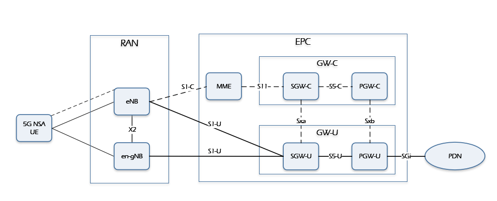
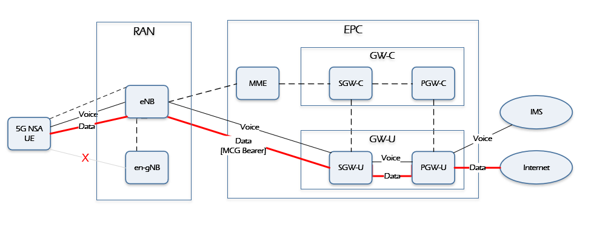
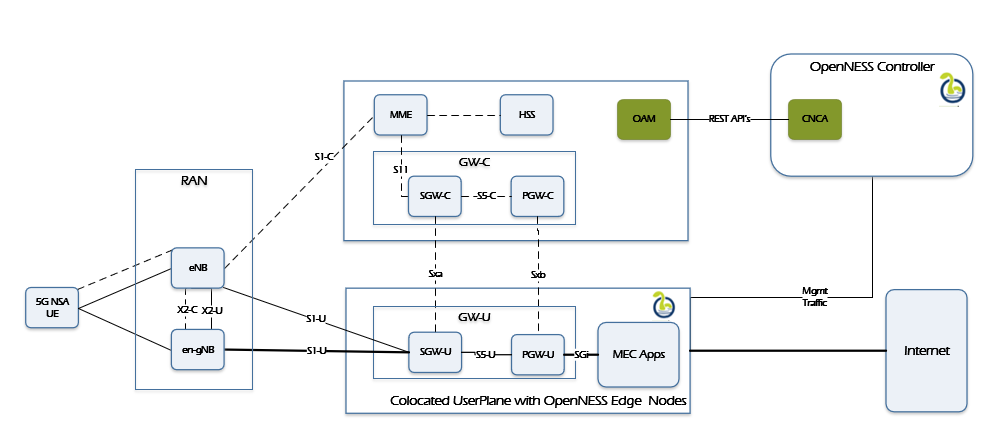

SPDX-License-Identifier: Apache-2.0       
Copyright (c) 2020 Intel Corporation

Edge Cloud Deployment with 3GPP 5G Non Stand Alone
=========
- [Introduction](#introduction)
- [5G NSA Option-3 Architecture aspects](#5g-nsa-option-3-architecture-aspects)
  - [Option-3](#option-3)
  - [Option-3a](#option-3a)
  - [Option-3x](#option-3x)
- [Edge Deployments with 5G NSA](#edge-deployments-with-5g-nsa)
  - [UE is in both 4G & 5G Coverage](#ue-is-in-both-4g--5g-coverage)
  - [UE is only in 4G coverage](#ue-is-only-in-4g-coverage)
    - [Data flows through the SCG Split Bearer, S1-U Split](#data-flows-through-the-scg-split-bearer-s1-u-split)
    - [Data flows through the MCG Bearer, S1-U Path Switch.](#data-flows-through-the-mcg-bearer-s1-u-path-switch)
  - [OpenNESS deployment for 5G-NSA Option 3x](#openness-deployment-for-5g-nsa-option-3x)
- [Summary](#summary)
- [References](#references)
- [List of abbreviations](#list-of-abbreviations)

# Introduction

Edge Compute is highlighted as a key deployment mechanism for delivering services to end users by placing applications closer to the user. Network and Enterprise operators are trying to take advantage of this advancement to provide low latency, user centric and secure edge services.

OpenNESS supports edge compute deployment for LTE Control and User Plane Separation(CUPS) as described  in[OpenNESS_EPC] and 5G Stand Alone as described in  [OpenNESS_NGC]. 5G can be deployed in five different deployment options as described in [3GPP 23.799][3GPP_23799], where SA (Stand Alone) options consist of only one generation of radio access technology and NSA (Non Stand Alone) options consist of two generations of radio access technologies (4G LTE and 5G). The early deployments of 5G will be adopting either NSA option 3 or standalone option 2 as the standardization of these two options have already been completed. The focus of this paper is towards the edge deployment using the **5G NSA Option-3 deployment** and how OpenNESS supports those deployment models.

# 5G NSA Option-3 Architecture aspects

5G NSA Option 3 represents a network having both LTE and NR(New Radio) radio access, but using only the EPC core of LTE to route the Control signals. In this option, LTE is used as the control plane anchor for NR, and both LTE and NR are used for user data traffic(user plane). The UE (User Equipment) can connect to the LTE and 5G NR base station. To support EN-DC (E-UTRAN New Radio Dual Connectivity, here E-UTRAN stands for Evolved UMTS Terrestrial Radio Access Network or in every days terms known as LTE ), the legacy LTE network needs to be upgraded to 3GPP release 15 which will be called **eLTE**.

A basic setup for such a scheme is:

1. The UE attaches to the LTE network. The UE signals to the network that it can simultaneously connect to the 4G and 5G networks.
2. The Core Network checks if the UE is authorized to connect to 4G and 5G networks. The 4G eNodeB is notified by the EPC(Core Network) that the UE is permitted to connect to the 5G network.
3. The eNodeB then takes a decision to activate a bearer on the 5G gNodeB.
4. The 4G eNodeB and 5G gNodeB communicate to set up the bearer on the 5G gNodeB.
5. The UE is notified about the 5G bearer via the RRC Connection Reconfiguration message.
6. The UE then connects to the 5G network while maintaining the connectivity to the 4G network.

The 5G NSA EPC networking architecture includes Option 3, Option 3a, and Option 3x as described here. Ref [3GPP 23.799][3GPP_23799] & [GSMA_5G_NSA][GSMA_5G_NSA]

## Option-3
In the option 3, all uplink/downlink data flows to and from the LTE part of the LTE/NR base station, i.e. to and from the eNB. The eNB then decides which part of the data it wants to forward to the 5G gNB part of the base station over the Xx interface. In simple terms, the 5G gNB never communicates with the 4G core network directly.

In this option, the X2 interface traffic between eNB and gNB has control plane traffic and user plane traffic. The traffic on the X2 interface is huge due to the control plane and user plane traffic.

## Option-3a

In this option, both the LTE eNB and the 5G gNB can directly talk to the EPS core network but they cannot directly talk with each other over the Xx (X2) interface for user data traffic. This means that a single data bearer cannot share the load over LTE and NR. For example, VoLTE voice traffic for a user is handled by LTE while the users Internet traffic is handled by the 5G part of the base station. It would be difficult to implement this scenario if the devices keep moving in and out of 5G network coverage continuously.

In this option, the X2 interface traffic between eNB and gNB has only control plane traffic. So the X2 traffic is very small.

## Option-3x

Option 3x is a combination of 3 and 3A. In this configuration, user data traffic will flow directly to the 5G gNB part of the base station. From there, it is delivered over the air to the mobile device. A part of the data can also be forwarded over the X2 interface to the 4G eNB part of the base station and from there to the UE. Slow data streams (Low Data), e.g. VoLTE bearers with a different IP address than that used for Internet access can be directly delivered from the core network to the 4G eNB part of the 4G/5G base station. The advantage is that the 5G upgrade of the base station is likely to have the much better performing IP interface so it is better suited to handle the higher data rates that can only be reached with a 4G/5G Non-Standalone network deployment.

In the Option 3x networking mode, there is little LTE user plane traffic in the X2 interface. From the perspective of the impact on the existing network, the Option 3x is relatively small and has become the mainstream choice for NSA networking. By using 4G as the anchor point of the control plane, it can meet service continuity targets and support rapid network construction in the initial stage of 5G deployment

In this configuration, the LTE eNB will act as the Master and will have control over which S1-U bearers are handled by radio of LTE or NR. Based on instructions from LTE eNB, MME will inform S-GW where to establish S1-U bearers, i.e. LTE or NR. If NR radio quality falls below a certain threshold,  S1-U bearer towards NR may be either split at NR and sent entirely over Xx to LTE or a PATH SWITCH may be triggered where all S1- U will go to LTE eNB.

# Edge Deployments with 5G NSA

The focus of this chapter would be considering the 5G NSA Option-3x. Option 3x has been considered as being the industry mainstream option as described in [GSMA_5G_NSA]. With the 5G NSA network the benefit seen over LTE networks is only enhanced mobile broadband (eMBB). The 5G features like URLLC (Ultra Reliable Low Latency Communication), massive IOT cannot be supported as still the 5G NSA core network is based out of EPC.

Before the Edge platform location and integration is described it is important to understand the traffic flows considering two different PDN's (Packet Data Network's- one for Data and one for Voice) and along with the UE being in 4G only coverage and in dual coverage. The figures here show the traffic flows for the different coverage scenarios:

## UE is in both 4G & 5G Coverage

## UE is only in 4G coverage

There are two possible flows

### Data flows through the SCG Split Bearer, S1-U Split

### Data flows through the MCG Bearer, S1-U Path Switch.

## OpenNESS deployment for 5G-NSA Option 3x

The MEC(Multi-access Edge Computing) solution is dependent on the Core Network deployed. MEC can be supported in EPC, but without a generic standardized framework.

For MEC with EPC there are generally two approaches: SGi-based and S1-based.

 The SGi-based approach for MEC can be addressed through a distributed anchor point approach. The distributed anchor point approach  has been demonstrated with OpenNESS, as described in [OpenNESS_EPC] Deployment model 3. The OpenNESS EPC deployment can work seamlessly with the 5G NSA as long as the traffic intercept point is the SGi Interface. A deployment model of OpenNESS with 5G NSA is shown below:

NOTE:
1. In the above picture, the GW-U components (SGW-U and PGW-U) are not part of OpenNESS solution.
2. There is no standard defined by 3GPP for the deployment of MEC with 5G NSA. The solution provided by OpenNESS is just a reference

The [4G CUPS Management API] exposed by the OpenNESS Core Network Configuration Agent (CNCA) can be used to set the appropriate configuration rules in the LTE Access Network through the OAM(Operations, Administration and Maintenance) agent. The OAM agent functionality should be part of EPC Core solution to add/update certain configuration information which is outside the scope of standards. The OAM configuration information supported by OpenNESS can be grouped into three
categories as described below:

- Config: Configure Sxx related IP address of user plane. Since the EPC control plane can also learn these parameters through other means, whether these parameters are required is vendor-dependent.

- Selectors: Bind the user plane to APN, TAC, etc. in the control plane, so that UEs can be assigned to a particular user plane (PGW-U and/or SGW-U) at the time of connection establishment.

- Entitlements: Allow further level of control in the gateway selection for UEs at EPC Control plane through IMSI's (International Mobile Subscriber Identity). It is recommended to use some level of indirect reference of IMSI's (proprietary to the operator network) to identify UEs, rather than to use IMSI itself.

OpenNESS suggests a REST based OAM interface APIs to configure the information.

Further information on the OpenNESS implementation can be found in [OpenNESS_EPC]

The S1-based approach for MEC can be addressed as “bump-in-the-wire” implementation whereby all uplink traffic on S1 is intercepted and inspected, some traffic is diverted towards the MEC platform, while the rest of it is re-injected on S1 in the uplink.

# Summary

This white paper describes an investigation of how the OpenNESS support for LTE CUPS based edge platform can be integrated with an 5G NSA network Option-3x. Further validation of the OpenNESS support for 5G NSA can be carried out with commercial 5G NSA partners.

# References

1. 3GPP 23.799 Study on Architecture for Next Generation System(Release 14) Annex J: Deployment Scenarios - <https://www.3gpp.org/DynaReport/23799.htm>

2. ETSI GS MEC 003 V2.1.1, “Mobile Edge Computing (MEC); Framework and Reference Architecture (2019-01) - <https://www.etsi.org/deliver/etsi_gs/MEC/001_099/003/02.01.01_60/gs_mec003v020101p.pdf>

3. GSMA 5G Implementation Guidelines: NSA Option 3 February 2020 - <https://www.gsma.com/futurenetworks/wp-content/uploads/2019/03/5G-Implementation-Guidelines-NSA-Option-3-v2.1.pdf>

4. Edge Cloud Deployment with 3GPP 4G LTE CUPS of EPC - <https://github.com/otcshare/specs/blob/master/doc/core-network/openness_epc.md>

5. Edge Cloud Deployment with 3GPP 5G Stand Alone - <https://github.com/otcshare/specs/blob/master/doc/core-network/openness_ngc.md>

6. 4G Control and User Plane Separation (CUPS) Management API - <https://github.com/otcshare/specs/tree/master/schema/cups>

[3GPP_23799]: <https://www.3gpp.org/DynaReport/23799.htm> "3GPP 23.799 Study on Architecture for Next Generation System(Release 14) Annex J: Deployment Scenarios"

[ETSI_MEC]: <https://www.etsi.org/deliver/etsi_gs/MEC/001_099/003/02.01.01_60/gs_mec003v020101p.pdf> "ETSI GS MEC 003 V2.1.1, “Mobile Edge Computing (MEC); Framework and Reference Architecture (2019-01)"

[GSMA_5G_NSA]: <https://www.gsma.com/futurenetworks/wp-content/uploads/2019/03/5G-Implementation-Guidelines-NSA-Option-3-v2.1.pdf> "GSMA 5G Implementation Guidelines: NSA Option 3 February 2020"

[OpenNESS_EPC]: <https://github.com/otcshare/specs/blob/master/doc/core-network/openness_epc.md> "Edge Cloud Deployment with 3GPP 4G LTE CUPS of EPC"

[OpenNESS_NGC]: <https://github.com/otcshare/specs/blob/master/doc/core-network/openness_ngc.md> "Edge Cloud Deployment with 3GPP 5G Stand Alone"

[4G CUPS Management API]: <https://github.com/otcshare/specs/tree/master/schema/cups> "4G Control and User Plane Separation (CUPS) Management API"

# List of abbreviations

- 3GPP: Third Generation Partnership Project
- CUPS: Control and User Plane Separation of EPC Nodes
- APN: Access Point Name
- TAC: Tracking Area Code
- RAN: Radio Access Network
- UE: User Equipment (in the context of LTE)
- MME: Mobility Management Entity
- API: Application Programming Interface
- ETSI: European Telecommunications Standards Institute
- HTTP: Hyper Text Transfer Protocol
- MEC: Multi-Access Edge Computing
- OpenNESS: Open Network Edge Services Software
- LTE: Long-Term Evolution
- OAM: Operations, Administration and Maintenance
- PDN: Packet Data Network
- CNCA: Core Network Configuration Agent
- UI: User Interface
- URLLC : Ultra-Reliable Low-Latency Communication
- MCG : Master Cell Group
- SCG : Secondary Cell Group
- NR : New Radio
- NSA : Non Stand Alone
- SA : Stand Alone
- EN-DC : E-UTRAN New RAdio Dual Connectivity
- E-UTRAN : Evolved UMTS Terrestrial Radio Access Network
- MEC : Multi-access Edge Computing
- IMSI: International Mobile Subscriber Identity