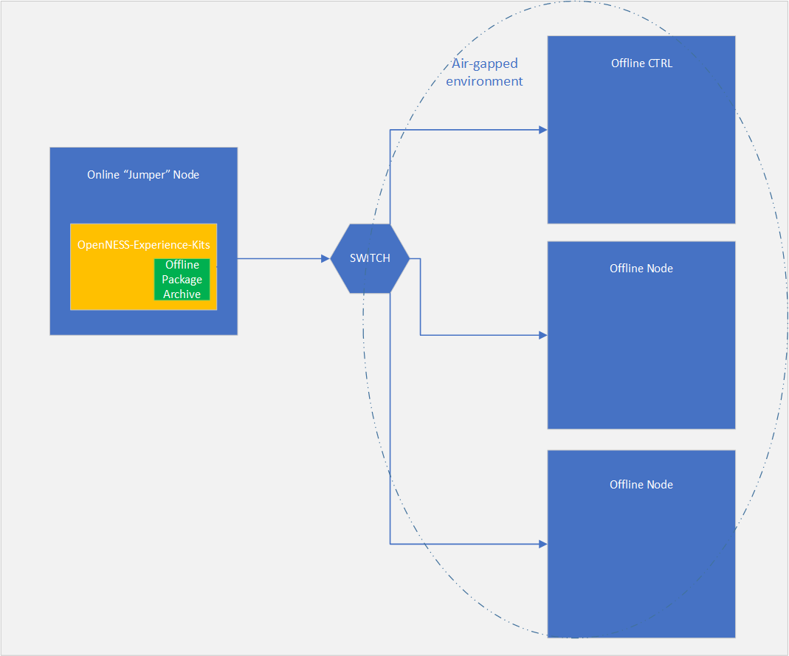
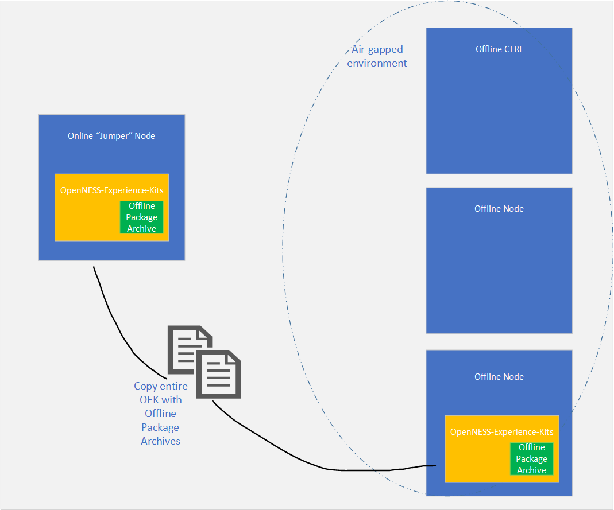
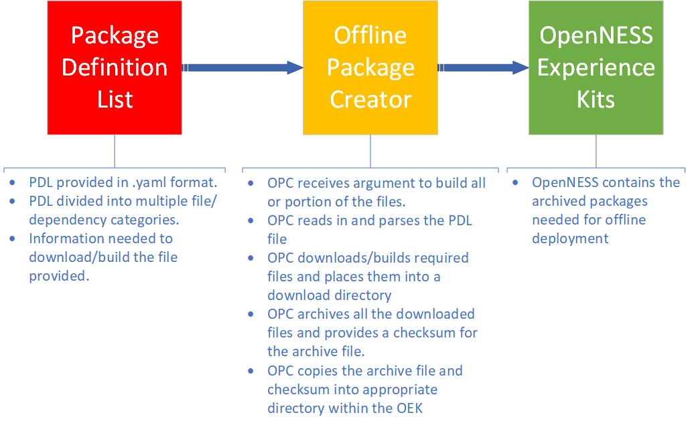

```text
SPDX-License-Identifier: Apache-2.0
Copyright (c) 2019-2020 Intel Corporation
```
<!-- omit in toc -->
- [OpenNESS Network Edge: Offline Deployment](#openness-network-edge-offline-deployment)
  - [OpenNESS support in offline environment](#openness-support-in-offline-environment)
  - [Setup prerequisites](#setup-prerequisites)
  - [Creating the offline package from an online node](#creating-the-offline-package-from-an-online-node)
  - [Placing the complete offline package in offline environment](#placing-the-complete-offline-package-in-offline-environment)
  - [Deployment in offline environment](#deployment-in-offline-environment)
# OpenNESS Network Edge: Offline Deployment

## OpenNESS support in offline environment

The OpenNESS projects supports a deployment of the solution in an air-gapped, offline environment. The support is currently limited to "[flexran" deployment flavor of OpenNESS Experience Kit](https://github.com/otcshare/x-openness-experience-kits/tree/master/flavors/flexran) only and it allows for offline deployment of vRAN specific components. Internet connection is needed to create the offline package, a script to download and build all necessary components will create an archive of all the necessary files. Once the offline package is created the installation of OpenNESS Experience Kits will be commenced as usual, in the same way as the default online installation would.

It can be deployed in two different scenarios. The first scenario is to deploy the OpenNESS Experience Kits from the online "jumper" node which is being used to create the offline package, this internet connected node must have a network connection to the air-gapped/offline nodes. The second scenario is to copy the whole OpenNESS Experience Kit directory with the already archived packages to the air-gapped/offline environment (for example via USB or other media or means) and run the OpenNESS Experience Kit from within the offline environment. All the nodes within the air-gapped/offline cluster need to able to SSH into each other.

Figure 1. Scenario one - online node connected to the air-gapped network

Figure 2. Scenario two - OEK copied to the air-gapped network


## Setup prerequisites

* A node with access to internet to create the offline package.
* Cluster set up in an air-gapped environment.
* Clean setup, see [pre-requisites](https://github.com/otcshare/x-specs/blob/master/doc/getting-started/network-edge/controller-edge-node-setup.md#preconditions)
* [Optional] If OEK is run from an online jumper node, the node needs to be able to SSH into each machine in air-gapped environment.
* [Optional] A media such as USB drive to copy the offline OEK package to the air-gapped environment if there is no connection from online node.
* All the nodes in air-gapped environment must be able to SSH to each other without requiring password input, see [getting-started.md](https://github.com/otcshare/x-specs/blob/master/doc/getting-started/network-edge/controller-edge-node-setup.md#exchanging-ssh-keys-between-hosts).
* The control plane node needs to be able to SSH itself.
* The time and date of the nodes in offline environment is manually synchronized by the cluster's admin.
* User provided files - OPAE_SDK_1.3.7-5_el7.zip and syscfg_package.zip

## Creating the offline package from an online node

To create the offline package the user must have an access to an online node from which the offline package creator can download all necessary files and build Docker images. The list of files to be downloaded/build is provided in a form of a package definition list (Only package definition list for "flexran" flavor of OpenNESS is provided at the time of writing). Various categories of files to be downloaded are provided within this list including: RPMs, PIP pacakges, Helm charts, Dockerfiles, Go modules, and miscellaneous downloads. According to the category of a file the logic of offline package creator script will handle the download/build accordingly. Some files such as proprietary packages need to be provided by user in specified directories (see following steps). Once the offline package creator collects all necessary components it will pack them into an archive and then place them in appropriate place within the OpenNESS Experience Kits directory. Once the packages are archived the OpenNESS Experience Kits are ready to be deployed in air-gapped environment. The following diagram illustrates the workflow of the offline package creator. Additional information regarding the offline package creator can be found in the [README.md file](https://github.com/otcshare/openness-experience-kits/blob/master/offline_package_creator/README.md).

Figure 3. Offline package creator workflow


To run the offline package creator run the following steps (user should not be a "root" user but does need "sudo" privileges to create the package, RT components will require installation of RT kernel on the node by the OPC):

Clone the OpenNESS Experience Kits repo to an online node:

```shell
# https://github.com/otcshare/x-openness-experience-kits.git
```

Navigate to offline package creator directory:

```shell
# cd x-openness-experience-kits/oek/offline_package_creator/
```

Create a directory from which user provided files can be accessed:

```shell
# mkdir /<usr>/<provided>/<directory>
```

Copy the 'OPAE_SDK_1.3.7-5_el7.zip' file (optional but necessary by default - to be done when OPAE is enabled in "flexran" flavor of OEK) and syscfg_package.zip (optional but necessary by default- to be done when BIOS config is enabled in "flexran" flavor of OEK) to the provided directory:

```shell
# cp OPAE_SDK_1.3.7-5_el7.zip /<usr>/<provided>/<directory>
# cp syscfg_package.zip /<usr>/<provided>/<directory>
```

Edit [x-openness-experience-kits/oek/offline_package_creator/scripts/initrc](https://github.com/otcshare/openness-experience-kits/blob/master/offline_package_creator/scripts/initrc) file and update with GitHub username/token if necessary, HTTP/GIT proxy if behind firewall and provide paths to file dependencies.

```shell
# otcshare token
GITHUB_USERNAME=""
GITHUB_TOKEN=""

# User add ones
HTTP_PROXY="http://<address>:<port>" #Add proxy first
GIT_PROXY="http://<address>:<port>"

# location of OPAE_SDK_1.3.7-5_el7.zip
BUILD_OPAE=disable
DIR_OF_OPAE_ZIP="/<usr>/<provided>/<directory>"

# location of syscfg_package.zip
BUILD_BIOSFW=disable
DIR_OF_BIOSFW_ZIP="/<usr>/<provided>/<directory>"

# location of the zip packages for collectd-fpga
BUILD_COLLECTD_FPGA=disable
DIR_OF_FPGA_ZIP="/<usr>/<provided>/<directory>"
```

Start the offline package creator script [x-openness-experience-kits/oek/offline_package_creator/offline_package_creator.sh](https://github.com/otcshare/openness-experience-kits/blob/master/offline_package_creator/offline_package_creator.sh)

```shell
# bash offline_package_creator.sh  all 
```

The script will download all the files define in the [pdl_flexran.yml](https://github.com/otcshare/openness-experience-kits/blob/master/offline_package_creator/package_definition_list/pdl_flexran.yml) and build other necessary images, then copy them to a designated directory. Once the script is finished executing the user should expect three files under the `x-openness-experience-kits/roles/offline_roles/unpack_offline_package/files` directory:

```shell
# ls x-openness-experience-kits/roles/offline_roles/unpack_offline_package/files

checksum.txt prepackages.tar.gz opcdownloads.tar.gz
```

Once the archive packages are created and placed in the OEK, the OEK is ready to be configured for offline/air-gapped installation.

## Placing the complete offline package in offline environment

User has two options of deploying the OEK for offline/air-gapped environment. Please refer to Figure 1 and Figure 2 of this document for diagrams.

Scenario 1: User will deploy the OEK from an online node with a network connection to the offline/air-gapped environment. In this case if the online node is the same one as the one on which the offline package creator was run and created the archive files for OEK than the OEK directory does not need to be moved and will be used as is. The online node is expected to have a password-less SSH connection with all the offline nodes enabled - all the offline nodes are expected to have a password-less SSH connection between control plane and node and vice-versa, and the control plane node needs to be able to SSH itself.

Scenario 2: User will deploy the OEK from a node within the offline/air-gapped environment. In this case the user needs to copy the whole OEK directory containing the archived files from [previous section](#creating-the-offline-package-from-an-online-node) from the online node to one of the nodes in the offline environment via USB drive or alternative media. It is advisable that the offline node used to run the OEK is a separate node to the actual cluster, if the node is also used as part of the cluster it will reboot during the script run due to kernel upgrade and the OEK will need to be run again - this may have un-forseen consequences. All the offline nodes are expected to have a password-less SSH connection between control plane and node and vice-versa, and the control plane node needs to be able to SSH itself.

Regardless of the scenario in which the OEK will be deployed the deployment method is the same.

## Deployment in offline environment

Once all the previous steps provided within this document are completed and the OEK with offline archives is placed on the node which will run the OEK automation, the user should get familiar with the ["Running-playbooks"](https://github.com/otcshare/x-specs/blob/master/doc/getting-started/network-edge/controller-edge-node-setup.md#running-playbooks) and ["Preconditions"](https://github.com/otcshare/x-specs/blob/master/doc/getting-started/network-edge/controller-edge-node-setup.md#preconditions) sections of getting started guide and deploy the OpenNESS as per usual deployment steps. Please note only deployment of "flexran" flavour is supported for offline/air-gapped environment, other flavours/configurations and default deployment may fail due to missing dependencies, the support for ACC100 accelerator is not available for offline deployment of "flexran" flavour at the time of writing. Both multi-node and single node modes are supported.

During the deployment of the offline version of the OEK the archived files created by the offline package creator will be extracted and placed in appropriate directory. The OEK will set up a local file share server on the control plane node and move the files to the said server. The OEK will also create a local yum repo. All the files and packages will be pulled from this file share server by nodes across the air-gapped OpenNESS cluster. During the execution of the OEK the Ansible scripts will follow the same logic as per the online mode with the difference that all the components will be pulled locally from the file share server instead of the internet.

The following are the specific steps to enable offline/air-gaped deployment from OEK:

Enable the offline deployment in [x-openness-experience-kits/group_vars/all/10-open.yml](https://github.com/otcshare/x-openness-experience-kits/blob/master/group_vars/all/10-open.yml)

```yaml
## Offline Mode support
offline_enable: True
```

Make sure the time on offline nodes is synchronized.

Make sure nodes can access each other through SSH without password.
Make sure cotrol-plane node can SSH itself. ie:

```shell
# hostname -I
<name>
# ssh-copy-id <name>
```

Make sure the CPUs allocation in "flexran" flavor is configured as desired, [see configs in flavor directory](https://github.com/otcshare/x-openness-experience-kits/tree/master/flavors/flexran).

Deploy OpenNESS using FlexRAN flavor for multi or single node:

```shell
# ./deploy_ne.sh -f flexran
```
OR
```shell
# ./deploy_ne.sh -f flexran single
```
