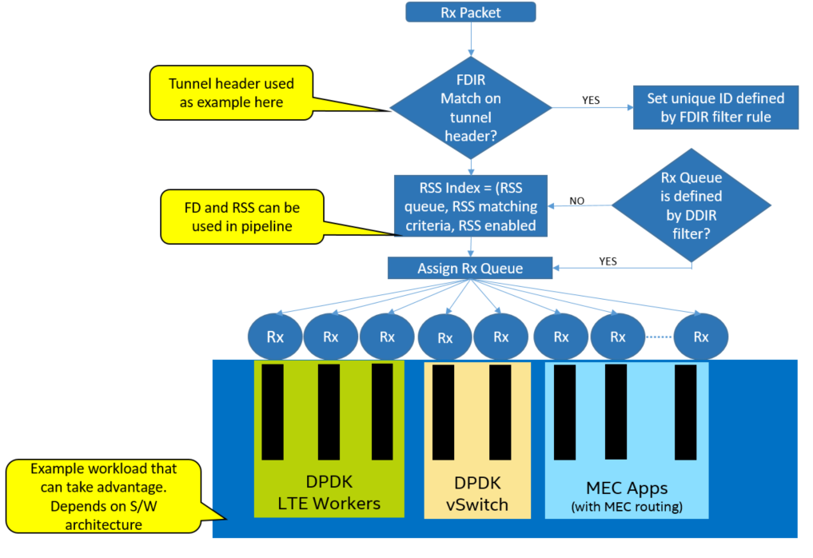
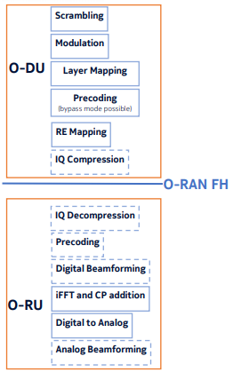
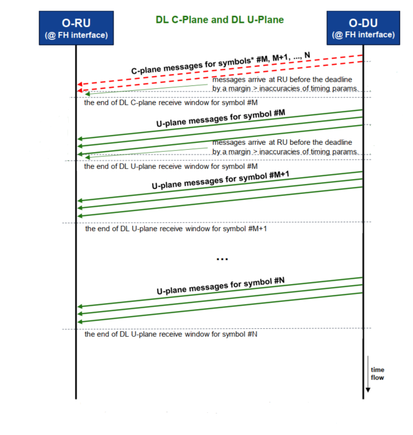
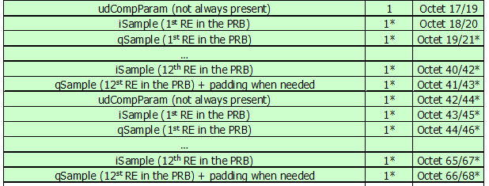
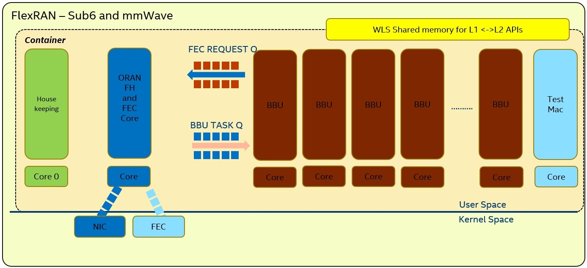
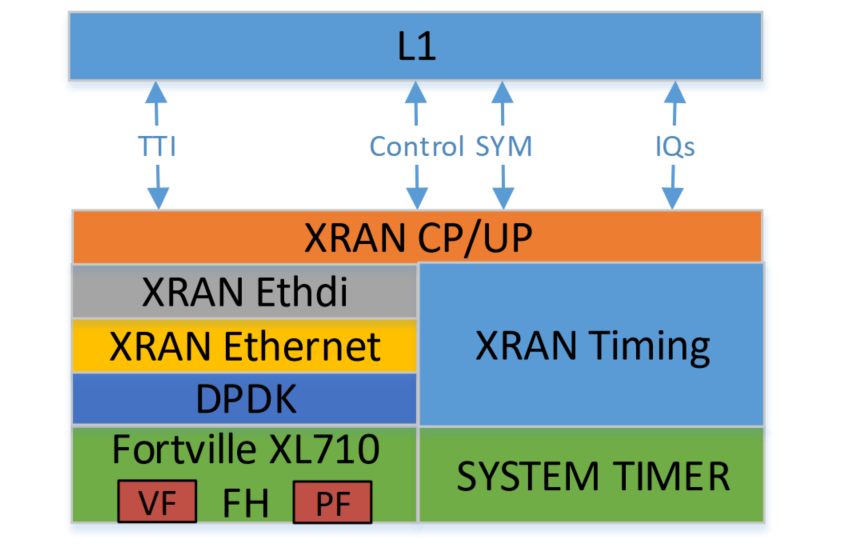
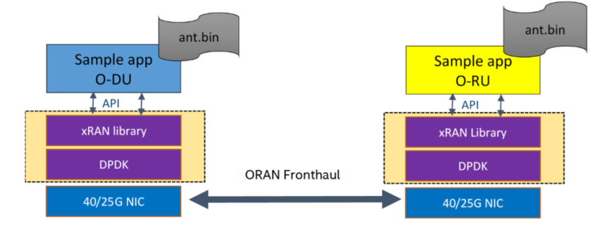
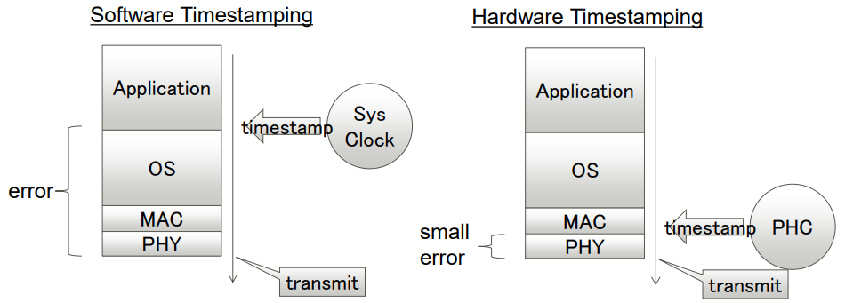
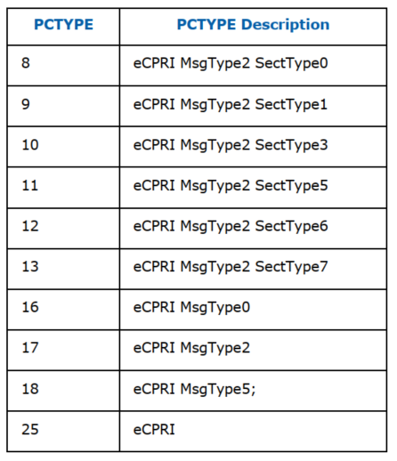

```text
SPDX-License-Identifier: Apache-2.0     
Copyright (c) 2020 Intel Corporation
```
<!-- omit in toc -->
# O-RAN Front Haul Sample Application in OpenNESS 
- [Introduction](#introduction)
- [Dynamic Device Personalization](#dynamic-device-personalization)
  - [X710 Flexible Pipeline](#x710-flexible-pipeline)
  - [Flow Director](#flow-director)
  - [Received Side Scaling](#received-side-scaling)
  - [DPDK support](#dpdk-support)
- [O-RAN Specification for vRAN Front Haul](#o-ran-specification-for-vran-front-haul)
  - [Front Haul Data Flows](#front-haul-data-flows)
  - [U-Plane Packet Structure](#u-plane-packet-structure)
  - [C-Plane Packet Structure](#c-plane-packet-structure)
  - [S-Plane](#s-plane)
- [Flexible Radio Access Network](#flexible-radio-access-network)
  - [5GNR FlexRAN PHY](#5gnr-flexran-phy)
  - [xRAN Library](#xran-library)
  - [Packet Classification](#packet-classification)
  - [xRAN Library Sample Application](#xran-library-sample-application)
  - [Precision Time Protocol Synchronization](precision-time-protocol-synchronization)
  - [eCPRI DDP Profile](#ecpri-ddp-profile)
- [xRAN Sample App Deployment in OpenNESS](#xran-sample-app-deployment-in-openness)
  - [Hardware Configuration and Checks](#hardware-configuration-and-checks)
  - [Deploy xRAN sample app O-DU and O-RU in OpenNESS Network Edge](#deploy-xran-sample-app-o-du-and-o-ru-in-openness-network-edge)
    - [Setting up SRIOV](#setting-up-sriov)
    - [Amend GRUB and tuned configuration](#amend-grub-and-tuned-configuration)
    - [PTP Synchronization](#ptp-synchronization)
    - [Deploy Openness NE](#deploy-openness-ne)
    - [Configure Interfaces](#configure-interfaces)
    - [Build xRAN Sample App](#build-xran-sample-app)
    - [Generate Test IQ samples](#generate-test-iq-samples)
    - [Create Docker Image](#create-docker-image)
    - [Deploy xRAN App Pods with Helm](#deploy-xran-app-pods-with-helm)
  - [DDP Profile Deployment](#ddp-profile-deployment)
    - [Steps Required to Apply eCPRI Profile through Software](#steps-required-to-apply-ecpri-profile-through-software)
- [Summary](#summary)
- [References](#references)
- [List of abbreviations](#list-of-abbreviations)

# Introduction
Recent and incoming telecommunication standards for Radio Access Network (RAN) tend to introduce open network interfaces that are expected to become adopted by broad numbers of RAN vendors and operators. Networks based on common standards are thought to be more inclined to innovations. Thus, standardization committees aim to support the global industry vision and encourage emerging multi-vendor, interoperable, and innovative virtualized RAN (vRAN) to enable vRAN shift to the Cloud and exploit the opportunities the Cloud has to offer—scalability, efficiency, cost reduction, and more. Flexible Radio Access Network (FlexRAN), which is part of proof-of-concept work at Intel, demonstrates vRAN deployment on Intel® architecture. It follows the most recent RAN standards and deploys innovative software and hardware solutions proposed by Intel to refine the baseband L1 functionality. Recently, 5GNR FlexRAN has started supporting the open Front Haul\* interface standard introduced by the O-RAN Alliance\* [here](https://www.o-ran.org/specifications). 

The focus of this white paper is to show how OpenNESS facilitates the deployment of 5GNR FlexRAN Front Haul functional units based on O-RAN specifications at the Network Edge. It also demonstrates how OpenNESS may assist in exploiting the capabilities of the X700 family NICs to address the challenges related to 5G RAN evolution including fast-growing user traffic and the move towards the Edge Cloud.
This document describes the Intel® Ethernet Controller X710 new capability known as Dynamic Device Personalization (DDP). It provides the steps for utilizing this feature on the OpenNESS platforms. DDP technology has been previously implemented and tested within LTE FlexRAN L1 and proven to reduce network latency and the number of CPU cycles used for packet processing, leading to the increase of the overall network throughput. Choosing DDP is a promising option for removing the network bottleneck related to packet filtering and realizing stringent latency and throughput requirements imposed onto 5G networks. Tests performed with FlexRAN using LTE Front Haul interface based on Ferry Bridge (FB), the codename of a technology from Intel, and incorporating the DDP capability of Intel® Ethernet Controller X710 showed up to 34% reduction in CPU cycles used for packet processing.  Whereas tests performed on Multi-access Edge Computing (MEC) solution demonstrated a nearly 60% reduction in network latency. These findings are already described in an incoming white paper “Dynamic Device Personalization: Intel Ethernet Controller 700 Series - RadioFH Profile Application Note”. Shifting towards DDP for increased performance is also a promising option for the Network Edge. Such deployment has already been tested on Kubernetes\* architecture and described [here](https://builders.intel.com/docs/networkbuilders/intel-ethernet-controller-700-series-dynamic-device-personalization-support-for-cnf-with-kubernetes-technology-guide.pdf). 

# Dynamic Device Personalization
In contrast to the Intel® Ethernet Controller X550 static pipeline, the packet processing pipeline built into Intel® Ethernet Controller X710 is programmable. It can be customized to achieve different packet filtering on separate NICs to meet the requirements of a variety of customers, or it is possible to enable different protocols and classification types (new protocols/filters ) for separate network segments. As a result, 64 unique classification configurations are possible on Intel 700 Series NICs. Intel NIC XL710 supports up to 64 PCTYPEs and up to 192 PTYPEs. However, only 21 PCTYPEs and a few PTYPEs are defined in the default profile. The configuration options are limited because of the limited resources on the hardware itself. Each PCTYPE needs its own filters’ configuration space. Enabling new configurations by overwriting the existing PCTYPES can be achieved through a firmware update. However, DDP capability provides a means to replace the original device configuration profile in run time using a DDP profile. A DDP profile is a binary file that loads new PTYPEs and PCTYPEs into the hardware configuration space. Then, each new PCTYPE needs to be mapped to an unused DPDK flow type. The original profile is saved and may be restored on the device in runtime as well. Some packets may be lost during the profiles switching.
During the processing of incoming traffic, the NIC's internal parser, filters, and switch are used to perform on-NIC packet classification and steer the traffic to specific queues from where the software application can take them over for further processing defined per queue.
To classify new packet types (xRAN) and protocols (eCPRI) on the Intel® Ethernet Controller X710 pipeline, they must be enabled on the NIC through device reconfiguration. Normally, this requires a firmware upgrade involving a cold restart of the server. But with DDP, new packet classification types can be added in runtime, and there is no need for a firmware upgrade requiring machine power off. Intel® Ethernet Controller X710 fully supports DDP since Firmware Version 6.0.

## X710 Flexible Pipeline
The flexible pipeline added onto the XL710 NIC consists of four main functional units: 
* buffer
* parser
* switch
* classifier filter: Flow Director (FD) and Hash Filter (Receive Side Scaling (RSS)

Before the buffered packet gets to the filters block, its headers are parsed, and specific header fields are extracted into a Field Vector (a metadata buffer that is attached to the packet). The parser detects the packet type (PTYPE), which is saved to the RX descriptor and defines the packet classification type (PCTYPE). Some fields from the Field Vector are used in the next functional block for switching the packet to the proper PF or VF. If FD and hash filters such as RSS are enabled for the pipeline, they are used to select the packet’s destination queue within the PF/VF it had been switched to. The information stored in the Field Vector fields is used by the filters to steer packet destination queues to where the host expects them.
The Intel® Ethernet Controller X710 provides programs with advanced classification and traffic steering functionality due to the following features of its pipeline:
- Multiple queues are available per virtual function (VF) / physical function (PF).
   - 1536 queue pairs in the device, 16 queues per VF and 128 VFs – 384 Virtual Station Interfaces (VSIs) in total
- Use of receive-side parser for packet classification.
- Switch and filter blocks use RSS and/or FD.
- The received packets are buffered in a packet buffer.
- The parser inspects different header fields such as Ethernet, IP, and UDP.
- The switch module switches the VSI/PCI function using parsed header fields. 
- The flow rules of the switch are programmable by the upper layer software.
- The packet filter/classifier module implements the queue selection logic.
- FD supports exact 8K match rules and wild card rules. 
- An 8K exact match rule can use up to 16 flexible bytes, along with L2, L3, and L4 header fields. 

The diagram below depicts the functional units of the Intel® Ethernet Controller X710 pipeline: 


## Flow Director
Flow Director (FD) is a packet filtering functionality provided by DPDK for routing packets to specific queues on NIC ports. DPDK Flow Types are equivalents of PCTYPEs used by the hardware. FD uses Flow Types, specific input set per Flow Type (exact match of the input set’s selected fields -tuples), or flexible payload fields to match packets and direct them accordingly to existing FD rules. A flow rule consists of a set of attributes with a matching pattern and a list of actions. Its primary use is to match actions with Flow Types. Actions that can be performed on the matched packets include dropping, diverting to a specific queue, port, or a virtual/physical device function, performing tunnel offloads, and marking packets. FD uses the Toeplitz hash function to calculate the hash signature of the input set generated for each filtered packet.

## Received Side Scaling
Received Side Scaling (RSS) is a hash filter used to statistically distribute packets into queues belonging to a queue region by maintaining load balance. The queues are assigned to different processors. Thus, the packet processing work is shared among several processors. RSS calculates the 32-bit hash signature out of the input set selected from the Field Vector. The 32-bit hash function based on the Toeplitz algorithm or an XOR scheme is used for generating that hash. Based on its hash, value flows are assigned to a queue region, including one queue at least. Packets of the same flow will be distributed evenly to all queues within the queue region. 
The flow chart below shows an example of using FD and RSS in the pipeline to achieve advanced classification and lookup.



## DPDK support
Special Admin Queue (AQ) commands have been added to the Intel® Ethernet Controller X710 firmware version 6 to assist new profile addition/removal to/from the hardware, and to retrieve information about the profiles currently registered on the NIC. The new AQ commands can update NIC configuration tables or read/retrieve their content. DPDK started supporting the DDP feature by providing software calls to the AQ commands gradually through versions 17.05, 17.08, and 17.11. Since then, DPDK provides full support for working with DDP profiles and enables the recognition of protocols not known to DPDK flows (rte_flows). Currently, DPDK APIs can be used to load/remove profiles and retrieve a list of registered profiles and their descriptions. DPDK “testpmd” application deploys RTE APIs to manipulate the DDP profiles and uses them to configure/enhance packet filtering on the NIC.

More information on Intel® Ethernet Controller X710 flexible pipeline can be found in the [here] (https://www.intel.com/content/dam/www/public/us/en/documents/datasheets/xl710-10-40-controller-datasheet.pdf). 
# O-RAN Specification for vRAN Front Haul
According to the O-RAN Alliance Fronthaul specification, the physical layer of the 5GNR vRAN network is divided into two functional units: O-RU and O-DU. The functional split of the eNG/gNB functions aims to keep the O-RU simple. O-RAN selected two possible options for the split called 7-2x: Category A (lower split) and Category B (upper split). The difference between the two split categories refers to precoding placement. In category A, precoding is done on the O-DU side. In Category B, it is done on O-RU. The O-RAN Alliance specifies the packet formats for the data flows over the 5GNR O-RAN Front Haul. 

The image below presents the 7-2x functional split and places Precoding on O-DU for Cat A split and on O-RU for Cat B split:


## Front Haul Data Flows

The following lists supported data flows in the 5GNR Front Haul defined by O-RAN.
 
1.  User Plane
    - Data Flow 1a: Flows of IQ Data in FFT frequency domain on DL
    - Data Flow 1b: Flows of IQ Data in FFT frequency domain on UL
    - Data Flow 1c: Flow of PRACH IQ data in FFT frequency domain
2.  Control Plane
    - Data Flow 2a: Scheduling commands (DL and UL) & Beamforming commands
    - Data Flow 2b: LAA Listen-Before-Talk (LBT) configuration commands and requests
    - Data Flow 2c: LAA LBT status and response messages
3. Synchronization-Plane

O-RAN specification includes Management Plane. Examples of the responsibilities of M-plane are:
- Generic static O-RU configuration
- O-RU management
- Compression configuration
- Choosing a power-saving setting

The following diagram presents the data flows between the proposed O-DU and O-RU:


U-Plane packets exchange IQ data between O-RU and O-DU. The data is transmitted symbol by symbol within U-Plane messages. The main purpose of the C-Plane messages is to transmit data control information required for the processing of user data. The data-associated control information is typically sent to every slot (or every TTI in LTE) in a different data flow with its header and encapsulated payload (C-Plane messages). C-Plane messages send information regarding the next expected U-Plane data packets.

An example of DL C-Plane and DL U-Plane Package Exchange is shown in the following diagram:



Information exchanged between O-DU and O-RU is encapsulated into standard Ethernet frames. Ethernet is used as a transport mechanism for both U-plane and C-plane. M-Plane should be responsible for MAC address resolution and VLAN tagging of the frames. According to the O-RAN standard, the Ethernet header is followed by an eCPRI transport header. Additionally, the eCPRI header can be encapsulated into IP/UDP datagrams but this solution is not supported by 5GNR FlexRAN.

Native Ethernet Frame with VLAN:


Native IPv4 Packet with VLAN:


eCPRI transport header:


The “ecpriMessage” field uses different values for U-Plane (0), C-Plane (2), and eCPRI One-Way Delay Measurement message (5), which is not supported in 5GNR FlexRAN. The standard proposes that U-Plane and C-Plane transmit data over separate channels.

## U-Plane Packet Structure

Following the transport layer in the U-Plane packets, there is the Radio Application Header used for time reference:


The Radio Application Header is followed by repeated Data Sections that start with the Application Header that is followed by the data in the form of multiple PRBs. Each PRB is built of 12 IQ samples.

The header of the Repeated Data Section:


Data Section Payload Format:



Currently, Section Type 1, 3, 5, and 6 are defined for U-Plane packets. All of them have the same field structure. 

## C-Plane Packet Structure
eCPRI packets with message type 2 (C-Plane) can contain different section types that apply to the specific purpose of the control plane packet:
- Section Type 0  Unused Resource Blocks or symbols in Downlink or Uplink
- Section Type 1  Most DL/UL radio channels
- Section Type 3  PRACH and mixed-numerology channels
- Section Type 5  UE scheduling information (UE-ID assignment to section)
- Section Type 6  Channel information
- Section Type 7  LAA

Following the eCPRI transport header, C-Plane messages have a Radio Application Common Header with the number and type of the Radio Application Sections included in the packet, followed by the actual sections. The sections send information applicable to specific PRBs sent over the U-Plane. Sections of different Section Type have different fields structure. 

Radio Application Common Header of a C-Plane Packet Section Type 1:


The Common Radio Application Header is followed by multiple sections.

Section Application Header for C-Plane Packet Section Type 1:


Next, each section carried by the C-Plane packets can contain a Section Extension that provides even more information applicable to the PRBs being referred by the section.  O-RAN defines the following types of section extensions:
- Section Extension Type 0 - Reserved, for future use
- Section Extension Type 1 - Beamforming weights
- Section Extension Type 2 - Beamforming attributes
- Section Extension Type 3 - DL Precoding configuration parameters and indications, not supported
- Section Extension Type 4 - Modulation compression parameter
- Section Extension Type 5 - Modulation compression additional scaling parameters
- Section Extension Type 6-127 - reserved for future use
As of version 20.04 all section extension types 1 to 5 are supported. 

## S-Plane 
For synchronization O-RAN proposes use of Precision Time Protocol (PTP) as it provides much higher precision than NTP - usually up to nanoseconds. PTP messages are transported over Ethernet using ethertype 0x88F7. 

The PTP packet format looks as below:


# Flexible Radio Access Network 

Wireless network consists of two major components: the Core Network owned by the Internet provider, and Radio Access Network (RAN) including base stations and antennas, known as Remote Radio Head (RRH) or Remote Radio Unit (RRU ), that cover a given territory. RAN which is the edge of the network, consists of multiple eNodeBs (eNB) in LTE networks or gNodeBs (gNB) in NR 5G networks. RRH and eNodeBs together build the network Front Haul. Here the frequency domain representation of the signal sent by a RRH is translated to the time domain to be sent over a digital connection towards eNodeB and then to access the network Back Haul leading to the Core Network. The underlying architecture of the Front Haul network differs with respect to the RAN technology – LTE or 5G. 5GNR networks add a split onto the gNB  PHY and divide its functionality into two functional units – Radio Unit (RU) and Distributed Unit (DU).

## 5GNR FlexRAN PHY

Flexible Radio Access Network is part of Intel proof of concept which demonstrates flexible 4G and 5G platform powered by Intel® architecture for virtualized RAN deployment that runs in a distributed Cloud environment. Flexran provides 4G and 5GNR baseband PHY reference design - L1, which is integrated  with third party L2 and L3 to complete the base station pipeline. FlexRAN demonstrates optimized baseband PHY functionality that achieves high-density baseband pooling in virtualized and distributed Cloud deployments.  Solutions deployed by FlexRAN provide a smart indoor coverage and next generation Front Haul architecture for 4G and 5G device connectivity, operator services, user applications and developer tools. FlexRAN deployment in the Cloud has been proven to be latency and energy efficient. More on FlexRAN deployment in the Cloud with use of OpenNESS toolkit is available [here](./openness_ran.md)
5GNR FlexRAN 5GNR provides reference implementation of the control plane (C-plane) and user plane (U-plane) as well as synchronization plane (S-Plane) functionality according to O-RAN Front Haul specification. In this 5G NR vRAN deployment communication between O-RAN  Distributed Unit (O-DU) and O-RAN Radio Unit (O-RU) happens over the PHY functional split. The details of the communication have been included in the new standard for Front Haul proposed by the O-RAN Alliance.
According to the standard, messages between the two units travel over the Ethernet connection and adhere to eCPRI data transport protocol. This new O-RAN defined Front Haul functionality has been implemented in FlexRAN and encapsulated in a stand alone library called "xRAN Library". 

In the 5GNR O-RAN scenario by FlexRAN, the xRAN library defines how the data between the two units is exchanged over a DPDK Ethernet port. From the hardware perspective, two networking ports are used for the communication in the Front Haul network as well as to receive PTP synchronization.  Time for the xRAN protocol is obtained from system time, where the system timer is synchronized to GPS time via PTP protocol using the Linux PHP package. Linux PTP package is used to synchronize the connected NICs to the PTP primary clock.
From the software perspective, the xRAN library is the core of the O-RAN FH implementation in FlexRAN. It is built on top of DPDK, that provides the interface to the Ethernet port. 5GNR reference PHY (L1) uses the xRAN library to access the interface to O-RU. The interface between the library and PHY is defined to communicate TTI event, symbol time, C-plane information as well as IQ sample data.

As of 5GNR FlexRAN release 20.04, the following data flows between O-DU and O-RU are supported:


5GNR FlexRAN O-RAN FH Thread Performs the following:
- Symbol base “time event” to the rest of the system based on System Clock synchronized to GPS time via PTP
- Baseline polling mode driver performing TX and RX of Ethernet packets
- Most of the packet processing such as Transport header, Application header, Data section header and interactions with the rest of the PHY processing pipeline.
- Baseband Polling of BBDev for FEC on PAC N3000 acceleration card

5GNR L1app Threads are presented on the diagram:




## xRAN Library
The library implements functionality to perform user plane and control plane tasks according to the O-RAN specification. The library defines the packet formats for transporting radio samples between O-RU and O-DU according to the ORAN Fronthaul specification. FlexRAN calls the FH packets "xRAN packets". The library provides functionality for generating these packets, appending IQ samples into their payload, and extracting IQ samples from the packets. The xRAN library as of version 20.04 is ready to be used in the PTP synchronized environment.

The xRAN library depends on DPDK primitives to perform Ethernet networking in user space, including initialization and control of Ethernet ports. Ethernet ports are expected to be SRIOV virtual functions (VF) but they can be physical functions (PF) as well.
The library is expected to be included in the FlexRAN project via xran_fh_o_du.h, statically compiled and linked with the L1 application as well as DPDK libraries. The xRAN packet processing-specific functionality is encapsulated into this library and not exposed to the rest of the 5GNR pipeline.

The xRAN Library functionality is broken down into two main sections:
- Ethernet and supporting functionality
- O-RAN specific packet handling

Ethernet (ethdi) consists of two modules:
- Ethernet implements xRAN specific HW Ethernet initialization, close, send and receive. "ethdi" provides Ethernet level software primitive to handle xRAN packet exchange
The O-RAN layer implements the next set of functionalities:
- Common code specific for both C-plane and U-plane as well as TX and RX
- Implementation of C-plane API available within the library and externally
- The primary function where general library initialization and configuration performed
- Module to provide the status of PTP synchronization
- Timing module where system time is polled
- eCPRI specific transport layer functions
- APIs to handle U-plane packets
- A set of utility modules for debugging (printf) and data tables are included as well.

The following diagram presents the xRAN Library sublayers:



## Packet Classification 
The U-Plane and C-Plane data flows are separated based on VLAN assumed to be assigned via M-plane. Two different VLAN IDs are expected to be assigned to C-Plane ad U-Plane packets. VLAN offload feature is used to filter the received C-Plane and U-Plane packets and direct them to separate virtual ports (VFs) (with assigned specific MAC addresses) or to insert proper VLAN IDs into transmitted packets. U-Plane packets are not farther classified.  
Next level of classification of the C-Plane packets is based on Section Type and it is performer by the software. Specific packet headers are being stripped off one by one from the processed packet in order to get to the Section Type hidden in the Common Radio Application header. Next, the packet’s sections are further parsed to retrieve the information they carry. The packet‘s sections can be parsed even farther to read the section extensions if they are present. The way the section extensions are parsed depends on the extension type. 

## xRAN Library Sample Application
A sample application was created as part of FlexRAN release to execute test scenarios with features of the xRAN library and test external API as well as timing. The xRAN sample application presents only the minimal functionality of the xRAN library which FlexRAN uses for O-RAN 5GNR Front Haul. The sample application does not include BBU or FEC related thread tasks.

The diagram below shows xRAN Library Sample Application - the O-DU and O-RU functional units exchanging messages over the Ethernet:



The sample application can act as O-DU or simplified simulation of O-RU depending on configuration file settings. O-DU and O-RU can be run on one or two separate machines.  In case of using separate machines they must be synchronized with PTP according to C1 or C3 configuration provided later in this document. O-RU and O_DU must be connected via Ethernet network cable. The sample application on both sides executes using a constant configuration according to settings in corresponding config files (./app/usecase/mu0_10mhz/config_file_o_du.dat and ./app/usecase/mu0_10mhz/config_file_o_ru.dat) and uses binary files with IQ samples as input.  Multiple-user cases for different numerologies and different BW are available as examples. 
From the start of the process, the application (O-DU) sends DL packets for the U-plane and C-plane and receives U-plane UL packets. Synchronization of O-DU and O-RU sides is achieved via IEEE 1588. 

## Precision Time Protocol Synchronization
Precision Time Protocol based on 1588 IEEE specification uses primary-secondary architecture for time synchronization between machines connected through ETH. The primary clock is a reference clock for the secondary nodes that adapt their clocks to the primary node's clock. Using Physical Hardware Clock called PHC (NIC's own clock) from the primary clock, the precision timestamp packets sent from the Primary Node NIC port can be served for other connected network nodes so nodes adjust their PHC to the primary clock following the IEEE 1588 specification.
For the best precision, PTP uses hardware timestamping to read current time just a moment before the packet is sent to minimize the delays added by the Kernel for processing the packet. In the case of software timestamping, the time is read at the application stage, giving a much larger difference between the time of packet timestamping and its transmission.

The following image shows the difference between software and hardware time stamping:



Not every NIC supports hardware timestamping. To verify if the NIC supports hardware timestamping,  run the ethtool command for the interface in use:

Example:

```shell

    ethtool -T enp134s0f0
```

Sample output:

```shell
    Time stamping parameters for enp134s0f0:
    Capabilities:
            hardware-transmit     (SOF_TIMESTAMPING_TX_HARDWARE)
            software-transmit     (SOF_TIMESTAMPING_TX_SOFTWARE)
            hardware-receive      (SOF_TIMESTAMPING_RX_HARDWARE)
            software-receive      (SOF_TIMESTAMPING_RX_SOFTWARE)
            software-system-clock (SOF_TIMESTAMPING_SOFTWARE)
            hardware-raw-clock    (SOF_TIMESTAMPING_RAW_HARDWARE)
    PTP Hardware Clock: 2
    Hardware Transmit Timestamp Modes:
            off                   (HWTSTAMP_TX_OFF)
            on                    (HWTSTAMP_TX_ON)
    Hardware Receive Filter Modes:
            none                  (HWTSTAMP_FILTER_NONE)
            ptpv1-l4-sync         (HWTSTAMP_FILTER_PTP_V1_L4_SYNC)
            ptpv1-l4-delay-req    (HWTSTAMP_FILTER_PTP_V1_L4_DELAY_REQ)
            ptpv2-l4-event        (HWTSTAMP_FILTER_PTP_V2_L4_EVENT)
            ptpv2-l4-sync         (HWTSTAMP_FILTER_PTP_V2_L4_SYNC)
            ptpv2-l4-delay-req    (HWTSTAMP_FILTER_PTP_V2_L4_DELAY_REQ)
            ptpv2-l2-event        (HWTSTAMP_FILTER_PTP_V2_L2_EVENT)
            ptpv2-l2-sync         (HWTSTAMP_FILTER_PTP_V2_L2_SYNC)
            ptpv2-l2-delay-req    (HWTSTAMP_FILTER_PTP_V2_L2_DELAY_REQ)
            ptpv2-event           (HWTSTAMP_FILTER_PTP_V2_EVENT)
            ptpv2-sync            (HWTSTAMP_FILTER_PTP_V2_SYNC)
            ptpv2-delay-req       (HWTSTAMP_FILTER_PTP_V2_DELAY_REQ)
```

Another PTP requirement is for the kernel to be built with a configuration having the following settings enabled:
- CONFIG_PPS
- CONFIG_NETWORK_PHY_TIMESTAMPING
- CONFIG_PTP_1588_CLOCK

To check, use the following commands:

```shell
    # grep CONFIG_PPS= /boot/config-`uname -r`
    CONFIG_PPS=m

    # grep CONFIG_NETWORK_PHY_TIMESTAMPING= /boot/config-`uname -r`
    CONFIG_NETWORK_PHY_TIMESTAMPING=y

    # grep CONFIG_PTP_1588_CLOCK= /boot/config-`uname -r`
    CONFIG_PTP_1588_CLOCK=m
```

To meet the xRAN library requirement, in a scenario with O-DU and O-RU running on separate nodes, the nodes should be synchronized with the use of PTP implementation "PTP for Linux" - a Linux package called "linuxptp" that provides two tools: ptp4l and phc2sys.

1. ptp4l

This tool handles all PTP traffic on the NIC port provided for synchronization and updates the node’s NIC PHC. It also determines the primary clock to be used by the node and tracks the status of the synchronization between the primary and secondary node. It observes the offset between the primary and the secondary nodes’ PHC and changes the secondary node PHC's frequency to minimize the offset.

2. phc2sys

The PHC clock is independent of the system clock. Synchronizing only PHC does not make the system clock the same as the primary clock. The xRAN library requires the use of the system clock to determine a common point in time on two machines (O-DU and RU) to start transmission at the same moment and keep time frames defined by ORAN Fronthaul specification. The phc2sys application keeps the system clock updated to PHC. It makes it possible to use POSIX timers as a time reference in the xRAN application.

>**NOTE**: The `linuxptp` package also includes PTP Management Client (PMC). It sends PTP management messages to PTP nodes and can be used by the user to verify the synchronization status from a particular node (primary or secondary). Use this command to check the node's current role in the PTP cluster and verify that it is synchronized.
Example:

```shell
    # pmc -u -b 0 'GET PORT_DATA_SET'

            portIdentity            90e2ba.fffe.2ce324-1
            portState               SLAVE
            logMinDelayReqInterval  0
            peerMeanPathDelay       0
            logAnnounceInterval     1
            announceReceiptTimeout  3
            logSyncInterval         -4
            delayMechanism          1
            logMinPdelayReqInterval 0
            versionNumber           2

```

## eCPRI DDP Profile
To enhance the filtering described above, a DDP profile for classification of O-RAN Front Haul traffic (xRAN packet format) was generated. The profile is called "eCPRI" DDP profile and is available on request after contacting an Intel representative. Its usage has not been incorporated into the sample application yet. It can be done for future releases following potential interest from a customer. 
The eCPRI profile adds new PTYPEs and PCTYPEs to the Intel® Ethernet Controller X710 NIC to enable the classification of xRAN packets on the NIC device. It is defined for the classification of xRAN packets using Native Ethernet (or IP/UDP) and eCPRI protocols for transport over the 5GNR vRAN Front Haul.
The classification is based on the Message Type in the eCPRI header and the Section Type hidden in the Common Radio Application Header within the eCPRI payload of the C-Plane packets. Loading of the eCPRI DDP profile on the NIC enables offloading classification tasks from the application to the hardware to accelerate packet processing in software and optimize core usage within the network Front Haul. 
Once the new PCTYPEs are loaded to the NIC configuration space with the DDP profile, the NIC can filter the xRAN packets sent over the network Fronthaul and steer them to queues assigned per PCTYPE. The new eCPRI DDP profile adds 10 new PCTYPEs to the NIC. By loading the DDP profile, the new PCTYPEs are applied to the NIC filters. More PCTYPEs can be added in the future to classify packets based on the information hidden in the eCPRI payload what could enable filtering of even higher granularity. 

The recently generated eCPRI DDP profile is the initial attempt to leverage the classification of xRAN packets by offloading it to the hardware. The xRAN sample application provides a limited functionality of 5GNR Front Haul defined by O-RAN specification. Thus, further work on the 5GNR Front Haul and the eCPRI profile can bring more advanced applications of on-NIC classification with DDP into the 5GNR Front Haul packet processing.
The following is the list of PCTYPES the eCPRI profile provides:




# xRAN Sample App Deployment in OpenNESS
As OpenNESS NE is based on Kubernetes architecture, the xRAN sample application deployed on OpenNESS platforms is expected to work in a pod environment. As of the OpenNESS release 20.06, pods with O-DU and O-RU applications are placed on the same K8s node. Thus, for this scenario, PTP synchronization between O-DU and O-RU is not needed. O-DU and O-RU can be deployed in one or two separate pods. Nevertheless, the default configuration of the xRAN application in OpenNESS is set to deploy them in separate pods. O-DU and O-RU are expected to communicate through an Ethernet connection. The machine hosting the two pods must have one Intel® Ethernet Controller X710 NIC with two ports connected via ETH. The machine must be SRIOV-enabled as two VFs must be created on each of the physical ports and made available to each application pod.

Deployment of O-DU and O-RU applications on separate K8s nodes will be enabled in a future OpenNESS release. This scenario requires the two nodes to be synchronized according to the Precision Time Protocol (PTP). PTP synchronization of nodes is enabled in OpenNESS 20.06. The instructions are provided [here](#ptp-synchronization).

The two supported by xRAN sample app configurations are as follows:

1. O-DU acts as PTP primary clock and O-RU acts as PTP secondary clock and is synchronized to the O-DU clock:


2. O-DU and O-RU are synchronized to another primary clock available in the network:


    

## Hardware Configuration and Checks
If needed, download and install an updated version of the i40e driver from: www.intel.com. The current recommended version of i40e is 2.10.19.82. However, any latest version of i40e after 2.9.21 is expected to be functional for ORAN FH.
Verify the i40e driver version of the NIC to be used and the firmware version on it.

```shell
    ethtool -i enp134s0f0
    driver: i40e
    version: 2.10.19.82
    firmware-version: 7.20 0x800079e6 1.2585.0
    expansion-rom-version:
    bus-info: 0000:86:00.0
    supports-statistics: yes
    supports-test: yes
    supports-eeprom-access: yes
    supports-register-dump: yes
    supports-priv-flags: yes
```

## Deploy xRAN sample app O-DU and O-RU in OpenNESS Network Edge

Before starting the deployment script, OpenNESS should be configured according to the instructions available [here](https://github.com/otcshare/ido-specs/blob/master/doc/getting-started/network-edge/controller-edge-node-setup.md)
Additional configuration steps are provided below.

### Setting up SRIOV 
1. Modify the `group_vars/all/10-default.yml` file as follows:

```yaml
    kubernetes_cnis:
    - kubeovn
    - sriov
```

```yaml
    ne_nfd_enable: True
```

```yaml
   kubeovn_dpdk: false
```

2. Modify `host_vars/<node_name>/10-open.yml`. Provide the physical addresses of the connected interface to be used by the xRAN sample application and the number of VFs to be created on each of the connected physical ports. Each port needs to have 2 VFs. The SRIOV setting should look similar to:

```yaml
    sriov:
      network_interfaces:  {enp134s0f0: 2, enp134s0f1: 2}
      interface_subnets: []
      interface_ips: []
      network_name: []
      vm_vf_ports: 0
```

Detailed instructions on configuring SRIOV for OpenNESS can be found [here](https://github.com/otcshare/ido-specs/blob/master/doc/enhanced-platform-awareness/openness-sriov-multiple-interfaces.md)

3. Modify SRIOV ConfigMap

Modify SRIOV ConfigMap. In the file `roles/kubernetes/cni/sriov/controlplane/files/sriov/templates/configMap.yml`, amend the “drivers” entry for SRIOV resource “intel_sriov_dpdk” adding “vfio-pci”. The output should look as below:

```yaml
        {
            "resourceName": "intel_sriov_dpdk",
            "selectors": {
                "vendors": ["8086"],
                "devices": ["154c", "10ed"],
                "drivers": ["igb_uio", "vfio-pci"]
            }
        }
```

### Amend GRUB and tuned configuration

In file `./group_vars/edgenode_group.yml`, change the following settings:

>**NOTE**: These configuration settings are for real-time kernels. The expected kernel version is - 3.10.0-1062.12.1.rt56.1042.el7.x86_64

1. Under “Tuned configuration”, set:

```yaml
    tuned_skip: false
```

```yaml
    tuned_vars: |
      isolcpus=1-19,21-39 nosoftlockup skew_tick=1 nohz=on nohz_full=1-19,21-39 rcu_nocbs=1-19,21-39
```

2. Under “GRUB configurations”, set:

```yaml
    hugepage_size: "1G"
    hugepage_amount: "40"
    additional_grub_params: “processor.max_cstate=1 intel_idle.max_cstate=0 intel_pstate=disable idle=poll selinux=0 enforcing=0 nmi_watchdog=0 audit=0 mce=off kthread_cpus=0,20 irqaffinity=0”
```

Host kernel version should be - 3.10.0-1062.12.1.rt56.1042.el7.x86_64

Instructions on how to configure the kernel command line in OpenNESS can be found in [OpenNESS getting started documentation](https://github.com/otcshare/specs/blob/master/doc/getting-started/openness-experience-kits.md#customizing-kernel-grub-parameters-and-tuned-profile--variables-per-host)

### PTP Synchronization

To enable PTP synchronization, modify one setting in `./group_vars/all.sh`:

```yaml
    ptp_sync_enable: true
```

For the two nodes that are to be synchronized with PTP, modify files `host_vars/nodeXX/10-open.yml`

Example:

For node "node01", modify file `host_vars/node01/10-open.yml`

1. For PTP Configuration 1 [see](#xran-sample-app-deployment-in-openness)

- For a node to act as a PTP primary clock (O-DU) to the node running O-RU, provide:
    - interface used to connect to its primary clock (ptp_port_gm) and the interface used to connect to the PTP secondary node running O-RU (ptp_port):

Example:

```yaml
    ptp_port_gm: ens786f0

    ptp_port: ens786f1

```

- For a node to act as a PTP node (O-RU), provide:
    - the interface used to connect to O-DU

Example:

```yaml
    ptp_port: enp175s0f0

```
  
2. For PTP Configuration 3 [see](#xran-sample-app-deployment-in-openness)

- For a node to act as a PTP Control Plane (O-DU), provide:
    - the interface used to connect to the PTP node (O-RU):

```yaml
    ptp_port: ens786f1

```
- For a node to act as a PTP node (O-RU), provide:
    - the interface used to connect to O-DU

Example:

```yaml
    ptp_port: enp175s0f0

```

### Deploy Openness NE
Run the deployment script:
```shell
    ./deploy_ne.sh -f <flavor>
```

**Note:**
Up to version 20.12 choosing flavor was optional. Since version 21.03 and moving forward this parameter is no longer optional. To learn more about [flavors go to this page](https://github.com/otcshare/ido-specs/blob/master/doc/flavors.md).

Check the `/proc/cmd` output. It should look similar to:

```shell
    #cat /proc/cmdline

    BOOT_IMAGE=/vmlinuz-3.10.0-1127.19.1.rt56.1116.el7.x86_64 root=/dev/mapper/centosroot ro crashkernel=auto rd.lvm.lv=centos/root rd.lvm.lv=centos/swap intel_iommu=on iommu=pt usbcore.autosuspend=-1 selinux=0 enforcing=0 nmi_watchdog=0 softlockup_panic=0 audit=0 intel_pstate=disable cgroup_memory=1 cgroup_enable=memory mce=off idle=poll hugepagesz=1G hugepages=16 hugepagesz=2M hugepages=0 default_hugepagesz=1G isolcpus=1-19,21-39 rcu_nocbs=1-19,21-39 kthread_cpus=0,20 irqaffinity=0,20 nohz_full=1-19,21-39
```

### Configure Interfaces

At this stage, OpenNESS with enabled SRIOV should be deployed. It is also expected that DPDK version 19.11 is installed on the node, and `vfio-pci` driver is loaded according to instructions given [here](https://cdrdv2.intel.com/v1/dl/getContent/611268).

Use the following commands to assign the following MAC addresses to the VFs, specifying the physical address of the PFs provided to the SRIOV configuration.

```
    ip link set <pf_1_address> vf 1 mac 00:11:22:33:44:66 vlan 1
    ip link set <pf_1_address> vf 0 mac 00:11:22:33:44:66 vlan 2
    ip link set <pf_2_address> vf 1 mac 00:11:22:33:44:55 vlan 1
    ip link set <pf_2_address> vf 0 mac 00:11:22:33:44:55 vlan 2
```

Example:
```
    ip link set enp134s0f0 vf 1 mac 00:11:22:33:44:66 vlan 1
    ip link set enp134s0f0 vf 0 mac 00:11:22:33:44:66 vlan 2
    ip link set enp134s0f1 vf 1 mac 00:11:22:33:44:55 vlan 1
    ip link set enp134s0f1 vf 0 mac 00:11:22:33:44:55 vlan 2
```

The output from the “ip link” command should display interfaces that look similar to:

```shell
    4: enp134s0f0: <BROADCAST,MULTICAST,UP,LOWER_UP> mtu 1500 qdisc mq state UP mode DEFAULT group default qlen 1000
        link/ether 3c:fd:fe:ce:24:f0 brd ff:ff:ff:ff:ff:ff
        vf 0 MAC 00:11:22:33:44:66, vlan 2, spoof checking on, link-state auto, trust off
        vf 1 MAC 00:11:22:33:44:66, vlan 1, spoof checking on, link-state auto, trust off
    5: enp134s0f1: <BROADCAST,MULTICAST,UP,LOWER_UP> mtu 1500 qdisc mq state UP mode DEFAULT group default qlen 1000
        link/ether 3c:fd:fe:ce:24:f1 brd ff:ff:ff:ff:ff:ff
        vf 0 MAC 00:11:22:33:44:55, vlan 2, spoof checking on, link-state auto, trust off
        vf 1 MAC 00:11:22:33:44:55, vlan 1, spoof checking on, link-state auto, trust off
```

Next, the VFs need to be manually bound to the `vfio-pci` driver using the following command:


```
    $RTE_SDK/usertools/dpdk-devbind.py --bind=vfio_pci <vf_address>
```

Example:

```shell
    /opt/openness/dpdk-19.11/usertools/dpdk-devbind.py --bind=vfio_pci 0000:86:0a.1
```

Restart the SRIOV device plugin pods from the K8s control plane.

Execute the command:

```shell
kubectl get pods -n kube-system -o wide
```
The output should show the SRIOV device plugin pods among the others.

Sample output:

```shell
    NAME                                                 READY   STATUS    RESTARTS   AGE     IP               NODE              NOMINATED NODE   READINESS GATES
    coredns-6955765f44-mxxgt                             1/1     Running   0          2d15h   10.16.0.3        silpixa00399145   <none>           <none>
    coredns-6955765f44-slbjq                             1/1     Running   0          2d15h   10.16.0.2        silpixa00399145   <none>           <none>
    etcd-silpixa00399145                                 1/1     Running   0          2d15h   10.237.222.140   silpixa00399145   <none>           <none>
    kube-apiserver-silpixa00399145                       1/1     Running   0          2d15h   10.237.222.140   silpixa00399145   <none>           <none>
    kube-controller-manager-silpixa00399145              1/1     Running   0          2d15h   10.237.222.140   silpixa00399145   <none>           <none>
    kube-multus-ds-amd64-8gw8q                           1/1     Running   0          2d15h   10.237.222.140   silpixa00399145   <none>           <none>
    kube-multus-ds-amd64-xzrg2                           1/1     Running   7          2d15h   10.237.223.134   silpixa00400101   <none>           <none>
    kube-proxy-5s29c                                     1/1     Running   0          2d15h   10.237.222.140   silpixa00399145   <none>           <none>
    kube-proxy-wtnz6                                     1/1     Running   7          2d15h   10.237.223.134   silpixa00400101   <none>           <none>
    kube-scheduler-silpixa00399145                       1/1     Running   0          2d15h   10.237.222.140   silpixa00399145   <none>           <none>
    sriov-release-kube-sriov-cni-ds-amd64-6tcdx          1/1     Running   7          2d15h   10.237.223.134   silpixa00400101   <none>           <none>
    sriov-release-kube-sriov-cni-ds-amd64-z79cg          1/1     Running   0          2d15h   10.237.222.140   silpixa00399145   <none>           <none>
    sriov-release-kube-sriov-device-plugin-amd64-95p6r   1/1     Running   0          2d4h    10.237.222.140   silpixa00399145   <none>           <none>
    sriov-release-kube-sriov-device-plugin-amd64-jf4vv   1/1     Running   0          2d4h    10.237.223.134   silpixa00400101   <none>           <none>

```

Locate the `sriov-release-kube-sriov-device-plugin-amd64_xxxxx` pod deployed on the node with the configured interfaces and delete it.

Example:

```shell
    kubectl delete pod sriov-release-kube-sriov-device-plugin-amd64_jf4vv -n kube-system
```

Verify if the pod has been restarted. Use the following command again:

```shell
   kubectl get pods -n kube-system -o wide
```

Now, check if the SRIOV devices have been found. Use the following command:

```shell
    kubectl get node <node_name> -o json | jq ".status.allocatable"
```

Example:

```shell
    kubectl get node silpixa00400101 -o json | jq '.status.allocatable'
```

The output should show that four devices have been found:

```shell
    "intel.com/intel_sriov_dpdk": "4",
```

### Build xRAN Sample App
Building the xRAN application and supporting software libraries and tools is beyond the scope of this document. Detailed instructions are provided in the documentation related to [O-RAN Front Haul Sample Application] (https://docs.o-ran-sc.org/projects/o-ran-sc-o-du-phy/en/latest/Setup-Configuration_fh.html#a-4-install-and-configure-sample-application).
To build the xRAN sample app as of version 20.04, the following versions of the software are required:
- icc version 19.0.3.206 (gcc version 4.8.5 compatibility)
- [140 driver v2.10.19.82](https://downloadcenter.intel.com/download/24769/Non-Volatile-Memory-NVM-Update-Utility-for-Intel-Ethernet-Network-Adapter-700-Series)
- [X710 NIC FW v7.10](https://sourceforge.net/projects/e1000/files/i40e%20stable/)
- DPDK-19.11
- [googletest v1.7](https://github.com/google/googletest/releases/tag/release-1.7.0)

1. Install the icc compiler, DPDK, and googletest according to the steps provided in the xRAN sample app documentation.
2. Download the `flexran_xran` v20.04 package.
3. Untar the package.
4. Set the required environmental variables:

```
    export RTE_SDK=${localPath}/dpdk-19.11
    export RTE_TARGET=x86_64-native-linuxapp-icc
    export XRAN_DIR=${localPath}/flexran_xran
    export GTEST_ROOT=${localPath}/gtest
    export GTEST_DIR=${localPathg}/gtest
```
5. Build xRAN:

```shell
    cd $XRAN_DIR
    ./build.sh xclean
    ./build.sh
```
 
### Generate Test IQ samples

1. Install Octave version 3.8.2-20.el7.x86_64 on the node:

```shell
    yum install octave-3.8.2-20.el7.x86_64
```

2. Generate test IQ samples:

```shell
    cd flexran_xran/app
    octave ./gen_test.m > octave_gen_test.log 2>&1
```

### Create Docker Image
To build the xran-sample-app:1.0 image, the xran (edgeapps/network-functions/xran/) directory needs to have the following items copied into it:

- flexran_xran – the downloaded fexran_xran package/repository with built xRAN sample app binaries
- dpdk-19.11 – build with target x86_64-native-linuxapp-icc
- gtest – with build googletestv1.7
- icc_libs - with built icc compiler run time libraries

The `xran-sample-app` Docker\* image can be built with the provided run.sh script:

```shell
    cd network-functions/xran
    ./run.sh
```

### Deploy xRAN App Pods with Helm
The edgeapp repository provides Helm charts to deploy the sample xRAN O-DU and O-RU applications on two seperate pods deployed on a single node.

To deploy the xRAN applications on the pods with the default configuration, run:

```shell
    cd network-functions/helmchart 
    helm install xran ./xranchart
```

Check if the xran-du and xran-ru pods are running:

```shell
    kubectl get pods --all-namespaces -o wide
```

Sample output:

```shell
    cdi           cdi-apiserver-5f6457f4cb-tn7tv                               1/1     Running   7          2d13h
    cdi           cdi-deployment-db8c54f8d-wk2x5                               1/1     Running   7          2d13h
    cdi           cdi-operator-7796c886c5-ljzws                                1/1     Running   7          2d13h
    cdi           cdi-uploadproxy-556bf8d455-7tx97                             1/1     Running   7          2d13h
    default       xran-du                                                      1/1     Running   0          21h
    default       xran-ru                                                      1/1     Running   0          21h
    kube-ovn      kube-ovn-cni-b5p8l                                           1/1     Running   8          2d13h
    kube-ovn      kube-ovn-cni-c6hkc                                           1/1     Running   0          2d13h
    kube-ovn      kube-ovn-controller-578786b499-dc8sj                         1/1     Running   7          2d13h
    kube-ovn      kube-ovn-controller-578786b499-dxx56                         1/1     Running   0          2d13h
    kube-ovn      ovn-central-5f456db89f-mbhsk                                 1/1     Running   0          2d13h
    kube-ovn      ovs-ovn-jlhn6                                                1/1     Running   0          2d13h
    kube-ovn      ovs-ovn-wm5ts                                                1/1     Running   7          2d13h
    kube-system   coredns-6955765f44-mxxgt                                     1/1     Running   0          2d13h
    kube-system   coredns-6955765f44-slbjq                                     1/1     Running   0          2d13h
    kube-system   etcd-silpixa00399145                                         1/1     Running   0          2d13h
    kube-system   kube-apiserver-silpixa00399145                               1/1     Running   0          2d13h
    kube-system   kube-controller-manager-silpixa00399145                      1/1     Running   0          2d13h
    kube-system   kube-multus-ds-amd64-8gw8q                                   1/1     Running   0          2d13h
    kube-system   kube-multus-ds-amd64-xzrg2                                   1/1     Running   7          2d13h
    kube-system   kube-proxy-5s29c                                             1/1     Running   0          2d13h
    kube-system   kube-proxy-wtnz6                                             1/1     Running   7          2d13h
    kube-system   kube-scheduler-silpixa00399145                               1/1     Running   0          2d13h
    kube-system   sriov-release-kube-sriov-cni-ds-amd64-6tcdx                  1/1     Running   7          2d13h
    kube-system   sriov-release-kube-sriov-cni-ds-amd64-z79cg                  1/1     Running   0          2d13h
    kube-system   sriov-release-kube-sriov-device-plugin-amd64-95p6r           1/1     Running   0          2d3h
    kube-system   sriov-release-kube-sriov-device-plugin-amd64-jf4vv           1/1     Running   0          2d3h
    kubevirt      virt-api-684fdfbd57-fz24p                                    1/1     Running   7          2d13h
    kubevirt      virt-api-684fdfbd57-pkgdj                                    1/1     Running   7          2d13h
    kubevirt      virt-controller-64db8cd74c-8lhb4                             1/1     Running   7          2d13h
    kubevirt      virt-controller-64db8cd74c-ks6th                             1/1     Running   7          2d13h
    kubevirt      virt-handler-j9wcf                                           1/1     Running   7          2d13h
    kubevirt      virt-operator-559b8d88b7-4m99h                               1/1     Running   7          2d13h
    kubevirt      virt-operator-559b8d88b7-l9djj                               1/1     Running   7          2d13h
    openness      docker-registry-deployment-6ff9f68454-w286l                  1/1     Running   0          2d13h
    openness      eaa-759fcc549-vhlwd                                          1/1     Running   7          2d13h
    openness      edgedns-swpk4                                                1/1     Running   7          2d13h
    openness      interfaceservice-ws8mn                                       1/1     Running   7          2d13h
    openness      nfd-release-node-feature-discovery-master-65f7cd7f68-44hkd   1/1     Running   0          2d13h
    openness      nfd-release-node-feature-discovery-worker-k5vjv              1/1     Running   7          2d13h
    openness      syslog-master-8v2mn                                          1/1     Running   0          2d13h
    openness      syslog-ng-xxk8j                                              1/1     Running   7          2d13h
    telemetry     prometheus-node-exporter-6hssb                               1/1     Running   11         2d13h
    telemetry     prometheus-server-77b4bdbbd-qq6f2                            2/2     Running   0          2d13h
    telemetry     telemetry-node-certs-slz22                                   1/1     Running   7          2d13h
```

Once started, the pods run the default test case. When the test case is finished, its results are verified by the python script, which is always executed on the pod acting as the O-DU.
To see the results, check the kubectl logs:

```shell
    kubectl logs -f xran-du
```

The output should show all tests PASSED.
Sample output:

```shell
    compare results: DL [compression 0]
    ('test result   :', '/opt/flexran_xran/results/o-ru-rx_log_ant0.txt')
    ('test reference:', '/opt/flexran_xran/results/o-du-play_ant0.txt')
    712320
    712320
    40
    ('test result   :', '/opt/flexran_xran/results/o-ru-rx_log_ant1.txt')
    ('test reference:', '/opt/flexran_xran/results/o-du-play_ant1.txt')
    712320
    712320
    40
    ('test result   :', '/opt/flexran_xran/results/o-ru-rx_log_ant2.txt')
    ('test reference:', '/opt/flexran_xran/results/o-du-play_ant2.txt')
    712320
    712320
    40
    ('test result   :', '/opt/flexran_xran/results/o-ru-rx_log_ant3.txt')
    ('test reference:', '/opt/flexran_xran/results/o-du-play_ant3.txt')
    712320
    712320
    40
    compare results: UL [compression 0]

    ('test result   :', '/opt/flexran_xran/results/o-du-rx_log_ant0.txt')
    ('test reference:', '/opt/flexran_xran/results/o-ru-play_ant0.txt')
    712320
    712320
    40
    ('test result   :', '/opt/flexran_xran/results/o-du-rx_log_ant1.txt')
    ('test reference:', '/opt/flexran_xran/results/o-ru-play_ant1.txt')
    712320
    712320
    40
    ('test result   :', '/opt/flexran_xran/results/o-du-rx_log_ant2.txt')
    ('test reference:', '/opt/flexran_xran/results/o-ru-play_ant2.txt')
    712320
    712320
    40
    ('test result   :', '/opt/flexran_xran/results/o-du-rx_log_ant3.txt')
    ('test reference:', '/opt/flexran_xran/results/o-ru-play_ant3.txt')
    712320
    712320
    40
    PASS
            Wed Jun 10 16:03:17 IST 2020 xRAN sample app test and test verification completed
```
To remove the pods, use the following command:

```shell
   helm uninstall xran
```

Optional Use:

Helm creates the xRAN pods using parameters for the pod specifications saved in the `xranchart/values.yml` file. 
The user can modify the xranchart/values.yml to run different test configurations.

For example, the configuration can be changed to run both O-DU and O-RU apps on one pod. To achieve this, the user should set the application mode for one of the pods to “ru-du” and the other one to “none”. And then adjust the pods' resources.

Example:

```yaml
duApplicationMode: ru-du
ruApplicationMode: none 
In this case the O-DU resources must be doubled:
duResources:
  #limits sets containers' resource limits
  limits:
    # sriovResName is the name of the sriov resource
    sriovResName: intel_sriov_dpdk
    # sriovResAmount is the limit for VFs number under sriovResName
    sriovResAmount: 4
    # hugepageSize sets the hugepage size limit to hugepages-2Mi or hugepages-1Gi
    hugepageSize:  hugepages-1Gi
    # hugepageAmount sets the the number of hugepages limit available to each pod
    hugepageAmount: 40Gi
    # memorySize is the memory size limit for each pod
    memorySize: 40Gi
  # requests specifies the requested containers' resource
  requests:
    # sriovResName is the name of the sriov resource
    sriovResName: intel_sriov_dpdk
    # sriovResAmount is the number of VFs requested
    sriovResAmount: 4
    # hugepageSize sets the requested hugepage size to hugepages-2Mi or hugepages-1Gi
    hugepageSize:  hugepages-1Gi
    # hugepageAmount sets the requested number of hugepages available to each pod
    hugepageAmount: 40Gi
    # memorySize is the size of memory requested for each pod
    memorySize: 40Gi
 
 O-RU resorses should be minimised:
ruResources:
  #limits sets containers' resource limits
  limits:
    # sriovResName is the name of the sriov resource
    sriovResName: intel_sriov_dpdk
    # sriovResAmount is the limit for VFs number under sriovResName
    sriovResAmount: 0
    # hugepageSize sets the hugepage size limit to hugepages-2Mi or hugepages-1Gi
    hugepageSize:  hugepages-1Gi
    # hugepageAmount sets the the number of hugepages limit available to each pod
    hugepageAmount: 1Gi
    # memorySize is the memory size limit for each pod
    memorySize: 1Gi
  # requests specifies the requested containers' resource
  requests:
    # sriovResName is the name of the sriov resource
    sriovResName: intel_sriov_dpdk
    # sriovResAmount is the number of VFs requested
    sriovResAmount: 0
    # hugepageSize sets the requested hugepage size to hugepages-2Mi or hugepages-1Gi
    hugepageSize:  hugepages-1Gi
    # hugepageAmount sets the requested number of hugepages available to each pod
    hugepageAmount: 1Gi
    # memorySize is the size of memory requested for each pod
    memorySize: 1Gi
```

## DDP Profile Deployment

### Steps Required to Apply eCPRI Profile through Software
To enable new PCTYPEs on the Intel® Ethernet Controller X710 NIC, the eCPRI DDP profile must be loaded onto the NIC. This step can be completed with the use of a DPDK test-pmd application or through ethtool commands. This process is well described in “Dynamic Device Personalization Guide: Intel® Ethernet 700 Series Controller – GTPv1 Profile” under section "Using DDP profiles with test-pmd".

The next required steps could be performed with the use of DPDK test-pmd application following the instructions in the document mentioned above or could be implemented in xRAN sample application. The application should make use of the DPDK APIs developed to support DDP on the Intel® Ethernet 700 series Controller NIC to configure the the pipeline in a specific way that works for xRAN sample applications. The following is the list of the further steps required to enable offloading of xRAN packet filtering to the hardware. Implementation of these steps in FlexRAN L1 application is also described in the white paper on the DDP usage in 4G FlexRAN. 

1.  Map all the new PCTYPEs to existing unused DPDK flow types by calling the DPDK function `rte_pmd_i40e_flow_type_mapping_update` for each new PCTYPE. The following PCTYPEs should be enabled:
    PCTYPEs: 8, 9, 10, 11, 12, 13 ( C-PLane packets based on Section Type ) 
    PCTYPE 16 ( all U-Plane packets )
    PCTYPE 17 and 25 (eCPRI packets that couldn't be further categorized based on the known PTYPEs and C-Plane that were not successfully categorized based on Section Type

    >**NOTE1**: PCTYPE 18 does not apply to the xRAN sample app as of v20.04
    >**NOTE2**: Intel® Ethernet Controller X71 has the limit of 8 queue regions per VSI
 
2.  Generate 8 RSS queue regions

    Add one queue (1 to 7) to each of seven regions for the following PCTYPEs (the limit of queue regions per VSI is 8). This will enable forwarding of this PCTYPES to separate queues:
    - PCTYPEs: 8, 9, 10, 11, 12, 13 if assigned to separate queues will enable classification of C-PLane packets based on Section Type
    - PCTYPE 0: if assigned to one specific queue, it will enable the forwarding of U-Plane packets to a separate queue

    Add three queues (8 to 10) to one left queue region for the following PCTYPEs (the limit of queue regions per VSI is 8).
    - then PCTYPEs 16, 17, and 25 can be forwarded to a common queue (queue 0) as they will mark eCPRI packets that could not be further categorized based on the known PTYPEs

    Call DPDK function `rte_pmd_i40e_rss_queue_region_conf` using `RTE_PMD_I40E_RSS_QUEUE_REGION_SET` as the function argument for operation type.

3.  Assign the flow types to separate queue regions. Use the DPDK function `rte_pmd_i40e_rss_queue_region_conf` and operation type `RTE_PMD_I40E_RSS_QUEUE_REGION_FLOWTYPE_SET`
    
    - Flow Type for PCTYPEs: 8, 9, 10, 11, 12, 13 should be assigned to seperate queue regions
    - Flow Type for PCTYPE 0 should be assigned to a seperate queue region
    - Flow Types for PCTYPEs: 16, 17 and 25 should be assigned a common queue region (queue 0)


4.  Apply the changes on the NIC. The configuration will apply to all ports on the NIC. Queue region configuration should be flashed with DPDK function `rte_pmd_i40e_rss_queue_region_conf` using `RTE_PMD_I40E_RSS_QUEUE_REGION_ALL_FLUSH_ON` as operation type.

# Summary
Performance results presented currently confirm that DDP capability enabled on 700 series NICs can accelerate packet processing and should be used for improving the performance of wireless networks. The more complex the classification, the higher the visible savings in terms of latency and core utilization. The application of DDP profiles increases network efficiency and leads to better utilization of available CPU resources. 

1.  Better core utilization
Moving packet classification and load balancing tasks from the software to the hardware reduces CPU overhead and leads to the reduction of the number of CPU cores needed for packet processing while the freed CPU cores can be used to perform other network tasks. Packet loads on cores are balanced on the NIC, where RSS is enabled to distribute loads of specific packet types equally among assigned queues leading to specific cores.

2.  Reduced packet latency
Full packet classification can be performed on the hardware. The time software needs for packet processing becomes reduced.

3.  Increased throughput
As a result of reduced packet latency, packet throughput grows on the nodes responsible for packet processing, reducing the risk of bottlenecks in the network. 

DDP capability enables firmware updates on the NIC in the run time. It adds support for new and custom protocols and packet classification types, which is a key feature in the open and fast-changing environment like the Cloud. 
Previous FlexRAN test cases proved that deployment of DDP profiles on the Intel® Ethernet Controller X710 tends to accelerate the processing of new protocols and packet classification types. It speeds up packet processing and reduces the possibility of network bottlenecks. DDP capability should continue to be implemented in other network sectors to optimize their performance. It should be further utilized to help more complex classification cases to further optimize the network.


# References
- Dynamic Device Personalization: Intel® Ethernet 700 Series Controller – RadioFH Profile Application Note, white paper, 2019
- Dynamic Device Personalization Guide: Intel® Ethernet 700 Series Controller – GTPv1 Profile, 2018 [https://downloadmirror.intel.com/28040/eng/ddp-guide-intel-ethernet-700-series-controller-gtpv1-profile-app-note.pdf](https://downloadmirror.intel.com/28040/eng/ddp-guide-intel-ethernet-700-series-controller-gtpv1-profile-app-note.pdf)
- Enabling new protocol processing with DPDK using Dynamic Device Personalization, presentation [https://www.slideshare.net/MichelleHolley1/enabling-new-protocol-processing-with-dpdk-using-dynamic-device-personalization](https://www.slideshare.net/MichelleHolley1/enabling-new-protocol-processing-with-dpdk-using-dynamic-device-personalization)
- Intel® Ethernet Controller 700 Series - Dynamic Device Personalization Support for CNF with Kubernetes Technology Guide [https://builders.intel.com/docs/networkbuilders/intel-ethernet-controller-700-series-dynamic-device-personalization-support-for-cnf-with-kubernetes-technology-guide.pdf](https://builders.intel.com/docs/networkbuilders/intel-ethernet-controller-700-series-dynamic-device-personalization-support-for-cnf-with-kubernetes-technology-guide.pdf)
- Intel® Ethernet Controller 700 Series Dynamic Device Personalization presentation at DPDK summit [https://www.youtube.com/watch?v=X8aMDdAnnBI](https://www.youtube.com/watch?v=X8aMDdAnnBI) 
- Intel® Ethernet Controller X710/XXV710/XL710 datasheet [https://www.intel.com/content/dam/www/public/us/en/documents/datasheets/xl710-10-40-controller-datasheet.pdf](https://www.intel.com/content/dam/www/public/us/en/documents/datasheets/xl710-10-40-controller-datasheet.pdf)
- O-RAN Fronthaul Control, User and Synchronization Plane Specification Version 3.0 - April 2020 (O-RAN.WG4.CUS.0-v03.00) [https://www.o-ran.org/specifications](https://www.o-ran.org/specifications)
- Precision Time Protocol on Linux, presentation, 2014 [https://events.static.linuxfound.org/sites/events/files/slides/lcjp14_ichikawa_0.pdf](https://events.static.linuxfound.org/sites/events/files/slides/lcjp14_ichikawa_0.pdf)
- xRAN Front Haul Software Architecture Specification v20.04 - [https://cdrdv2.intel.com/v1/dl/getContent/611268](https://cdrdv2.intel.com/v1/dl/getContent/611268)

# List of abbreviations
- API:  	Application Program Interface
- AQ:		Admin Queue Command
- BBU: 		Base Band Unit
- CLI:		Command Line Interface
- eCPRI:		Enhanced Common Public Radio Interface
- CPU:		Central Processing Unit
- DDP:		Dynamic Device Personalization
- DPDK:		Data Plane Development Kit
- eNB:		Evolved base station, eNodeB
- gNB:     	Next generation base station, gNodeB
- EPC:		Evolved Packet Core
- FD:		Flow Director
- FEC: 		Forward Error Correction
- FH:		Front Haul
- FlexRAN:	Flexible Radio Access Network
- FPGA:  	Field Programmable Gate Array
- FW:		Firmware
- GTP:		GPRS Tunneling Protocol
- IA:		Intel Architecture
- IP: 		Internet Protocol
- LTE:		Long-Term Evolution
- MEC:		Multi-access Edge Computing
- NIC:		Network Interface Controller
- NR:		New Radio
- O-DU:		O-RAN Distributed Unit  
- O-RAN:   	Open Radio Access Network
- O-RU:		O-RAN Radio Unit 
- PCI:		Peripheral Component Interconnect
- PCTYPE:	Packet Classification Type
- PF:           Physical Function
- PTP:		Precision Time Protocol 
- PTYPE:		Packet Type
- PRACH:		Physical Random Access Channel
- PUSH:		Physical Uplink Shared Channel
- RAN:     	Radio Access Network
- RRH: 		Remote Radio Head
- RSS:		Receive Side Scaling
- RU: 		Radio Unit
- RX:		Reception
- SRIOV:		Single Root Input/Output Virtualization 
- UDP:		User Datagram Protocol
- VF:		Virtual Function
- VLAN:		Virtual Local Area Network
- vRAN:    	Virtualized Radio Access Network
- VSI:		Virtual Station Interface

